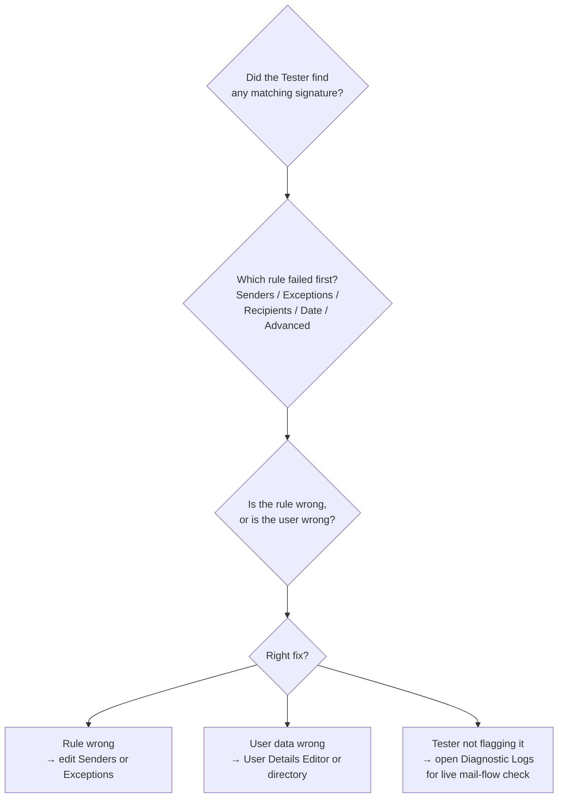

The Signatures Tester is an interactive simulator that walks a chosen From and To pair against every enabled signature and reports which rules passed, which failed, and what would have been applied. It's the first tool you reach for on a "signature isn't applying" ticket because it answers the question without sending real email.

## The four-question triage

Walk the four questions in order. Each one feeds the next.

### 1. Did the Tester find a match?

Sidebar, Signatures Tester. Pick **Server-side signatures tester** if the customer is on server-side, **Client-side signatures tester** if they're using the Outlook Add-in. Enter the user's email in **From** (one address; aliases need the Alias addresses feature enabled or you'll get a "Domain not valid" error) and the recipient in **To**. Optionally fill Subject and message. Click **Test**.

The Results screen lists every enabled signature and shows whether it would apply.

### 2. Which rule failed first?

Click **Details** on a signature to see the rules breakdown. The Tester checks, in order:

- Enabled for client-side or server-side
- Senders (the From rule)
- Exceptions (the From-block rule)
- Recipients (internal or external; included or excluded recipients)
- Date and Time
- Advanced Rules (server-side only)

Each rule shows a green tick (passed) or yellow cross (failed). Rules that were never set are greyed out. The first failure is usually the cause.

<Callout type="info" title="Vendor doc naming inconsistency">
Exclaimer's own articles aren't fully aligned on what to call this list. The Signatures Tester article describes the order above; the Diagnostics Logs article uses slightly different rule labels for the same concepts. Trust the Tester's own UI labels when reading a Details breakdown, and translate to the Diagnostic-Logs labels only when escalating.
</Callout>

### 3. Is the rule wrong, or is the user wrong?

Two different fixes:

- **Rule wrong.** The Senders tab targets the wrong group, the Exception list excludes the user it shouldn't, the recipient type is "Internal Only" but the user is sending external. Edit the rule.
- **User wrong.** The user's directory data missed a field the signature relies on. The Tester's preview shows blank fields when the data is missing. Fix the directory record (or delegate via the User Details Editor).

### 4. What if the Tester says it should apply, but real mail still has no signature?

The Tester only evaluates Exclaimer's own rules. It cannot evaluate:

- The "Identify Messages to Send to Exclaimer Cloud" transport rule in Exchange Online
- The Exclaimer Exchange Transport Agent
- Google Workspace Content Compliance rules

If those upstream rules block the message from reaching Exclaimer, the Tester will report success but no signature will appear. That's when you escalate to the Diagnostic Logs (covered in the Advanced course's troubleshooting lesson).

## A worked ticket: Northwind Logistics

Northwind Logistics, mid-market warehouse operator. A driver opens a ticket: *"My signature has no phone number when I email customers, but my colleague's does."*

<StepThrough client:load>
  <Step title="Open the Tester">
    Sidebar, Signatures Tester, Server-side signatures tester. From: the driver's email. To: a customer's email (or any external address you control).
  </Step>
  <Step title="Read the rules breakdown" image="/img/exclaimer/signatures-tester-success.png" imageAlt="The Tester's Details window showing a signature with green-tick passes on every sender rule, message rule, and recipient rule, with the Result reading 'Signature is applied'">
    Click Details on the matching signature. Green ticks against every applicable Senders, Message, and Recipient rule; the Result reads **Signature is applied**. Greyed-out rows are checks you didn't configure on this signature; they're ignored. So the issue isn't a rule failure.
  </Step>
  <Step title="Look at the Preview">
    The Designer preview pane, with the driver's email in the search bar, renders the template against their actual directory data. The `{Mobile}` field is blank.
    {/* TODO: capture screenshot of the Tester Results pane next to the Designer Senders tab */}
  </Step>
  <Step title="Check the directory">
    Microsoft 365 admin centre, the user's profile. Mobile field is empty. The colleague's record has a mobile number; the driver's doesn't.
  </Step>
  <Step title="Decide the fix">
    Either get HR to populate the directory (right answer for an MSP that owns onboarding) or enable the User Details Editor on the appropriate field so the driver can self-serve. Don't hardcode the number into the template; that breaks for the next driver.
  </Step>
</StepThrough>

<Callout type="warn" title="Test what actually fails">
"It's not working" is rarely a precise enough signal to act on. Always reproduce the failure shape in the Tester before changing rules. Half the tickets in this category turn out to be missing directory data, not rule problems, and you'll know that within sixty seconds with the Tester open.
</Callout>

## What this is NOT

- **Not a real send.** The Tester does not put a message on the wire. It evaluates rules and renders a preview. If you need to confirm DKIM, SPF, or final on-the-wire formatting, you still need a real test send.
- **Not a multi-recipient simulator (server-side).** Server-side testing accepts one From and one To at a time; client-side accepts up to ten recipients. For multi-recipient scenarios on server-side, run the test multiple times.

<Callout type="info" title="Sources">
[Signatures Tester](https://support.exclaimer.com/hc/en-gb/articles/360050806591-Signatures-Tester), [How to troubleshoot Signature is not applied](https://support.exclaimer.com/hc/en-gb/articles/6590963841437-How-to-troubleshoot-Signature-is-not-applied), [Diagnostics Logs](https://support.exclaimer.com/hc/en-gb/articles/4405784771089-Diagnostics-Logs).
</Callout>
