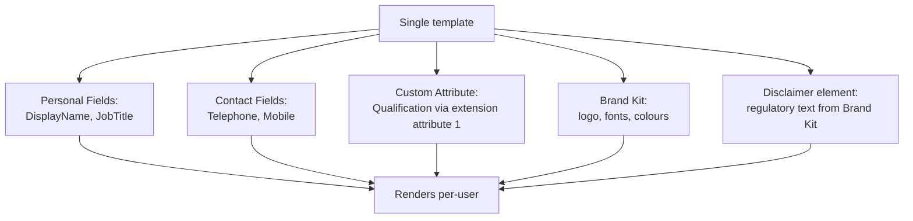

The Beginner course covered building a single signature with Personal Fields for one customer. Intermediate starts with a different problem: *one customer, many roles, one template that handles all of them*. The trick is to push variation into the data layer (directory attributes plus custom fields) and keep the design layer simple.

## The data-driven design pattern

| Variation | Where to handle it | Why |
|---|---|---|
| Job title, phone, mobile, address | Directory fields rendered with Personal, Contact, Address elements | The data is already in Entra ID or Google Directory; sync it once |
| Branded job title (e.g. "Senior Solicitor / Notary Public") | Custom attribute (Microsoft 365 Additional Attributes or Google Custom Attributes) | The directory schema is fixed; custom attributes extend it without forking the template |
| Hyperlink that varies per user (e.g. personal Calendly URL) | A Field-token-bearing hyperlink in a Text or Calendar element | Avoid one-template-per-user explosion |
| Office logo or brand colour | Brand Kit asset, not embedded in the design | Brand changes should be one edit, not 30 |
| Campaign banner | A separate Campaign object | A campaign isn't a signature; treat it as a campaign |

Each row pushes the change to the layer where it belongs. The template stays small.

## Custom attributes for off-schema data

Microsoft 365 ships fifteen Additional Attributes (commonly called extension attributes) that admins can write into and Exclaimer can read. Google Workspace exposes a similar Custom Attributes mechanism. Use them for fields the standard schema doesn't carry: pronouns, professional certifications, branded job-title strings, vehicle reg numbers for a logistics customer.

The Fields elements expose them in the same dropdown as standard fields, so a custom attribute renders identically to `{JobTitle}` in the template. Document which custom attribute holds what in the customer's runbook; the directory itself doesn't carry that documentation.

For Microsoft 365, the toggle is in the portal: cogwheel, Sender Management, **Synchronize Additional User Attributes**. Owner or Admin enables it; Exclaimer then surfaces the additional attributes in the Fields dropdown after the next sync. Without that toggle on, the custom data sits in Entra ID but doesn't reach the Designer.

## A worked design: Riverbend Legal (small but role-heavy)

Riverbend Legal is a 22-person law firm. Three roles need three different signatures on paper:

- Solicitors, name, qualification, direct line, regulatory disclosure.
- Paralegals, name, role, main switchboard.
- Support staff, name, role, main switchboard, no direct line.

The naive solution is three templates. The data-driven solution is one template:

A solicitor's record has the qualification populated; a paralegal's doesn't. Field separators automatically hide if the field on either side is blank, so the support-staff signature naturally collapses to name plus role plus switchboard without a special template. One design, three audiences, no duplication.

The collapse hides empty fields and their separators, but it doesn't reflow the layout. If two roles need fundamentally different shapes (one with a banner row, one without), that's a Senders rule on two templates, not one template with magic.

<Callout type="tip" title="Inline fields beat one-off Text elements">
To inject a field into a Text element instead of using a Fields block, type `{` and pick from the dropdown. That keeps a single sentence like *"Direct: `{Telephone}`, mobile: `{Mobile}`"* working as one element instead of fragmenting into half a dozen pieces. Fragmented elements are harder to keep aligned during a brand refresh.
</Callout>

## Dynamic hyperlinks

A common request: *"each consultant has their own Calendly URL; embed it as a 'Book a meeting' button in their signature."* The wrong fix is one template per consultant. The right fix:

1. Add the Calendly URL to a custom attribute on each consultant's directory record.
2. In the Signature Designer, drag a Text or Image element that's also a hyperlink.
3. Set the hyperlink target to a value with the field token, e.g. `https://calendly.com/{CustomVariable1}` or `{CustomVariable1}` if the directory holds the full URL.

Exclaimer renders the link with the consultant's specific value. Updates to the directory propagate to every email automatically.

<Checkpoint slug="exclaimer-deployment-checkpoint-templates" client:load />

<Callout type="info" title="Sources">
[Signature Designer](https://support.exclaimer.com/hc/en-gb/articles/360052425951-Signature-Designer), [How to add personal details to your signature template](https://support.exclaimer.com/hc/en-gb/articles/31062708712093-How-to-add-personal-details-to-your-signature-template), [How to add fields to text in your signature template](https://support.exclaimer.com/hc/en-gb/articles/4418547265041-How-to-add-fields-to-text-in-your-signature-template), [Working with the All Fields signature element](https://support.exclaimer.com/hc/en-gb/articles/360050806571-Working-with-the-All-Fields-signature-element).
</Callout>
