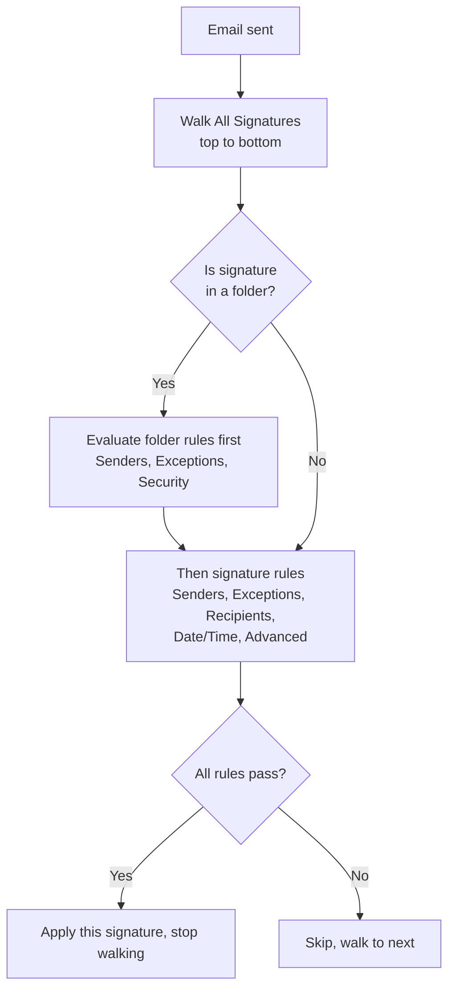
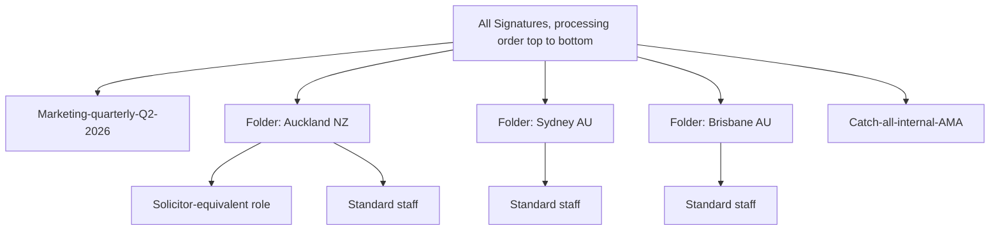

When a customer has more than five or six signatures, processing order and folder structure stop being cosmetic and start being correctness. Exclaimer applies the *first* matching signature in the All Signatures list. Get the ordering wrong and the marketing signature lands on every solicitor's email.

## The processing model

Two facts that bite people:

- **Folder rules run before the rules on signatures inside the folder.** A folder Senders rule that excludes a user means *no* signature in that folder applies to them, regardless of what each signature inside says.
- **Only the first matching signature is applied.** Exclaimer does not evaluate the rest. If you want a different signature for a different scenario, the more specific signature must come first in the order.

## Folders: when to use them

Folders aren't decoration; they're a rule scope. Reach for them when:

- **Region-specific signatures.** A folder per region with the region's senders rule on the folder, signatures inside don't repeat the region rule.
- **Customer-managed sub-team.** A folder with security restricted to that sub-team's editor role, so the customer's marketing lead can update marketing signatures without seeing finance's.
- **Bulk on/off control.** Disabling a folder disables every signature inside.

Plan-tier note: Starter cannot create folders; Standard and Pro can. The All Signatures tab holds at most 100 objects (signatures and folders combined), and a folder holds up to 100 signatures.

A folder has five tabs of its own: **Senders** (who the folder applies to), **Exceptions** (who it doesn't), **Security** (which roles can edit signatures inside), **Signatures** (the contents), and **Re-order** (the per-folder ordering UI). The first three set the folder's rule scope; the last two organise what's inside.

## Designing the order

For most customers, three buckets cover the field:

| Bucket | Where to put it | Why first / last |
|---|---|---|
| Marketing campaigns or seasonal banners (when modelled as signatures, not Campaigns) | Top | Marketing is short-lived; if the rule matches, you want it to win for that window |
| Role-specific signatures (solicitor, paralegal) | Middle | More specific than the catch-all; less specific than marketing windows |
| Catch-all "Everyone in my organisation" signature | Bottom | Last fallback when nothing else matched |

The Re-order tab on All Signatures (and inside each folder) is the drag-to-reorder UI. Only Owner and Admin can re-order top-level; Editors can re-order inside folders they have access to.

## A worked design: Able Moose Accounting (mid-market)

Able Moose has grown to 120 staff across three offices. The MSP designs the signature stack like this:

The folder Senders rule on each region-specific folder restricts to that region's mail-enabled security group. Inside the folder, signatures vary by role with their own Senders rules. The catch-all sits at the bottom and only applies if nothing else matched, which protects against the mistake of someone joining a region group without a role group.

<Callout type="warn" title="Conflicting folder and signature rules cause errors">
If a folder rule excludes a user and a signature inside the folder explicitly includes them, Exclaimer can't honour both. The Signatures Tester is the documented way to surface that conflict before it ships. Build a habit of running the Tester for one user from each role bucket whenever you change folder structure.
</Callout>

## What this is NOT

- **Not a way to apply more than one signature per email.** Server-side picks the first match and stops. Client-side has an Outlook Add-in option to append multiple signatures, but that's an Add-in feature, not signature rules. Treat "stack two signatures" requests as a Campaigns or Disclaimers job instead.
- **Not the same as Disclaimers or Campaigns processing.** Disclaimers and Campaigns are separate objects appended *after* whichever signature was selected; their own rules decide whether they appear. Don't expect a folder rule on a signature to suppress a Campaign banner.

<Callout type="info" title="Sources">
[Signatures within Folders](https://support.exclaimer.com/hc/en-gb/articles/360050510792-Signatures-within-Folders), [Re-order Signatures](https://support.exclaimer.com/hc/en-gb/articles/360050806651-Re-order-Signatures), [All Signatures](https://support.exclaimer.com/hc/en-gb/articles/360050338752-All-Signatures), [Create New Folder](https://support.exclaimer.com/hc/en-gb/articles/360050339652-Create-New-Folder), [How to use folders to manage signatures for multiple regions](https://support.exclaimer.com/hc/en-gb/articles/6871209056029-How-to-use-folders-to-manage-signatures-for-multiple-regions).
</Callout>
