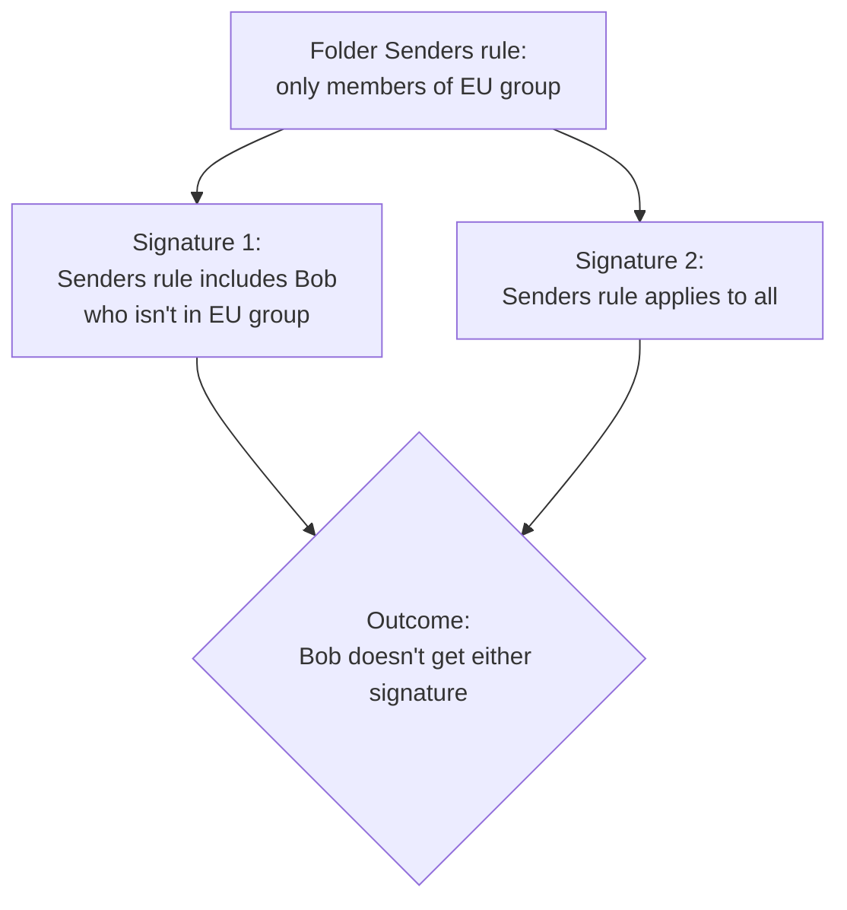

The Beginner course used the Signatures Tester to triage one user. Intermediate uses it as a pre-ship routine: walk a deliberate matrix of users and recipients to confirm that *the entire ruleset* behaves correctly before pushing changes live.

## A four-row pre-ship matrix

Before any change to signatures, folders, or rules, run these four cases through the Tester:

| Case | From (sender) | To (recipient) | What you're checking |
|---|---|---|---|
| 1 | A user the change is meant to affect | An external recipient | The change took effect for an external email |
| 2 | The same user | An internal recipient | Internal recipient rules do what you expect |
| 3 | A user the change is *not* meant to affect | An external recipient | No collateral impact on other audiences |
| 4 | A user covered by the catch-all signature only | An external recipient | The catch-all still applies for users with no specific match |

Five minutes of pre-ship testing prevents the next day's "why does the marketing signature appear on legal emails" ticket.

<Callout type="info" title="Client-side Tester is Microsoft 365 only">
The client-side Signatures Tester only works on Microsoft 365 subscriptions. Google Workspace customers can simulate against the server-side Tester only. If the customer is on Google and the deployment includes any client-side surface, plan a real test send into the QA matrix; the Tester won't cover it.
</Callout>

## Folder rules combined with signature rules: the conflict pattern

Folder Senders rules are evaluated before signature rules. The interaction biggest tickets come from:

Bob isn't in the EU group, so the folder excludes him. The signature inside that says "include Bob" never gets evaluated for him. The Tester surfaces this as a folder-level rule failure; the fix is either to put Bob's signature outside the folder or to add Bob to the folder's Senders condition.

When in doubt, run a Tester case for each user the change is supposed to include, *and* one for a user the change isn't supposed to affect, against both internal and external recipients.

## Disclaimers: three different objects, three different jobs

Customers ask for "a disclaimer" and mean three different things:

| What they mean | The right Exclaimer object | Why |
|---|---|---|
| Plain-text legal text appended after the signature, applied broadly | Disclaimers (sidebar) | The standalone Disclaimer object; date-bounded; applies independently of which signature was selected |
| Branded disclaimer text rendered inside specific signatures, with the same fonts and colors as the rest of the signature | Disclaimer signature element from the Brand Kit | Lives in the template; uses Brand Kit text |
| A permanent banner image, not text | Inside the signature template | Brand image element, not a Disclaimer at all |

Constraints to know:

- The standalone Disclaimers feature is Standard and Pro only, max 5000 characters of plain text per Disclaimer, and it can't include hyperlinks. On Gmail, Disclaimers deploy server-side only.
- The Disclaimer signature element uses Brand Kit text and supports Brand Kit fonts; it also can't carry hyperlinks (Brand Kit asset text is plain text).
- For hyperlinked legal text, use a Text element inside the signature.

## A worked design: Riverbend Legal

Riverbend's compliance lead requires:

1. A regulatory disclosure on every solicitor's outbound email, branded, fonts and colours matching the signature.
2. A confidentiality footer on every external email regardless of role, plain text, no fancy formatting.

Two different jobs, two different objects:

<StepThrough client:load>
  <Step title="Branded regulatory disclosure" image="/img/exclaimer/brand-kit-disclaimer.png" imageAlt="The Disclaimer asset section of a Brand Kit, with a multi-line Disclaimer Text field and a 5000-character counter">
    Settings, Brand Kits, open the kit, **Disclaimer** asset. Paste the regulatory language into **Disclaimer Text** (up to 5000 characters). Save. Now drop the **Disclaimer** signature element into the solicitor signature template — the text inherits the Kit's fonts and colours and renders inside the signature on every solicitor email.
  </Step>
  <Step title="Plain-text confidentiality footer for everyone external" image="/img/exclaimer/disclaimers-screen.png" imageAlt="The Disclaimers list screen with one Sample Disclaimer showing Senders 'Everyone', status Live, Always Active, Any Recipient, and a Create Disclaimer button in the top-right">
    Sidebar, **Disclaimers**, **Create Disclaimer** (top right). Plain text under 5000 characters, recipient type set to External Only. Save. The Disclaimer applies after every signature on every external email, regardless of which signature matched. Different object from the Brand Kit Disclaimer asset above: this one is standalone and template-independent.
  </Step>
  <Step title="Test a four-row matrix">
    Solicitor to external. Solicitor to internal. Paralegal to external. Standard staff to external. The Tester confirms which signature applies and (for server-side) shows that the standalone Disclaimer is appended on the external cases.
  </Step>
</StepThrough>

<Callout type="warn" title="Email disclaimers are not legal armour">
Exclaimer's own documentation calls out that email disclaimers don't provide complete protection against legal action. They're a discipline, not a defence. The customer's lawyers should write the text; you implement it accurately.
</Callout>

<Callout type="info" title="Sources">
[Signatures Tester](https://support.exclaimer.com/hc/en-gb/articles/360050806591-Signatures-Tester), [Disclaimers](https://support.exclaimer.com/hc/en-gb/articles/25373484031901-Disclaimers), [Working with the Disclaimer signature element](https://support.exclaimer.com/hc/en-gb/articles/360050339292-Working-with-the-Disclaimer-signature-element).
</Callout>
