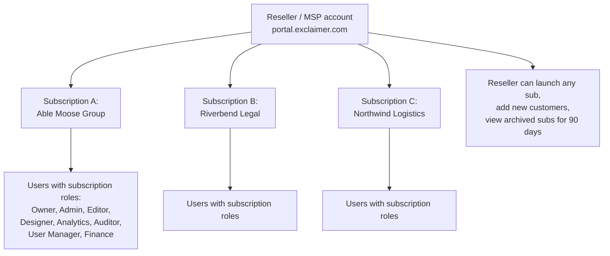

Exclaimer's tenancy model isn't like DNSFilter's MSP-with-sub-orgs hierarchy. Each customer has their own Exclaimer **subscription**, fully isolated; the MSP runs across them through the **reseller portal** at portal.exclaimer.com plus per-subscription user accounts. That shape changes everything about how an MSP organises its work.

## The subscription model

Three things to notice:

- **Each subscription is self-contained.** Brand Kits, signatures, Disclaimers, Campaigns, Audit Log, all live inside the subscription. They don't propagate or inherit from the reseller layer the way DNSFilter's MSP-level objects do. Exporting a signature template and importing it into another subscription works, but Brand Kit references resolve against the importing subscription's Brand Kit, so you re-attach assets after every import; there's no one-click clone across customers.
- **The reseller portal is a launcher and a customer manager.** It lists active customer subscriptions, lets the reseller launch any of them, lets the reseller add new customer subscriptions and view archived ones for 90 days.
- **Per-subscription roles, not MSP-wide roles.** A user has a role in each subscription they're given access to. There's no "MSP-wide Admin" object that applies across all customer subscriptions.

This means that an MSP's day-to-day discipline is *which subscription am I in*, far more than *which org am I in* (the DNSFilter framing). The Change Subscription menu under the initials icon is the canonical switcher; confirm in the header before any change.

{/* TODO: capture screenshot of the initials-icon Account menu with Change Subscription visible */}

## The role model inside a subscription

Eight roles, layered:

| Role | What it can do |
|---|---|
| **Owner** | Unrestricted. Only role that can accept terms, manage payment, remove integrations, and delete users. Cancellation is also Owner-gated, documented separately on the Manage screen rather than in the role-table exceptions. |
| **Admin** | Unrestricted *except* for the four Owner-only role-table exceptions: accepting terms, managing payment, removing integrations, deleting users. |
| **Editor** | Signature design, management, testing; configure (but not remove) integrations; manage user data. |
| **Designer** | Create and edit signatures, campaigns, disclaimers, branding; view Meeting Branding and edit icon and background. |
| **Analytics** | View and manage Engagement, Usage, Feedback, and Social Feeds analytics. |
| **Auditor** | Access the Audit Log (Pro plan only). |
| **User Manager** | Add and remove users; change roles. |
| **Finance** | Download invoices (direct customers only). |

A user can hold multiple roles. The MSP-side pattern is usually one person who's Admin in many subscriptions plus one or two who hold Designer roles for self-service marketing teams.

<Callout type="info" title="Cancellation is Owner-only, separately">
The role-table lists four Admin exceptions. Subscription cancellation isn't one of them: it's gated by Owner-only access via the Manage screen, documented in the Cancel-Subscription article rather than the User-Management role table. A practical consequence: only the Owner can wind a subscription down at the end of a customer relationship.
</Callout>

## Three partner-access patterns

The reseller-vs-customer split shapes how you set up users at onboarding. Pick deliberately, document the choice, and don't drift between patterns:

| Pattern | Who holds which role | Use when |
|---|---|---|
| **MSP-managed (default)** | MSP staff hold Admin and Designer in the customer's subscription. Customer has no users. | Customer hands over signature work entirely. |
| **Co-managed** | Customer's marketing or compliance lead holds Designer or Editor for specific folders. MSP holds Admin. | Customer wants in-house control over campaigns and text content but not over connectors and mail flow. |
| **Customer-managed with MSP fallback** | Customer staff hold Owner. MSP retains an Admin seat for emergency support. | Customer's IT runs Exclaimer day-to-day and just wants the MSP available for outage scenarios. |

Drift between patterns happens because nobody noticed the customer added their own staff as Owner, then the MSP-side tech leaves with the only documented set of access notes. Lock the pattern down in the customer's runbook.

<Checkpoint slug="exclaimer-l3-checkpoint-tenancy" client:load />

## The MSP partner programme: not the same as just being a reseller

For Microsoft 365 customers, Exclaimer offers a Managed Service Provider programme that runs through Microsoft Marketplace. To join, the MSP needs:

- A completed commercial marketplace account in Microsoft Partner Center
- Access to Microsoft Marketplace offers
- A verified Microsoft tenant
- Reseller authorisation from Exclaimer
- A valid payout and tax profile

The programme links the MSP's organisation to Exclaimer resale offers in the Marketplace, which shifts billing into the customer's existing Microsoft commitment. That's not the same as the standard reseller account, where Exclaimer bills the MSP directly. Choose the programme based on the customer billing model.

<Callout type="info" title="Sources">
[Managing subscriptions and users as a Reseller](https://support.exclaimer.com/hc/en-gb/articles/4406114131601-Managing-subscriptions-and-users-as-a-Reseller), [Managed Service Provider (MSP) onboarding](https://support.exclaimer.com/hc/en-gb/articles/35341080208541-Managed-Service-Provider-MSP-onboarding), [User Management](https://support.exclaimer.com/hc/en-gb/articles/16768782574237-User-Management), [Subscription details](https://support.exclaimer.com/hc/en-gb/articles/360019102897-Subscription-details), [Manage your subscription](https://support.exclaimer.com/hc/en-gb/articles/360019111298-Manage-your-subscription).
</Callout>
