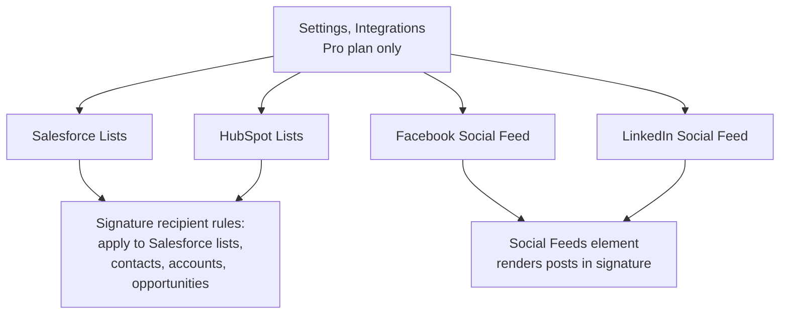

The Intermediate course handled rules and folders inside one customer. Advanced uses Exclaimer's integrations to bring data and behaviour from outside, Salesforce lists for recipient targeting, social feeds for dynamic content, and the documented sync cadence that governs how fresh that data stays.

## The Integrations menu (Pro plan)

Each integration plugs into a specific feature: CRM lists drive recipient rules; social-feed connectors render dynamic content blocks. None of them alter the mail flow path; signatures still go server-side or client-side as configured.

<AnnotatedScreenshot src="/img/exclaimer/integrations-cards.png" alt="The Settings Integrations tab with four connector cards: LinkedIn Social Feed, Facebook Social Feed, Salesforce Lists (Connect button highlighted), and HubSpot Lists" caption="Settings, Integrations. Four cards, four jobs: LinkedIn and Facebook drive the Social Feed signature element; Salesforce and HubSpot drive recipient-list rules on signatures and disclaimers." />

## Salesforce as a recipient source

Available on Pro, requires a Salesforce account on Professional with API access, Enterprise, Performance, Unlimited, or Developer. Once connected:

- Salesforce Lists synchronise immediately on connection.
- Subsequent sync runs daily at 3 AM local time.
- Per-signature recipient rules can target Salesforce Contact, Account, or Opportunity lists.

The pattern that pays off is segmented signatures for sales conversations: a customer-success-team signature for accounts in the customer's "active customer" list, a product-launch-banner signature for opportunities in a specific pipeline stage. The connector makes the segmentation a Salesforce data question, not an Exclaimer rule question.

## A worked design: Northwind Logistics

Northwind has a sales team running on Salesforce Enterprise. Marketing wants to test whether a contract-renewal banner on the sales team's signature lifts renewal rates. The plan:

<StepThrough client:load>
  <Step title="Connect Salesforce">
    Settings, Integrations, Salesforce Lists, Connect with Salesforce. Authenticate with the Salesforce account; if Northwind uses a custom domain, fill it in. Wait for the initial sync to complete (immediate, then daily at 3 AM).
  </Step>
  <Step title="Build the targeting list in Salesforce">
    Inside Salesforce, create a Contact list named 'Renewal-Q3-2026' that contains the contacts at accounts due for renewal that quarter. The list updates as Salesforce records change.
  </Step>
  <Step title="Add the renewal-banner signature in Exclaimer">
    Designer, new signature based on the existing sales-team template, add the renewal banner image. Senders rule: the sales team's mail-enabled security group. Recipients rule: include the 'Renewal-Q3-2026' Salesforce list.
  </Step>
  <Step title="Order it ahead of the standard sales-team signature">
    Re-order tab. The renewal-banner signature must be above the standard sales-team signature in processing order, otherwise the standard signature wins because it also matches.

    <AnnotatedScreenshot src="/img/exclaimer/signatures-reorder-move.png" alt="The signature Re-order tab showing Move up and Move down arrows" caption="Move up and Move down on the Re-order tab. Above the catch-all means above in the list; the renewal-banner needs to win the first-match-and-stop walk before the standard sales-team signature does.">
      <Hotspot client:load x={50} y={50} label="Move up / Move down" purpose="The whole governance shape lives here" body="More-specific signatures sit higher; the catch-all sits at the bottom. Get this wrong and the catch-all wins because it matched first." />
    </AnnotatedScreenshot>
  </Step>
  <Step title="Wait for the daily sync, then test">
    Salesforce list changes don't propagate to Exclaimer in real time. The 3 AM sync is the cadence. After overnight sync, run Tester from a sales-team user to a contact in the renewal list, confirm the renewal-banner signature applies; test against a contact not in the list, confirm the standard signature applies.
  </Step>
</StepThrough>

<Callout type="warn" title="The sync cadence is the design constraint">
A sales rep adds a contact to a list mid-morning and expects the renewal banner to appear on emails sent that afternoon. It won't, the next sync runs overnight at 3 AM local time. Either set expectations with the customer or design the segmentation around list snapshots that are stable for a day.
</Callout>

## Social Feeds as dynamic content

Facebook and LinkedIn social feeds let the customer surface their latest social posts inside the signature. The Social Feeds element in the Toolbox renders an automatically updated thumbnail and link.

The Social Feeds Analytics dashboard then reports which posts received the most clicks, which lets the customer's social team measure the email channel separately from organic social reach.

When this is worth doing: customers whose marketing strategy relies on sustained social posting and who want their email signature acting as an amplifier. When it isn't: customers who post sporadically. A stale post in every email signature for two months reads as more performative than the post itself.

## Automation: connector-driven, not REST-API-driven

Exclaimer's automation pattern is connector-driven through the Marketplace integrations and bulk-import surfaces, not REST-API-driven. There's no general-purpose signature-management API equivalent to DNSFilter's REST endpoints. Most automation patterns work through:

- **Bulk user data uploads** (User Details Upload, Standard and Pro). For onboarding or bulk role changes, prepare a CSV with the directory fields you need to change and upload through the Sender Management screen.
- **CRM integrations** (Salesforce, HubSpot) for recipient-side automation.
- **The Microsoft 365 connector** for tenant-side automation; once set up, it runs without further intervention until it's deliberately changed.

Patterns that don't fit Exclaimer well: real-time webhook pushes from a third-party app into a specific Exclaimer signature change. If the customer's automation case requires sub-minute change propagation, that's an integration architecture conversation, not an Exclaimer config click.

## HubSpot Lists for the same recipient pattern

HubSpot Lists work the same way as Salesforce Lists in the Recipients rule: connect HubSpot in Settings, Integrations; the lists you've curated in HubSpot become available as recipient targets on a per-signature Recipients rule. The cadence is the same overnight sync. Use HubSpot Lists for customers whose marketing or RevOps team works in HubSpot rather than Salesforce, the design pattern (segmented signature, list-driven recipients, processing-order-aware folder structure) is identical, only the source-of-truth CRM changes.

<Callout type="info" title="Sources">
[Integrations](https://support.exclaimer.com/hc/en-gb/articles/12165013144221-Integrations), [Salesforce Lists](https://support.exclaimer.com/hc/en-gb/articles/15448696530589-Salesforce-Lists), [Social Feeds Analytics](https://support.exclaimer.com/hc/en-gb/articles/13875435957277-Social-Feeds-Analytics).
</Callout>
