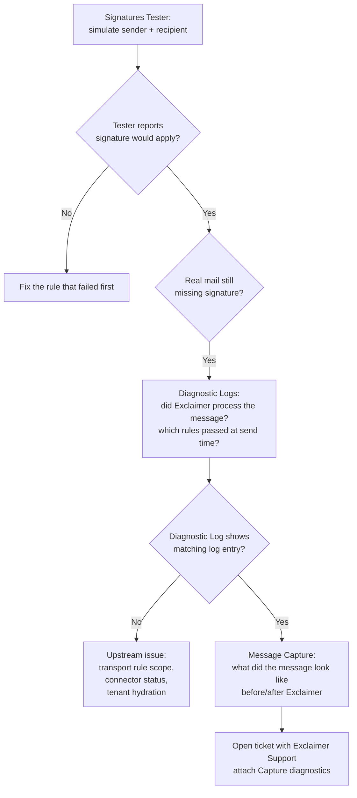

The Signatures Tester answers "would Exclaimer apply this signature?" The Diagnostic Logs answer "did Exclaimer apply this signature?" Message Capture answers "what did the email actually look like before and after Exclaimer touched it?" Most Advanced-level support tickets need at least one of those last two.

## The escalation chain

Walk the chain in order. Each tool answers a different question; jumping ahead skips diagnostics that would tell you what was wrong.

## Diagnostic Logs: the past-7-days rule audit

Open via the question-mark icon, **Diagnostics**. Search by sender email, deployment type (Client-Side, Server-Side, Exchange On-Premises), and date range up to the last 7 days (Exclaimer retains 7 days of log information; older logs are gone).

<AnnotatedScreenshot src="/img/exclaimer/diagnostics-help-menu.png" alt="The Exclaimer portal Help menu showing Diagnostics, Signature Search, and Message Capture entries" caption="Diagnostics lives behind the question-mark Help menu, alongside Signature Search and Message Capture. Account-level menus (Subscription, Audit Log) live behind the initials icon next door; don't confuse them.">
  <Hotspot client:load x={88} y={8} label="Question-mark icon" purpose="How techs reach Diagnostics from any portal screen" body="Diagnostics, Signature Search, Message Capture, and the Signatures Tester shortcut all live here. Account-level menus live behind the initials icon next door." />
  <Hotspot client:load x={88} y={28} label="Diagnostics" purpose="Per-message log" body="Search by sender, deployment type, or rule outcome. Seven-day retention. This is what you check when 'Tester says yes, real mail says no'." />
  <Hotspot client:load x={88} y={38} label="Signature Search" purpose="By-sender lookup" body="Quick check of which signature fired for a known sender. Cross-references the rule chain without you opening the per-message log." />
  <Hotspot client:load x={88} y={48} label="Message Capture" purpose="Live capture" body="For when you can't reproduce a problem in the Tester. Up to 10 messages, 2 senders, 2 recipients. Read-write for Owner; the Diagnostics article describes broader Admin access here, see the caveat below." />
</AnnotatedScreenshot>

Each result row shows timestamp, status, whether a signature was matched, and the sender. Drill into Log Details and you get two tabs:

- **Signatures**: the same rule breakdown the Tester shows, but recorded against the *actual send*. Each enabled signature, each rule, with a tick or cross. This is how you confirm the rules-as-evaluated-at-send-time matched what the Tester predicted.
- **Details**: log type (the configured deployment of the signature), log message ("signature applied" or the failure reason), and signatures matched (true/false).

<Callout type="warn" title="Vendor docs disagree on Admin access to Diagnostics">
The Diagnostics-Logs article gives Admin full access. The User-Management role table excludes Admin from Diagnostics. Both are current; the discrepancy is the vendor's, not yours. Test in the customer's tenant before promising Admin can run a Diagnostic Log search; if the role table wins on that subscription, route through Owner. Editors don't see Diagnostic Logs at all on either reading.
</Callout>

## Message Capture: the shape-of-message tool

When the Diagnostic Logs say a signature applied but the recipient still doesn't see one, or when DKIM, formatting, or a downstream filter is suspected, Message Capture is the next tool. It captures up to 10 messages between a chosen sender and a chosen recipient (or all recipients), records before-and-after diagnostic data, and emails it to a chosen address inside the customer's tenant.

<StepThrough client:load>
  <Step title="Open Message Capture">
    Question-mark icon, Message Capture. The Owner has read-and-write; Admins are read-only on this screen.
  </Step>
  <Step title="Configure capture conditions">
    Enable message capture. Set 'Messages to capture' (max 10). Enter the Sender (max two addresses). Choose 'Capture messages to all recipients' or 'Capture message to a specific recipient' (max two). Optionally tick 'Capture replies from this recipient to the specified sender' for round-trip capture (server-side only). Set 'Deliver diagnostic data to' as an address inside the customer's Microsoft 365 or Google Workspace tenant.
  </Step>
  <Step title="Wait for the user to send the next emails">
    Capture is conditioned on real mail flow; the customer needs to send the matching messages naturally. The customer's own mail flow continues uninterrupted; captured messages still reach the recipient.
  </Step>
  <Step title="Forward the diagnostic email to Exclaimer Support">
    Capture results land in the diagnostic-data inbox. Reply to the existing Exclaimer Support ticket with the captured data attached. Don't share the captured emails outside the ticket; they contain the customer's mail content.
  </Step>
</StepThrough>

<Callout type="warn" title="Pre-requisite for Message Capture">
Message Capture only records emails that route through Exclaimer. If the customer's mail flow rules aren't active (transport rule disabled, connector deleted, hydration not yet complete), nothing gets captured because nothing reaches Exclaimer. Confirm mail flow is active *before* enabling capture.
</Callout>

## A worked ticket: Riverbend Legal

Riverbend's compliance lead opens a ticket: *"Our outbound emails to one specific external counsel are arriving without the signature. Other recipients see it fine."*

<StepThrough client:load>
  <Step title="Run the Tester">
    From: a Riverbend solicitor. To: the external counsel's address. Tester reports the signature would apply. Rules pass. The Recipients rule type is 'All Recipients'.
  </Step>
  <Step title="Diagnostic Logs">
    Search by the solicitor's email, Server-Side, last day. The log entry for the relevant timestamp shows 'Signatures matched: true' and the signature applied. So Exclaimer did its job.
  </Step>
  <Step title="Message Capture">
    Configure Capture for the solicitor and the external counsel, capture all replies from counsel back to the solicitor. Wait for the next round-trip exchange. The captured before-Exclaimer message has the signature placeholder; the after-Exclaimer message has the rendered signature. So the issue is not at Exclaimer's layer.
  </Step>
  <Step title="Investigate downstream">
    Counsel's mail server is stripping HTML and presenting plain-text only. Confirm with counsel's IT, then offer the customer two options: ask counsel's IT to allow HTML from Riverbend's domain, or accept plain-text-only on that thread. Either way, the resolution sits outside Exclaimer.
  </Step>
</StepThrough>

The escalation chain confirmed the problem is downstream. Without it, the temptation is to keep editing Exclaimer rules; the Diagnostic Logs and Capture diagnostics are the discipline that keeps your fix where the bug is.

<Checkpoint slug="exclaimer-multi-tenant-ops-checkpoint-troubleshooting" client:load />

## When to escalate to Exclaimer Support

Open a Technical Support ticket (question-mark, Raise a support ticket) when:

- Diagnostic Logs show a signature should have applied but Capture proves Exclaimer modified the message incorrectly.
- The connector wizard fails with an error not covered by the documented hydration case.
- Mail flow consistently fails for messages that pass the Tester and the Diagnostic Logs.

When you open the ticket, attach the Capture diagnostic data (forwarded from the diagnostic-recipient inbox), the Diagnostic Log row IDs, and the Subscription ID (Account menu, Subscription details). Support can find you faster with the ID; lean on it.

## What this is NOT

- **Not a substitute for Microsoft's own message trace.** For end-to-end mail flow questions that span Exchange Online, Microsoft 365 message trace is still the right tool. Exclaimer's Capture only sees messages that reach Exclaimer; messages blocked upstream don't appear.
- **Not retroactive.** Capture only records messages sent *after* it's enabled and matching the conditions. There is no retroactive capture of yesterday's email.

<Callout type="info" title="Sources">
[Diagnostics Logs](https://support.exclaimer.com/hc/en-gb/articles/4405784771089-Diagnostics-Logs), [Message capture](https://support.exclaimer.com/hc/en-gb/articles/4406966358173-Message-capture), [Support Ticket](https://support.exclaimer.com/hc/en-gb/articles/360019857437-Support-Ticket), [Support FAQ](https://support.exclaimer.com/hc/en-gb/articles/9193144742173-Support-FAQ).
</Callout>
