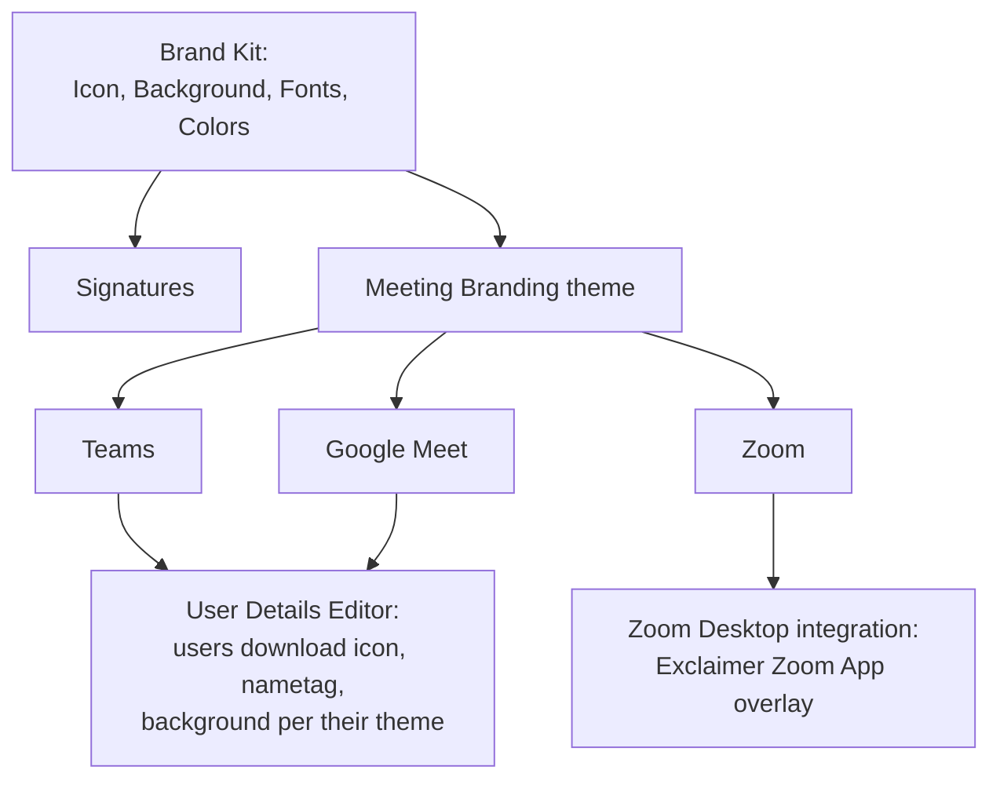

A signature carries the customer's brand and (often) their regulatory disclosure on every external email. That makes signature changes auditable territory: who changed it, when, and on whose authority. Exclaimer's governance surface is small but specific; the Advanced-level discipline is using each piece deliberately.

## The Audit Log

Pro plan only. Found via the initials icon, **Account menu**, **Audit Log**. Only the subscription **Owner** and any user with the **Auditor** role can download it. The output is a CSV with UTC timestamps for users who sign in to the subscription, and the role each user holds (Admin, Editor, or both).

Two limitations to know:

- The Audit Log is sign-in-and-role-focused, not change-by-change. It tells you *who signed in when, with which role*; it doesn't itemise every signature edit. For change-by-change attribution, the discipline has to be in the team's process, naming changes in commit-style messages internally, and using the Diagnostic Logs to locate the timeline of when a signature actually started behaving differently.
- It's downloaded as CSV, not surfaced in a dashboard. Schedule the download (monthly is typical) and store it with the customer's compliance evidence.

## Role-rotation discipline

Five rules that keep the Audit Log honest:

1. **Owner is a documented seat, not a person's personal account.** When that person leaves the MSP or the customer, document the handover and reassign the Owner role in the Subscription details. A departed Owner with no documented handover means the customer can't cancel or restructure their subscription without Exclaimer Support intervention.
2. **No shared logins across MSP staff.** A shared 'msp-admin@' login destroys the Audit Log's usefulness; every action looks like the same actor. Per-tech accounts, even if it costs more user seats.
3. **Auditor role for compliance-only access.** A customer's compliance officer or external auditor doesn't need Admin; the Auditor role gives them Audit Log read access without the rest of the surface.
4. **Editor by default for designers and marketing.** Designer plus Editor is enough for most marketing-led change. Reserve Admin for techs who actually need mail-flow and integration access.
5. **Document the role pattern in the customer's runbook.** Drift between MSP-managed, co-managed, and customer-managed (Intermediate-course pattern) is the single biggest source of governance bugs. Periodic re-read of the runbook plus a User Management screen comparison catches drift.

## The regulatory-disclaimer authority chain

The Intermediate course's Disclaimers lesson covered the three Exclaimer objects (standalone Disclaimers, the Disclaimer signature element, in-template text). Advanced adds the question of *who authorised the text*.

| Step | Who | Why |
|---|---|---|
| Drafting the regulatory text | Customer's lawyer or compliance officer | Liability lives with the customer's legal authority, not the MSP |
| Reviewing the implementation | Customer's compliance lead | Confirm the implemented text matches the drafted text exactly |
| Configuring it in Exclaimer | MSP admin | The mechanical step |
| Signing off the change | Customer's compliance lead in writing | Audit-trail |
| Annual re-review | Customer's compliance lead | Regulations change |

Don't let the MSP's signature designer rewrite legal text on the fly. Even a typo correction in a regulatory disclosure is a question for the compliance lead, not a technical change. Exclaimer's documentation explicitly notes that email disclaimers don't provide complete legal protection; the implementation is the customer's compliance posture, not Exclaimer's.

## Meeting Branding as governance extension

Meeting Branding (Pro plan) attaches branded nametag overlays and backgrounds to user video calls in Microsoft Teams, Google Meet, and Zoom. The same Brand Kit assets that drive signatures also drive Meeting Branding themes; signature governance now extends into video.

Three platform notes:

- **Microsoft Teams**: users download the theme's icon, nametag overlay, and/or background from the User Details Editor and apply them as a Teams background. Transparent backgrounds are accepted and behave as blurred backgrounds.
- **Google Meet**: same download path, but the nametag must be baked into the background image because Meet doesn't accept transparent backgrounds for overlays. Users upload the combined image as their Meet background.
- **Zoom**: Exclaimer integrates a Zoom App with the Zoom Desktop client. Overlays show the participant's display name, job title, and optional brand icon plus a picture background drawn from the theme.

The governance angle: a customer running Meeting Branding now has another surface where brand and (depending on the customer) compliance show up. A regulated customer's external video calls might want a specific disclosure overlay or a known-good background; that's a Meeting Branding theme decision, made the same way a signature is.

## Putting it together: the QBR workflow

Once a quarter, walk this checklist for every customer subscription:

<StepThrough client:load>
  <Step title="Audit Log download">
    Pull the CSV. Confirm the user list matches the customer's runbook. Anyone unexpected, escalate.
  </Step>
  <Step title="Role review">
    User Management screen. Confirm Owner is the documented seat, not a personal account. Confirm Auditor is held by whoever the customer expects (compliance lead or external).
  </Step>
  <Step title="Brand Kit and signature audit">
    Open the customer's Brand Kit. Confirm logo, fonts, colours match the brand-of-record. Spot-check three signatures across roles for asset consistency.
  </Step>
  <Step title="Disclaimer review">
    Standalone Disclaimers, the Disclaimer signature element. Confirm text matches the customer's compliance-of-record. Confirm dates if any are scheduled to expire.
  </Step>
  <Step title="Analytics-driven recommendation">
    Pull Engagement, Usage, and Feedback dashboards as covered in the Analytics lesson. Bring two or three named recommendations for the QBR.
  </Step>
</StepThrough>

That's the difference between a tech who "manages" Exclaimer and an MSP that owns Exclaimer governance for their customers.

## What this is NOT

- **Not legal advice.** Email disclaimers, video-call backgrounds, and signature copy are the customer's compliance posture. The MSP implements faithfully; the customer's legal authority owns the text.
- **Not a substitute for Microsoft 365 or Google Workspace audit logs.** Exclaimer's Audit Log covers Exclaimer activity. For Microsoft 365 admin actions, the Microsoft 365 audit log is separate; for Google, Google Admin's audit logs. Compliance reporting usually pulls all three.
- **Not the only place a signature can change.** End users with the User Details Editor can edit the fields the admin enabled for self-service. That's a feature, not a bug; document the scope in the runbook so a "the signature changed" ticket starts in the right place.

<Callout type="info" title="Sources">
[Audit Log](https://support.exclaimer.com/hc/en-gb/articles/15555615448093-Audit-Log), [User Management](https://support.exclaimer.com/hc/en-gb/articles/16768782574237-User-Management), [Meeting Branding](https://support.exclaimer.com/hc/en-gb/articles/25299729490973-Meeting-Branding), [Disclaimers](https://support.exclaimer.com/hc/en-gb/articles/25373484031901-Disclaimers).
</Callout>
