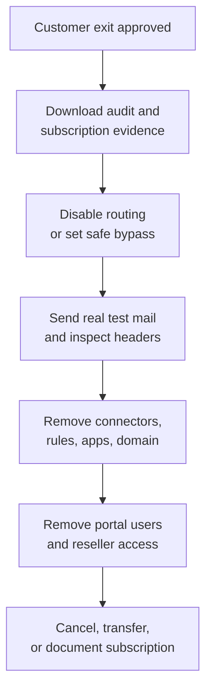

Exclaimer sits in a sensitive place: brand, legal text, user data, and in server-side deployments, mail flow. A sloppy exit can leave a former technician with portal access or leave Exchange Online routing mail to a service the customer no longer pays for.

## Two different removals

| Removal | What changes | Who can do it |
|---|---|---|
| **Remove a subscription user** | The person can no longer sign in to the Exclaimer portal for that subscription. | Subscription Owner or User Manager. Admins can do most things in the portal, but adding and removing users is reserved for Owner and User Manager. |
| **Remove a signature sender** | The user's mail no longer receives a specific signature or falls out of signature scope. | Depends on the signature and sender-management model. |

Do not confuse those. A former MSP technician is a subscription-user problem. A customer leaver is usually an IdP and sender-data problem. A customer exit is mail flow, connector, app grant, subscription, and evidence work.

## The customer-exit sequence

## Runbook

<StepThrough client:load>
  <Step title="Freeze signature changes">
    Stop template edits, sender-rule changes, Brand Kit changes, and campaign banners for the customer. Keep emergency mail-flow work in the change ticket, but do not let marketing changes overlap the exit.
  </Step>
  <Step title="Export the evidence">
    Download the Audit Log if the plan exposes it. Capture subscription owner, user list, deployment method, key signature rules, and the current Exchange Online or Google Workspace routing objects. Store the evidence in the PSA ticket.
  </Step>
  <Step title="Remove former MSP and customer portal users">
    In User Management, remove users who should no longer sign in. Confirm the remaining Owner and User Manager seats match the customer runbook before any cancellation or handover.
  </Step>
  <Step title="Handle customer leavers through the source of truth">
    If the user has left the customer, remove or disable them in Microsoft 365, Google Workspace, or the HRIS source. Then sync sender data. Use Sender Management or sender exceptions only for signature behavior that differs from the identity source.
  </Step>
  <Step title="Stop server-side routing in a controlled window">
    For a temporary stop, disable the Exclaimer transport rule. For a permanent exit, remove the transport rules and connectors. If the subscription is being uninstalled from Microsoft 365, also remove the related Entra apps and Exclaimer domain as the vendor guide describes.

    The Microsoft 365 admin centre's Integrated apps page is where the Exclaimer Cloud for Outlook add-in is removed. Once you click Remove, the page shows progress and a confirmation:

    <AnnotatedScreenshot src="/img/exclaimer/integrated-apps-removing.png" alt="The Microsoft 365 Integrated apps page showing 'Removing apps in progress'" caption="Removal kicks off and the row shows 'Removing'. Wait for completion before assuming any other cleanup step has worked.">
      <Hotspot client:load x={50} y={50} label="Removing apps in progress" purpose="Don't move on yet" body="Microsoft sometimes silently fails this step. Confirm the progress indicator clears before working through the connector and transport-rule removal." />
    </AnnotatedScreenshot>

    <AnnotatedScreenshot src="/img/exclaimer/integrated-apps-removed.png" alt="The Microsoft 365 Integrated apps page showing the Exclaimer add-in successfully removed" caption="A clean removal shows the success state. If a row still says 'In progress' after a few minutes, that's a Microsoft retry case, not an Exclaimer config problem.">
      <Hotspot client:load x={50} y={50} label="Successfully removed" purpose="Add-in cleanup confirmed" body="This is the only client-side artefact you can confirm visually. Server-side removal still needs the transport-rule and connector cleanup, plus the Entra app removal." />
    </AnnotatedScreenshot>
  </Step>
  <Step title="Verify with real mail">
    Send internal and external test messages from an in-scope sender. Confirm the message does not route through Exclaimer, no Exclaimer signature appears, and headers show the expected Microsoft 365 or Google Workspace path.
    {/* TODO: capture screenshot of an inspected message header showing no Exclaimer routing */}
  </Step>
  <Step title="Close subscription and billing">
    Only the subscription Owner can cancel an active Exclaimer subscription. Trial subscriptions expire instead of being canceled. If the customer keeps Exclaimer and the MSP exits, document the Owner handover rather than canceling.
  </Step>
</StepThrough>

## When Tester and real mail disagree

This is the quick helpdesk bridge that was missing from the earlier course:

| Tester result | Real mail result | Likely cause | Next move |
|---|---|---|---|
| Signature applies | No real signature | Mail did not route through Exclaimer. | Check transport rule, connector, content-compliance rule, and deployment path. |
| Signature does not apply | No real signature | Sender, recipient, folder, or exception rule does not match. | Fix rule design or sender data. |
| Signature applies | Wrong real signature | Multiple signatures or folder order conflict. | Use rule order and folder processing checks. |
| Signature applies in a reply chain, then stops | Thread contains Exclaimer anti-duplication marker. | Escalate with Diagnostic Logs or support evidence. |

## What this is NOT

- **Not a mailbox-deletion process.** Microsoft 365 or Google Workspace owns mailbox and identity offboarding.
- **Not a reason to hardcode leavers into exclusions.** Fix the identity source unless the exception has a documented business owner.

<Checkpoint slug="exclaimer-l3-checkpoint-offboarding" client:load />

<Callout type="info" title="Sources">
[Add or remove a user for your Exclaimer subscription](https://support.exclaimer.com/hc/en-gb/articles/360019160098-Add-or-remove-a-user-for-your-Exclaimer-subscription), [Cancel Exclaimer subscription](https://support.exclaimer.com/hc/en-gb/articles/360019046337-Cancel-Exclaimer-subscription), [Deconfigure or disable Server-Side signatures for Microsoft 365](https://support.exclaimer.com/hc/en-gb/articles/4404031036945-How-to-uninstall-or-disable-server-side-signatures-for-Exclaimer-Microsoft-365), [Uninstall Exclaimer with Microsoft 365](https://support.exclaimer.com/hc/en-gb/articles/4404095939345-Uninstall-Exclaimer-with-Microsoft-365), [Sender Management](https://support.exclaimer.com/hc/en-gb/articles/360018921518-Sender-Management).
</Callout>
