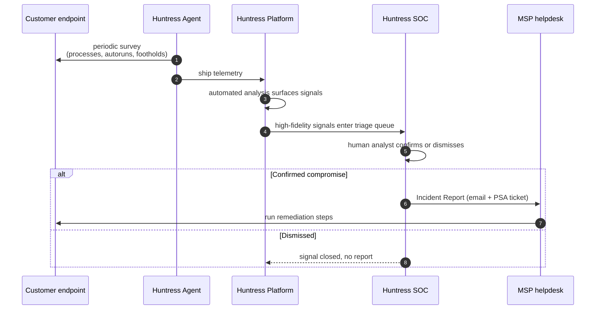

Huntress is a managed security suite. Endpoints, Microsoft 365 and Google Workspace identities, Defender posture, and ingested log sources all feed a single 24x7 Security Operations Centre. The SOC triages what looks suspicious and the partner portal hands the helpdesk Incident Reports with remediation steps to action. The "managed" part is the load-bearing word. The SOC investigates on your behalf so the helpdesk does not need a 24x7 analyst rota of its own.

## The problem this product solves

Endpoints get compromised. Antivirus catches the obvious file, the user clicks past a warning, an attacker drops a scheduled task, and ninety days later somebody notices an odd PowerShell session at 3am. By that point the attacker has already moved laterally.

An MSP with twenty customers cannot watch every endpoint at 3am. Hiring a SOC is a six-figure annual commitment. The choice is usually between deploying nothing past antivirus and accepting the gap, or paying a managed-detection vendor to do the watching.

Huntress is built for that choice in the SMB-and-MSP segment. The pitch is concrete: deploy a small agent across the customer's endpoints, and a 24x7 SOC reviews the events that look suspicious. When the SOC confirms a compromise it sends an Incident Report describing what happened, the indicators of compromise, the user accounts and systems involved, and step-by-step remediation. The MSP runs those steps. The SOC operates 24x7 across multiple regions so a Critical incident at 3am gets a human eye somewhere in the world.

This is the slot Huntress occupies in a typical MSP stack:

- **Above the antivirus layer.** Defender, Bitdefender, or whichever AV the customer already runs catches signature-known threats. Huntress watches for the things AV misses: persistence mechanisms, suspicious process behaviour, identity attacks against Microsoft 365.
- **Across the security data pipeline.** Managed SIEM ingests filtered log data from firewalls, syslog sources, and OS event logs. The Smart Filter retains only the security-relevant slice, and the same SOC reviews it alongside EDR and ITDR signals. Where a self-run SIEM asks the customer to write the correlation rules, Huntress writes them.
- **Alongside an RMM and a PSA.** The RMM (NinjaOne, Datto, Atera, ConnectWise Automate) is how you push the agent out. The PSA (HaloPSA, ConnectWise Manage, Autotask, Syncro) is how Huntress incident reports turn into tickets your team actions.

## The shape of a Huntress deployment

Two things to notice in that flow. Most signals never become incidents, the platform's own definitions describe events analysed in the tens of thousands per month per account, with only a small fraction promoted to an investigation. And the report only lands once a human analyst has confirmed there is something to act on. That is the difference between MDR and a raw alert feed.

## The components, and how each one earns its keep

The platform is a suite, not a single product. Five Managed services run on top of the agent, the portal, and the integrations. The "Managed" prefix on each one is the load-bearing word: it means a person in the 24x7 SOC is on the other end, doing the work that an in-house team would otherwise do (the [MDR](/glossary/mdr/) model). [ITDR](/glossary/itdr/) is the identity-specific service inside that broader managed-detection delivery; the same SOC reviews it.

For each component below, the four-beat shape is the same: **what it monitors**, **how the SOC decides if it's real**, **how it surfaces to the helpdesk**, **what containment or remediation looks like**.

### Managed EDR (with Process Insights and Ransomware Canaries)

- **Monitors**: the agent surveys processes, persistent autoruns, scheduled tasks, services, and other footholds on the endpoint, and ships the telemetry to the platform. *Process Insights* is the part that watches what processes do over time, mapped against frameworks like MITRE ATT&CK. *Ransomware Canaries* are bait files placed in user profiles; the agent watches for them being modified, renamed, or deleted.
- **Investigates**: automated analysis surfaces signals; a human analyst reviews high-fidelity ones. Tens of thousands of events per account per month become a small number of investigated signals; only the confirmed-malicious ones become Incident Reports.
- **Alerts**: Critical, High, or Low Incident Reports in the portal, plus PSA tickets via the configured integration. Lower-fidelity Process Insights findings (e.g. Potentially Unsecured Credentials) come through as low-severity reports.
- **Contains and remediates**: the SOC can isolate a host during an active investigation (traffic dropped except for the Huntress channel). Many reports include an Assisted Remediation plan the partner approves and Huntress runs; others are Manual.

### Managed ITDR (Microsoft 365 and Google Workspace identity)

- **Monitors**: the cloud identity layer. Sign-in events, MFA state, mailbox rules, OAuth grants, and (on Microsoft 365 only, where the Graph telemetry exists) session-token attributes that detect token theft, credential harvest, and Adversary-in-the-Middle attacks. The [Unwanted Access](/glossary/unwanted-access/) capability watches for logins from countries or VPNs the partner hasn't marked as expected.
- **Investigates**: same SOC, same pipeline as EDR. Identity events feed the same triage queue.
- **Alerts**: Incident Reports for confirmed identity compromise, plus *Unexpected Country* and *Unexpected VPN* escalations for the lower-risk "is this the user?" signals (covered in the low-risk-triage lesson).
- **Contains and remediates**: the SOC can revoke active sessions and disable the affected identity directly through the integration. Setting an Unwanted Access rule to Unauthorized triggers the same logout-and-disable.

### Managed SIEM

- **Monitors**: logs from sources outside the endpoint and identity layers. Syslog (firewalls, network gear), HTTP Event Collector (HEC), vendor APIs, and on-endpoint OS logs (Windows Event Log, Linux AuditD/JournalD). The Rio service inside the Huntress agent is what listens for syslog on the LAN and forwards it to the platform.
- **Investigates**: Smart Filter drops logs that vendor docs and compliance bodies confirm aren't security-relevant (heartbeats, debug, verbose), keeping access/permission/auth/modification/delete events. The remaining stream feeds the same SOC pipeline that handles EDR and ITDR.
- **Alerts**: Incident Reports when the SOC correlates SIEM data with an endpoint or identity signal to confirm an attack. The value SIEM adds is *correlation*: a suspicious sign-in becomes a higher-confidence finding when a firewall log shows the same IP probing other services.
- **Contains and remediates**: SIEM doesn't run actions itself. Remediation flows back through the EDR or ITDR side that the correlation enriched.

### Managed Antivirus

- **Monitors**: the configuration and posture of Microsoft Defender across every endpoint where the agent is installed. The Huntress side is a management plane, not a parallel scanning engine. Defender's own engine does the scanning.
- **Investigates**: the partner sets policy (Recommended Defaults plus exclusions) and Huntress reports on whether endpoints match the intended posture. Detections Defender raises are visible in the Huntress portal alongside other signals; Process Insights still watches independently for things Defender misses.
- **Alerts**: posture drift in the Managed AV dashboard, plus the standard Incident Reports when Defender raises a detection the SOC validates.
- **Contains and remediates**: most of the work is configuration work, not incident remediation. Tamper Protection state is *visible* in the dashboard but managed at the endpoint (Intune, GPO), not from the Huntress portal.

### Managed Security Awareness Training (SAT)

- **Monitors**: not endpoints. The SAT platform (delivered through the Curricula acquisition at mycurricula.com) tracks learner enrolment, episode completion, and phishing-simulation outcomes per learner.
- **Investigates**: no SOC role. The signal here is operational: which learners are clicking simulated phishes, which haven't completed their assigned episodes.
- **Alerts**: campaign-level dashboards (compromised-learner counts, report rate trends), plus optional Slack/email notifications when learners are assigned new content.
- **Contains and remediates**: targeted training assignments for repeat-clickers; partner-facing baseline reports for customer business reviews. SAT is a long-running behaviour-change programme, not an incident-response tool.

The agent is one install; what the SOC can see for a given customer depends on which of those five modules the partner has subscribed to.

<Callout type="info" title="What the SOC actually does for you">
The SOC reviews events of interest, takes containment actions, and produces incident reports. It does not run wholesale incident-response engagements after the fact. Huntress has limited capacity for retrospective forensics on systems that were already compromised before the agent went on. Confirmed compromise on legacy hosts gets handed off to a third-party IR firm.
</Callout>

## What this is NOT

- **Not an unmanaged SIEM.** Managed SIEM is a real Huntress module, but it is not the same product class as a self-run SIEM where the customer designs the correlation rules. The Smart Filter discards log volume Huntress's detections do not need, the SOC writes the rules, and per-source pricing replaces per-GB pricing. If a customer specifically needs every byte retained for an audit purpose Huntress will not keep, that is a different vendor.
- **Not a firewall, not DNS filtering, not an email gateway.** Huntress sits at the endpoint, the identity layer, and the log-ingest layer. It does not block a user from clicking a phishing link; it tells you when somebody's mailbox starts auto-forwarding to an attacker's address.
- **Not endpoint hygiene.** A workstation with disabled MFA, an unpatched browser, and a shared local-admin password is still a workstation with disabled MFA, an unpatched browser, and a shared local-admin password. Huntress raises the floor; baseline hygiene is the MSP's job.

<Callout type="info" title="Sources">
Drawn from the Huntress help centre: [What is the Huntress Managed Security Platform](https://support.huntress.io/hc/en-us/articles/15125647051923-What-is-the-Huntress-Managed-Security-Platform), [What is Huntress SIEM](https://support.huntress.io/hc/en-us/articles/46290672525587-What-is-Huntress-SIEM), [What is ITDR](https://support.huntress.io/hc/en-us/articles/30274195702547-What-is-ITDR), [What is Process Insights](https://support.huntress.io/hc/en-us/articles/4414615214099-What-is-Process-Insights), [Signals Investigated](https://support.huntress.io/hc/en-us/articles/23770609228307-Signals-Investigated).
</Callout>
