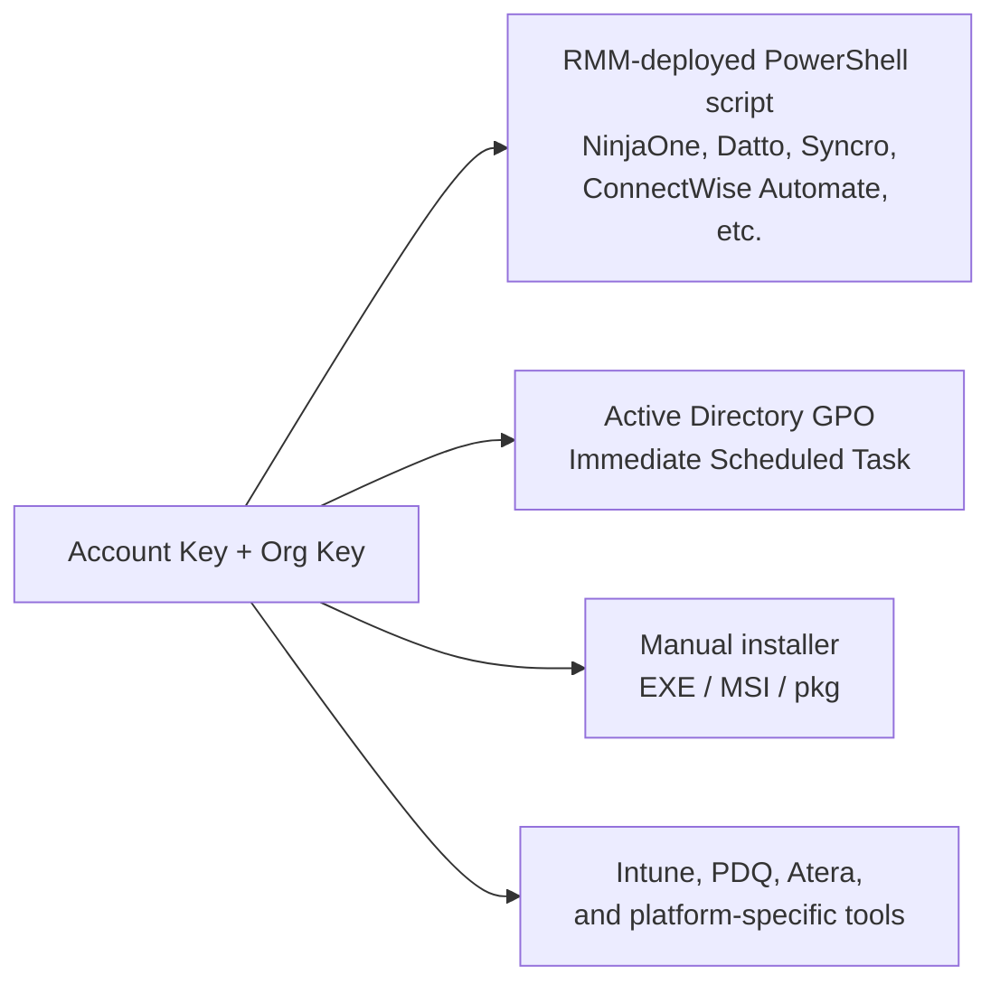

The agent is one binary, two identifiers, and one of several deployment paths. Get the keys right and the install paths almost always work. Get the keys wrong and you will burn an afternoon chasing a registration error that says exactly what is wrong if you read it.

## The two keys

Per the Account Keys, Organization Keys and Agent Tags documentation:

- **Account Key.** A long opaque secret tied to the MSP's Huntress account. It controls billing, every agent installed with this key bills against the MSP's contract. Treat it as a credential. Available to Account-level users on the *Download Agent* page.
- **Organization Key.** A short, partner-defined identifier per customer. The platform uses it to slot the agent into the right Huntress Organization. If the Organization Key doesn't match an existing Organization, the platform creates one automatically. The Organization *name* in the portal can be renamed for display, but the Key is what binds agents — renaming the Organization does not migrate agents off an old Key.

Spaces in the Organization Key are sanitised: the PowerShell deployment script strips them, the EXE installer turns them into dashes. Pick a key without spaces and the two paths produce the same Organization name.

## What counts as registered

Per the Windows install guide:

- The base agent registers with the portal **within 15 minutes** of install (usually faster). It then begins periodic surveys.
- The EDR component (Rio), required for Process Insights and SIEM, layers in **typically within an hour** of the base agent, but vendor docs allow up to 24 hours, so a four-hour Rio gap is still inside the documented window. Verify it via the Agent Overview page's *EDR Version* field.

"Registered" means the agent appears under the right Organization with the right hostname and a recent Last Seen timestamp.

## The deployment paths

Two principles apply across paths:

- **Prefer the PowerShell script over a static installer file.** The script always pulls the current agent build, the EXE pinned in your RMM template eventually goes stale.
- **Don't hard-code the Account Key in shared script bodies.** Where the RMM supports it, store the key as a script variable or a global custom field. The NinjaOne guide demonstrates the pattern with a `HuntressInstallKey` mandatory script variable.

### The supported routes (Windows)

The Windows install guide explicitly lists Huntress-supported deployment scripts for ConnectWise Automate, Datto RMM (ComStore), Syncro, Continuum, Kaseya, Naverisk, NinjaOne (NinjaRMM), N-able N-central, N-able RMM, ConnectWise Control / ScreenConnect, and PDQ. The cross-cutting GPO + Immediate Scheduled Task pattern is covered in its own article and is the right answer when there is no RMM yet but there is Active Directory.

A common GPO gotcha from the documentation: the Domain Computers security group needs Read & Execute NTFS permissions and Read SMB share permissions on the script's location, because the install runs in the computer account context (before user logon). Most "GPO didn't deploy" tickets trace back to that share permission.

## A worked install: Able Moose Accounting

Sarah at Able Moose Accounting has bought ten new laptops; they are joined to the existing AD and visible in the customer's NinjaOne RMM.

<StepThrough client:load>
<Step title="Pull the Account Key">
In the Huntress portal, hamburger menu, Download Agent. Use *Copy Key* to grab the Account Key (an opaque random string). The neighbouring *Regenerate Account Key* button is the offboarding lever, never the install lever — use it when a tech who had the key leaves. Treat the page like a credentials page; don't screenshot it into a chat.
</Step>
<Step title="Confirm the Organization Key convention">
Per the NinjaOne guide, the Organization Key is the customer's NinjaOne site name. For Able Moose Accounting that's `AbleMooseAccounting` (no space). Confirm it matches what's already in the portal so existing agents don't get split into a new Organization.
</Step>
<Step title="Run the deployment script">
In NinjaOne, the saved Huntress deploy script reads the Account Key from a global custom field, picks up the Organization Key from the site name, and runs as System. Target the policy to the new laptops.
</Step>
<Step title="Verify in the portal">
Within 15 minutes the new hostnames appear under Able Moose Accounting in Agents. The columns to scan are *Hostname*, *EDR Version*, and *Last Seen*. An empty EDR Version on a five-minute-old agent is normal — Rio layers in shortly after the base agent registers. The toolbar above the list (Uninstall, Move To, New Task, Download, Filter) is for moving or removing existing agents, not for verifying a fresh install.
</Step>
</StepThrough>

## When registration fails, read the message

Three errors from the install troubleshooting guide that come up most:

**`unable to register agent: invalid account secret key`**
Account Key wrong, most often a stray space at the start or end. Re-copy the key from the Download Agent page; confirm no whitespace either end.

**`Installer failed to complete in 120 seconds. Possible interference from a security product?`**
A third-party AV or SSL inspection is blocking. Allowlist the Huntress installer in the existing AV; confirm SSL/TLS inspection isn't intercepting Huntress certs.

**`The Huntress Agent is already installed in C:\Program Files\Huntress`**
An agent install exists already. Either confirm the existing install is healthy and registered, or uninstall first.

`C:\Windows\Temp\HuntressInstaller.log` and `C:\Program Files\Huntress\HuntressAgent.log` on the endpoint are the authoritative source for what the installer did.

<Checkpoint slug="huntress-incident-triage-checkpoint-agent" client:load />

## Uninstalling

Two reasons to uninstall: the endpoint was wiped or decommissioned (you want to stop billing), or you're cleaning up an agent that registered to the wrong place. Per the uninstall guide, the recommended paths are *Remote Uninstallation* from the portal (single agent), *Bulk Remote Uninstallation* (whole Organization or all Unresponsive agents), and the break-glass option for Tamper-Protection-disabled scenarios.

The Tamper Protection caveat is important: a local uninstall on a Windows or macOS endpoint requires Tamper Protection disabled for ~30 minutes first, with the HuntressRio service running in that window. The remote-uninstall route bypasses that need.

For decommissioned endpoints you can no longer reach, remote-uninstall from the portal closes any associated incidents and removes the agent from your billing count. Agents are marked Unresponsive after 45 days without a check-in; bulk-uninstalling unresponsive agents periodically keeps the dashboard clean.

<Callout type="info" title="Sources">
[Install the Huntress Agent for Windows OS](https://support.huntress.io/hc/en-us/articles/4404005189011-Install-the-Huntress-Agent-for-Windows-OS), [Install via Group Policy GPO and Immediate Scheduled Task](https://support.huntress.io/hc/en-us/articles/4404012795027-Install-via-Group-Policy-GPO-and-Immediate-Scheduled-Task), [Install via NinjaOne RMM Windows](https://support.huntress.io/hc/en-us/articles/4404012714003-Install-via-NinjaOne-RMM-Windows), [Using Account Keys, Organization Keys and Agent Tags](https://support.huntress.io/hc/en-us/articles/4404012734227-Using-Account-Keys-Organization-Keys-and-Agent-Tags), [Uninstalling the Huntress Agent](https://support.huntress.io/hc/en-us/articles/4404005116435-Uninstalling-the-Huntress-Agent), [How do I remove an agent so that I am no longer billed for it](https://support.huntress.io/hc/en-us/articles/4404012681875-How-do-I-remove-an-agent-so-that-I-am-no-longer-billed-for-it).
</Callout>
