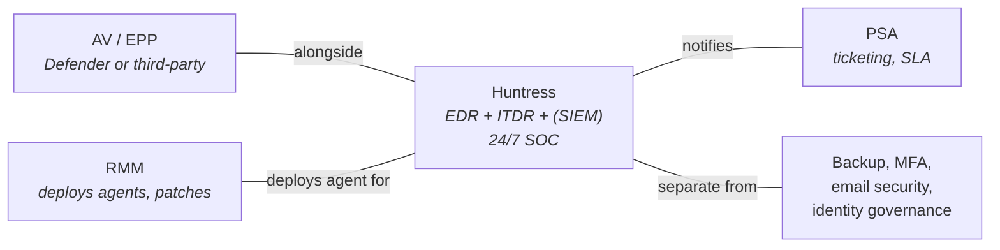

Carry the wrong mental model of Huntress into your first ticket and you will work the ticket wrong. The most common wrong model is "Huntress is just AV with a fancier dashboard." It is not. AV decides whether to block something for you. Huntress collects telemetry, runs analysis, hands a recommendation to a human SOC analyst, and asks you to take action on the analyst's call. The work on this platform is mostly *responding to an analyst*, not *responding to an alert*. The shape of every lesson in this course depends on that distinction landing.

## What Huntress actually is

Huntress is a managed security platform sold mostly to MSPs. Three product surfaces sit inside it and share one back end: Managed EDR on the endpoint, Managed ITDR on Microsoft 365 and Google Workspace identities, and an optional Managed SIEM for ingested logs. Ransomware canaries are a tripwire feature *inside* Managed EDR — they are not a fourth surface. Managed SAT is a separate product and is out of scope for this course.

All three surfaces feed the same SOC. When telemetry crosses a threshold the SOC cares about, an analyst looks at it, decides if it is a real signal, writes up an Incident Report with a recommendation, and routes that to the MSP. Lesson 06 walks each surface in detail; this lesson is the framing.

## Where it sits in the stack

Huntress does not replace the rest of the stack. It expects to run alongside an AV product, get pushed via the RMM, and pipe Incident Reports into the PSA. Backup, MFA, email security, identity governance — Huntress doesn't do those. The mental model: **Huntress is the layer that catches what the others miss and triages the catch before it reaches you.** The SOC is the human in the loop the rest of the stack doesn't have.

## How Huntress differs from AV

The headline differentiator is **isolation, not blocking**. When the SOC sees enough signal to call something a high-confidence compromise, the SOC contains the affected *thing* — the whole endpoint, the whole identity — to prevent the threat spreading inside the customer. AV doesn't have an equivalent. AV decides whether to block a specific file; it doesn't take a host or a mailbox out of circulation. Containment is the SOC's job, not the tech's. (Lesson 15 covers ITDR's documented auto-response actions; later lessons cover EDR host isolation and the Managed Response automated remediation the SOC can take.)

Three supporting differences flow from that.

First, **AV blocks individual files. Huntress isolates whole entities.** The unit of action is different. AV quarantines `evil.exe`; Huntress isolates `WS-FINANCE-04` from the network, or revokes a user's session and resets their credentials.

Second, **AV is binary; Huntress is graded.** Malicious or not vs. Low, High, Critical (severity bands are lesson 09). The grading drives the response model. A Low EDR detection is a different shape of work from a Critical one, and only the high-confidence end of the spectrum triggers SOC-driven containment.

Third, **AV's expert opinion is signature-based. Huntress's expert opinion is a named analyst.** That changes the relationship. You don't second-guess the analyst on disposition without a new signal, but you can ask them clarifying questions. The "don't second-guess the SOC" rule is the keystone of lesson 05.

<Callout type="info" title="The easiest tell">
If an incident notification is signed by a named SOC analyst, that is Huntress. AV alerts don't carry a human signature. When a client says "the AV caught it," that was probably the AV. When a senior says "what does Huntress say?," they mean the Incident Report.
</Callout>

## What this looks like on a ticket

A client emails: *Defender just blocked something on Sarah's machine, we're worried, should we be doing anything else?* You check the portal and there is no Huntress incident for Sarah's host. The right read is not "Huntress missed it." The right read is: Defender did its job, Huntress watches behaviour *around* the catch (autoruns, scheduled tasks, lateral signals), and nothing crossed the SOC's threshold. Confirm the endpoint is clean and reassure the client. Defender noisy and Huntress quiet is a normal, designed state.

When a client asks the deeper question — *is Huntress just AV?* — the framing to use is *alongside*, not *instead of*. "Huntress sits alongside Defender. Behavioural and identity telemetry feeds a 24/7 SOC. Defender blocks individual files; Huntress catches what gets past the block and, when the SOC is confident the customer is being compromised, isolates the affected endpoint or identity so the threat can't spread while we respond."

## Misconceptions to drop now

- *It is just MDR-as-a-service / just AV.* Overlaps with both labels and is neither. The SOC plus the recommendation model is what makes it neither.
- *If Huntress catches it, AV must have missed it.* The AV may have caught and quarantined the file; Huntress is reporting on the behaviour around it. Both being involved is the design, not a failure.
- *Huntress will block things for me.* Mostly no. ITDR has documented auto-response actions (lesson 15); the default model elsewhere is collect, analyse, recommend, action. The tech is the actioning party.

## What to do with this

When a Huntress incident lands, the first reflex is *find the recommendation*. The analyst has done the analysis already; your job is to read what they wrote and act on what they recommended. Lesson 05 (the SOC model) and lesson 11 (recommendation vs. context) sharpen this further. When you see a Huntress tag on a ticket, ignore the temptation to start investigating before reading the recommendation. The investigation has happened. What remains is the response.

<Checkpoint slug="huntress-foundations-checkpoint-what-huntress-is" client:visible />
