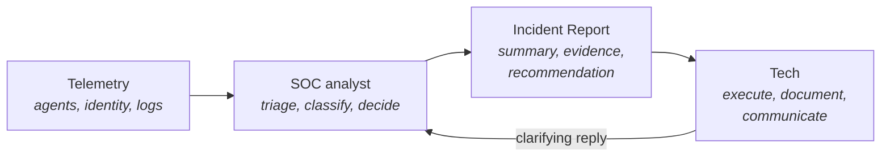

This is the keystone of the course. Half of the new-tech mistakes the rest of the lessons warn against are the same mistake in different clothing: not trusting the analyst on the other side of the Incident Report. Once this lands, the rest of the platform makes sense. Until it lands, every Incident Report feels like the start of an investigation rather than the closing of one.

## What "managed SOC" means here

A SOC, Security Operations Centre, is a team of analysts who watch security telemetry and decide what to act on. Huntress runs theirs 24/7, staffed by humans backed by automation. The model is: the platform collects telemetry from agents, identity sources, and (optionally) ingested logs. Anything that crosses a threshold of interest does not go straight to you. It goes to an analyst first.

The analyst reads the raw signal, pulls context (the host, the user, recent activity, known false-positive patterns for that customer), decides whether it's a real incident, and writes an Incident Report with a recommendation. By the time you see the report, three things have already happened: triage, classification, and recommendation. The Incident Report is the *output* of analysis, not its input.

That's the part the new tech has to internalise. The work that looks like investigation has been done by someone whose job is to do it. Your work is downstream of theirs.

## The default disposition

In a traditional alert pipeline (AV pops up, a generic SIEM raises a rule), the tech's job is to figure out whether the alert is real before deciding what to do. The default disposition is *investigate, then act*. That mental model is wrong on Huntress and it is the model new techs bring with them.

The Huntress default is: read the recommendation, verify the host or user matches, perform the recommended action, document, close. The analyst has done the "is this real" question for you. Doing it again, from a tech's seat with a fraction of the analyst's tooling, is wasted time at best and a stuck ticket at worst.

This does not mean you turn your brain off. It means the work you're doing is executing the recommendation correctly on the right host, not deciding whether the recommendation is correct. That distinction is the whole game.

## The cardinal mistake

The single most common new-tech failure on this platform is second-guessing the analyst. It shows up in a handful of recognisable shapes:

- The tech reads the Incident Report, decides the activity "looks legitimate," and closes the incident without performing the recommended action.
- The tech reopens a closed incident "to take another look," with no new signal, only unease.
- The tech sends a reply to the analyst arguing the disposition, when what they wanted was clarification.
- The tech "softens" the recommendation: does part of it, skips the part that worried them.

All four flow from the same misread. The tech still thinks step one is *decide if this is real*. It is not. Step one was the analyst's, hours or minutes before the report landed.

<Callout type="warn" title="The keystone rule">
The right move when something doesn't fit is **clarify, not override**. A reply to the analyst on the Incident Report, phrased as a factual question, is the right surface. The "don't second-guess the SOC" rule is about unilateral disagreement, not about disagreement at all.
</Callout>

## "New signal" vs. "gut feeling"

The one legitimate reason to challenge a closed Incident Report is **new signal**, information the analyst didn't have when they wrote the recommendation. *My gut says this is wrong* is not new signal. The two get confused under pressure. The tree below sorts them.

<DecisionTree client:load
  startId="root"
  nodes={[
    { type: "question", id: "root", prompt: "Something about this closed incident is bothering you. What kind of thing?", choices: [
      { label: "A specific new fact the analyst didn't have", next: "specific" },
      { label: "A feeling that the disposition is wrong, no new fact attached", next: "gut" },
      { label: "Something the Evidence section said, that I re-read", next: "evidence" },
    ]},
    { type: "question", id: "specific", prompt: "Is the new fact something external — another host, another user, a customer statement, a different system?", choices: [
      { label: "Yes, a second host or user shows the same activity, or a customer told me something material", next: "reply" },
      { label: "No, it's still inside the same Incident Report", next: "gut" },
    ]},
    { type: "outcome", id: "reply", label: "New signal — reply to the analyst", tone: "success",
      body: "This is what \"new signal\" means. Post the new fact on the Incident Report as a reply, leave the incident in whatever state the analyst left it in, and let them update the disposition. Don't reopen, don't re-action, don't override." },
    { type: "outcome", id: "gut", label: "Gut feeling — accept the disposition", tone: "warn",
      body: "Unease alone isn't new signal. The analyst weighed the same evidence and reached a disposition. Re-deciding from your seat is second-guessing in slow motion. Document, move on. If a specific new fact arrives later, you can come back." },
    { type: "outcome", id: "evidence", label: "Same evidence, same conclusion — accept the disposition", tone: "warn",
      body: "Re-reading the Evidence section produces the same input the analyst already weighed. If something in the Evidence reads differently to you, that's a question for the analyst on the original ticket; it's not grounds to reopen. The reading-order lesson (10) and recommendation-vs-context lesson (11) sharpen this further." },
  ]}
/>

## A worked ticket: Able Moose Accounting

A High-severity EDR Incident Report lands for Able Moose Accounting. The host is the IT manager's laptop. The Recommendation says: approve the autoruns remediation. The Evidence shows a scheduled task running a script at login. The IT manager calls you, says he set up that scheduled task himself yesterday and it's deliberate.

The wrong moves are easy to name. Closing the incident on his word overrides the SOC on a verbal claim. Approving the remediation anyway runs a remediation on a senior user's machine without confirming whether the new context is being weighed; you get the angry follow-up. The right move is a reply to the analyst with the new context: *user confirms he created this scheduled task yesterday, please advise on whether to proceed*. The IT manager's statement is new signal. The analyst is the right body to weigh it. You're neither overriding nor blindly executing.

When the analyst replies an hour later confirming the task is legitimate, your job is documentation and client comms. The ticket closes. If a peer says *we should approve the remediation anyway, to be safe*, you've watched the cardinal mistake try to come back through the side door.

## What to do with this

When the next Incident Report lands, run two checks before doing anything else. Find the Recommendation section and read it. Verify the host or user the recommendation applies to is the right one (a typo from the analyst, while rare, would be caught here). Then execute. If something does not fit, the reply is *factual question, please clarify*, not *I'm closing this, I disagree*.

The senior cue worth listening for: a senior who asks *did you action it?* rather than *did you investigate it?* is using the right verb. The verb maps to the model. Acting on the recommendation is the work; investigating from your seat is duplicating the analyst's with worse tooling.

<Checkpoint slug="huntress-foundations-checkpoint-managed-soc-model" client:visible />
