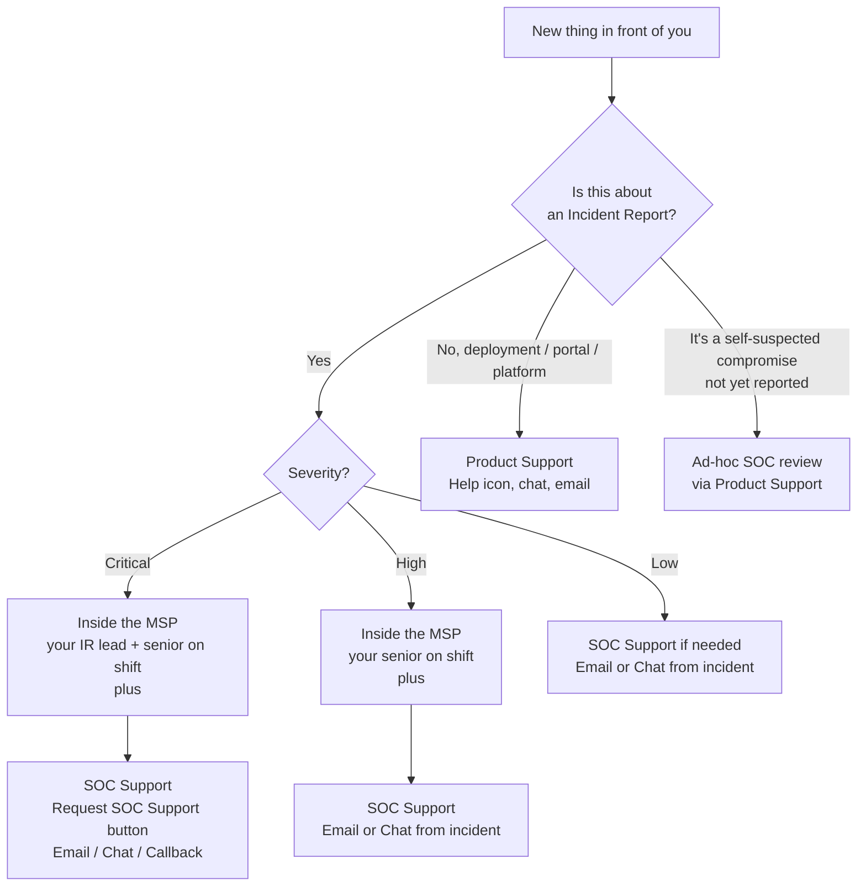

A helpdesk technician's job in a Huntress workflow is to action what the SOC has confirmed and to know when something needs to leave the helpdesk. Both halves matter. Escalating everything is a tax on the SOC and your seniors; escalating nothing means a Critical incident lands on a Friday afternoon and gets resolved by the end-of-shift handover.

## Three channels, not one

There are two vendor-side channels and one MSP-side channel, and the MSP-side one is the part this lesson can't fully prescribe — it's defined by your MSP's runbook, not by Huntress. Find out who runs incident response inside your MSP, who the named senior is on each shift, and what the after-hours rotation looks like, *before* a Critical lands at 4:55pm on a Friday.

The vendor side: SOC Support handles incident-related questions; Product Support handles everything else (deployment issues, portal bugs, integration problems). Per the platform overview, ad-hoc SOC review is available for partners during business hours through Product Support, who triage and pass to the SOC for topics like government breach notifications, self-identified suspected compromise, or third-party security alerts referencing your environment.

The MSP side: Critical and High incidents involve the MSP's own incident-response chain *as well as* SOC Support, not instead of it. Whose name goes on which row of that chain is your MSP's call.

## When to use SOC Support

The Request SOC Support button appears on Critical incident reports and is restricted to Account-level Admins and Security Engineers. It opens three contact paths:

- **Email.** `incidents@huntress.com`. Goes into the SOC Support queue with a follow-up.
- **Chat.** Real-time chat session.
- **Callback.** A SOC Support team member calls back. **Only on Critical reports**; Huntress callbacks are made from `1-833-486-8669`, a useful number to put in the team contact list so a real call from the SOC isn't mistaken for a cold call.

Use SOC Support when:

- The incident report doesn't make sense after a careful read.
- You are partway through remediation and something doesn't match (a remediation step fails repeatedly, an indicator the SOC mentioned isn't there).
- The customer has questions you can't answer from the report alone.
- A Critical incident is in progress and you need a second set of eyes during business hours.

SOC Support is scoped to active incidents, ad-hoc threat questions tied to a real concern, and breach-notification scenarios. Generic "what does Huntress think about this domain" hunting is what the SOC does during an investigation, not a helpdesk trivia line.

## When to use Product Support

Use Product Support when the question is about the platform, not the incident:

- The agent installer keeps failing on a specific machine.
- The PSA integration stopped creating tickets.
- A new tenant won't onboard to ITDR.
- A Managed AV policy isn't applying as expected.
- A Process Insights alert table looks broken.

Per the Chat Support guide, the Help icon sits in the lower-left of the dashboard. Click it to open the chat-bot, then choose *Get in Touch* and *Live Chat*. Pick *Product Support* unless the question is genuinely about an incident, in which case *SOC Support*.

## When to escalate inside the MSP

The SOC's report tells you the technical fix; the MSP's runbook tells you who needs to know. The shape below is a generic starting point — every MSP has its own version, and the named contacts and after-hours numbers belong on a printed page next to your monitor or in the team's pinned channel, not in a vendor's training notes. If your MSP doesn't have a written escalation matrix yet, that's the first thing to flag to your team lead.

| Situation | Escalate to (typical pattern) |
|---|---|
| Critical incident on any customer | Whoever runs incident response inside your MSP, immediately, regardless of hour. |
| High incident affecting multiple endpoints in one customer | Same. Multi-endpoint scope changes the conversation. |
| ITDR Unwanted Access (suspicious M365 login) | Account holder (with their MFA already trusted) plus customer's named primary contact. |
| Customer-business-impacting findings (mailbox forwarding rules, identity isolation) | Customer-side primary contact, via the documented path. |
| Anything you don't have authority to action (re-image, password reset, account disable) | The named senior on shift. |
| A report that conflicts with what the customer says they were doing | SOC Support, *and* the senior on shift. |

The boring rule: when you escalate, send the incident URL, the report severity, the affected hostname or user, and your one-sentence summary of what you're being asked to decide. A tech who escalates with "the SOC sent a report, what do I do?" wastes the senior's time recreating the context.

## A worked decision: Able Moose Accounting

A Low severity Incident Report lands at 10am on a Tuesday: a Process Insights detection for a `wmiprvse.exe` spawning `cmd.exe` on `AMA-LAPTOP-04`. The report flags it as suspicious but not actively malicious; remediation is informational, no manual or assisted steps required.

<DecisionTree client:load
  startId="d1"
  nodes={[
    { type: "question", id: "d1", prompt: "Is the report Critical or High?", choices: [
      { label: "Critical or High", next: "esc-now" },
      { label: "Low", next: "d2" },
    ]},
    { type: "question", id: "d2", prompt: "Is the customer asking you to investigate, or is the report informational only?", choices: [
      { label: "Customer is asking", next: "d3" },
      { label: "Informational only, no remediation steps", next: "acknowledge" },
    ]},
    { type: "question", id: "d3", prompt: "Do you have enough context to answer from the report?", choices: [
      { label: "Yes", next: "acknowledge" },
      { label: "No, the customer's question is beyond the report", next: "soc-support" },
    ]},
    { type: "outcome", id: "esc-now", label: "Escalate inside the MSP and contact SOC Support", tone: "warn",
      body: "Critical and High reports go to whoever runs IR for your MSP, immediately. Use Request SOC Support for callback or chat if needed." },
    { type: "outcome", id: "acknowledge", label: "Acknowledge and resolve", tone: "success",
      body: "Read the report, mark it acknowledged, resolve. Note in the PSA ticket why no further action was needed." },
    { type: "outcome", id: "soc-support", label: "SOC Support via the report", tone: "info",
      body: "Open the report, use Email or Chat from inside it. Bring the customer's specific question." },
  ]}
/>

## Where notifications land

Huntress reports flow through whichever integrations are configured. The supported destinations include the PSA (ConnectWise Manage, Autotask, Syncro, HaloPSA, Kaseya BMS), generic email integration, and Microsoft Defender for Endpoint forwarding. Cell phone SMS notifications exist via a separate "Cell Phone Text Notifications" integration for after-hours coverage. The Intermediate course covers PSA mapping in detail; for now, the helpdesk-relevant fact is *every confirmed incident creates a ticket via the configured integration*. If a tech sees an incident in the portal but no PSA ticket arrived, the integration is broken, that's a Product Support problem.

<Checkpoint slug="huntress-l1-checkpoint-escalation" client:load />

<Callout type="info" title="Sources">
[Requesting SOC Support for Incident Reports](https://support.huntress.io/hc/en-us/articles/35542397154835-Requesting-SOC-Support-for-Incident-Reports), [How to use Chat Support](https://support.huntress.io/hc/en-us/articles/28323423983763-How-to-use-Chat-Support), [What is the Huntress Managed Security Platform](https://support.huntress.io/hc/en-us/articles/15125647051923-What-is-the-Huntress-Managed-Security-Platform), [Huntress Portal User Permissions](https://support.huntress.io/hc/en-us/articles/4404012728083-Huntress-Portal-User-Permissions), [Use Email for Incident Report Integrations](https://support.huntress.io/hc/en-us/articles/4404005082387-Use-Email-for-Incident-Report-Integrations).
</Callout>
