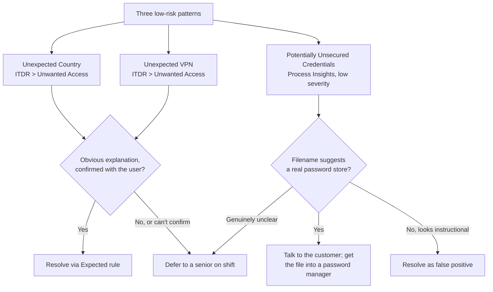

The *Reading a Huntress Incident Report* lesson covered the headline events: SOC-confirmed Critical and High reports the helpdesk treats with urgency. Most days, the volume in the portal looks different. An Unexpected Country escalation, an Unexpected VPN escalation, a low-severity Potentially Unsecured Credentials report. None of those are the SOC saying "we caught a breach". Each one is the system asking whether the activity is expected, and the answer is almost always either obvious or one short question to the customer away.

## Three patterns that account for most low-risk volume

Three detection sources you'll see day to day. They surface differently in the portal but triage the same shape: identify the noise, ask the obvious question, decide.

## Unexpected Country

A login event arrived from a country that doesn't match the identity's Microsoft Entra Usage Location and isn't covered by an Expected rule under [ITDR](/glossary/itdr/) > Unwanted Access. Per the Huntress docs, the platform rolls up further unexpected logins for that country and Organization into the same escalation until someone resolves it with a rule.

The first question is always the obvious one: **are they on holiday, or expected to be working from another country?** Annual leave, a wedding overseas, a contract role in another office, all of it normal. A short call or Teams ping to the user (or to the customer's office manager) usually closes it in a minute.

How to resolve once the answer is "yes, they're in Bali for two weeks":

- Open the escalation in the portal.
- Create an **Expected** rule at the Identity level (just this user) or Organization level (a customer that does business widely abroad).
- For travel-bounded cases, set a **Start Date** and **Expiration Date**, both honoured in UTC. The rule auto-expires when the trip ends.

Reserve the opposite resolution, **Unauthorized**, for confirmed-malicious cases. Per the Huntress docs: *"Rules created for Unauthorized locations and VPNs will immediately cause a Critical alert and Incident Report to be generated and will logout and disable the associated identity"*. That is a real action with a real customer impact. Don't reach for it casually.

## Unexpected VPN

Same shape as Unexpected Country, but the discriminator is the VPN or proxy network the login came through. The first question, every time: **did the user enable a VPN?**

The most common cause we see at the helpdesk: someone installed a personal VPN client (NordVPN, ExpressVPN, Mullvad, the free tier of any of them) on a phone or personal laptop, and then logged into Microsoft 365 through it. The login is theirs; the network is novel. If the customer also runs a corporate VPN or has agents on a known SD-WAN, you'll often see a one-time Unexpected VPN per VPN endpoint until somebody marks it Expected at the Organization level.

Resolution mirrors the country flow: **Expected** at the Identity, Organization, or Account level (with optional date bounds), or **Unauthorized** if the access is confirmed malicious. The same logout-and-disable warning applies.

<Callout type="warn" title="Account-level Deny All can override what you set further down">
Per the Unwanted Access docs, when an Organization has Deny All enabled at its own level, the Account-level rules don't apply to that organization at all (Organization-level rules take over completely). The cascade isn't always intuitive when a customer has both layers configured. If you change a rule and the behaviour doesn't match what you expected, check the higher-level Deny-All toggles before assuming the rule itself is broken.
</Callout>

## Potentially Unsecured Credentials

This one arrives as a low-severity Incident Report from [Process Insights](/glossary/process-insights/), the EDR detection layer. The surface is different from the Unwanted Access escalations above; the triage discipline is the same. One load-bearing fact gates the work:

**Huntress matches on the filename, not the file contents.** From the documentation: *"we do not collect and analyze file content to actually verify credential data is present. But, based on empirical and anecdotal evidence files named password.xlsx often contain insecure password data"*.

Your triage starts by reading the filename out loud and asking: *does this name suggest a real password store, or does it just contain the word "password"?*

| Filename | Likely | Action |
|---|---|---|
| `company_passwords.xlsx` | Real password spreadsheet | Talk to the customer; get them onto a password manager. Resolve the report. |
| `office_passwords_2024.txt` | Real password file | Same. |
| `secure_password_guide.pdf` | IT or vendor instructional document | False positive. Resolve. |
| `password_reset_form.docx` | HR or IT template | False positive. Resolve. |
| `passwords_old.txt` | Could be either | Ask the customer before resolving. |

Cadence facts worth holding so you don't over-triage these:

- Reports go out at **1000 UTC daily**.
- A given host won't generate **more than one report every 30 days**, so the same machine isn't going to spam the queue.
- There is **no Assisted Remediation** for this category; resolution is manual.
- The portal supports **bulk resolve** if a wave of the same false-positive pattern lands across an Organization.
- Huntress does **not support file-level exclusions** today. You can exclude a host or an Organization in Settings > Managed Response > Exclusions, but you can't tell Huntress to ignore one specific filename. Use the broader exclusion sparingly; you're hiding a class of detection from one host or a whole customer.

## Defer when you're even 5% uncertain

At this level on the helpdesk, make the final call only on things you're certain about. *Certain*, not *probably*. A senior on shift would rather field three "is this real?" questions than untangle one badly-resolved escalation a week later.

Three cases that always leave the helpdesk regardless of how the alert looks:

- **You can't reach the user** to confirm "are you in country X?" or "did you turn on a VPN?". Don't guess. Hold the escalation, ping the customer's primary contact, escalate to a senior if the user is genuinely out of contact.
- **The obvious answer doesn't quite fit.** User says they're in Sydney, login is from Manila. User says they didn't enable a VPN, but the IP geolocates to a known consumer-VPN endpoint. Both are escalation moments, not "trust the easy answer" moments.
- **Multiple low-risk alerts on the same identity in the same week.** Three Unexpected Country escalations on the same user within a week, even from countries the user explains plausibly, is a pattern. Flag it. Patterns are the SOC's job to read; the helpdesk's job is to surface them.

The escalation lesson covers the channels (SOC Support inside the report, Product Support for platform issues, your MSP's own runbook for the internal chain).

## A worked decision: Able Moose Accounting

Sarah at Able Moose Accounting just triggered an Unexpected Country escalation. The login is from Bali, Indonesia. Her Microsoft Entra Usage Location is Australia.

<DecisionTree client:load
  startId="d1"
  nodes={[
    { type: "question", id: "d1", prompt: "Have you reached Sarah (or her office manager) to confirm she's travelling?", choices: [
      { label: "Yes, Sarah confirms she's in Bali for two weeks of leave", next: "expected-bounded" },
      { label: "Yes, Sarah says she is not in Bali and isn't using a VPN", next: "unauthorized" },
      { label: "No, can't reach Sarah right now", next: "hold" },
    ]},
    { type: "outcome", id: "expected-bounded", label: "Create an Expected rule with start and end dates", tone: "success",
      body: "Identity-level Expected rule for Sarah's account, Location = Indonesia, Start = today, Expiration = her return date. The rule auto-expires; nothing to remember to clean up later." },
    { type: "outcome", id: "unauthorized", label: "Escalate; do not unilaterally hit Unauthorized", tone: "warn",
      body: "Sarah's account is potentially compromised. Escalate to the senior on shift before flipping the rule to Unauthorized. Unauthorized triggers an immediate logout-and-disable, which is the right action if confirmed but is not a helpdesk-unilateral call. The senior decides whether to also raise this with SOC Support." },
    { type: "outcome", id: "hold", label: "Hold the escalation; chase a confirmation", tone: "info",
      body: "Don't resolve. Don't create a rule on a guess. Try the customer's primary contact, leave a message for Sarah, note your attempts in the ticket. If the escalation is still unresolved at end of shift, hand it over with the chase log so the next person picks it up where you left off." },
  ]}
/>

<Checkpoint slug="huntress-incident-triage-checkpoint-low-risk-reports" client:load />

<Callout type="info" title="Sources">
[Unwanted Access Overview](https://support.huntress.io/hc/en-us/articles/32426389935635-Unwanted-Access-Overview), [How to Create an Unwanted Access Rule](https://support.huntress.io/hc/en-us/articles/32325189301523-How-to-Create-an-Unwanted-Access-Rule), [Potentially Unsecured Credentials](https://support.huntress.io/hc/en-us/articles/21966460493331-Potentially-Unsecured-Credentials).
</Callout>
