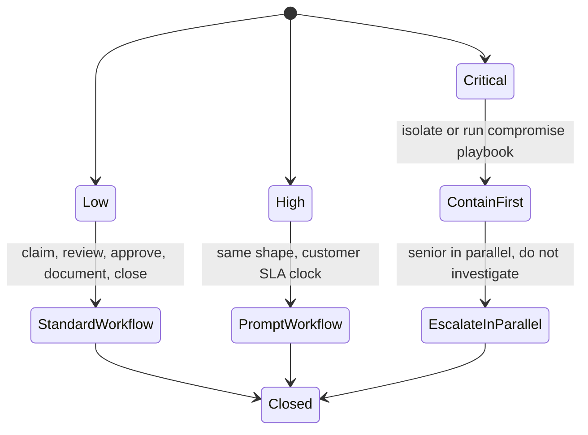

Severity drives the entire response shape. Two incidents with the same body text and the same hostname get worked differently if one is Low and one is Critical. The tech who doesn't internalise the bands does the right things at the wrong tempo: investigating a Critical, queueing a Low, or worse, treating a Critical as a Low because the title didn't shout loudly enough.

## The three bands and their response shapes

The grading is the SOC analyst's call. You do not re-grade.

### Low

The SOC has confirmed a signal worth your attention but the activity is not compromising the endpoint or identity. Examples: a process detection that's suspicious but not running with elevated rights; an autoruns entry from a legitimate-but-uncommon vendor; a sign-in from a new country that the user confirms.

The response is *standard workflow*: claim, review the recommendation, approve any remediations, verify, document, close. Done at normal tempo during business hours.

### High

The SOC has confirmed a signal that needs prompt action, but the activity is not at the level where you'd wake someone up. Examples: a scheduled task running PowerShell with encoded commands; a malicious-looking inbox rule auto-forwarding mail to an external address; an OAuth grant to a third-party app the user doesn't recognise.

The response is *prompt workflow*: same shape as Low, less tolerance for sitting in a queue. Your MSP's SLA usually sets the clock on this band. After-hours, High incidents wait for the morning unless the SLA specifies otherwise.

### Critical

The SOC has confirmed activity that requires containment now. Examples: ransomware canary trip; mass deletion of files; lateral movement indicators; admin-credential abuse; tenant-wide identity compromise indicators.

The response model is *different from Low and High*: contain first (isolate the host, run the ITDR compromise playbook on the identity), escalate in parallel, **do not investigate**. Forensics and persistence-hunting are above the helpdesk ceiling. After-hours Criticals wake the on-call senior; the SLA on Critical is *now*.

## How the bands map to your MSP's SLAs

Huntress does not enforce an SLA on your side; that's your MSP's contract with each customer. The bands are inputs to those SLAs. A typical mapping looks something like this, though every MSP has its own:

- Critical: respond within minutes, contain, escalate.
- High: respond within business hours, complete within the customer's High SLA (often 4 to 8 hours).
- Low: respond within the customer's Low SLA (often 1 business day) or batched into a session that clears the queue.

Two reasons to learn your own MSP's actual numbers rather than relying on the typical pattern: customer tiers (your high-value tenants have tighter SLAs than your small-business tenants), and after-hours rules (some MSPs treat High as wake-the-senior after-hours, most don't).

## The band and the recommendation should line up

The recommendation in an Incident Report is severity-aware. A Low incident's recommendation will be a remediation to approve. A High incident's recommendation might be a remediation plus a user-verification step. A Critical incident's recommendation will lead with *isolate the host* or *execute the compromise playbook*.

<Callout type="warn" title="When the band and the text disagree">
If the tag and the recommendation text don't seem to match (a Low incident with *isolate* in the recommendation, say), that's worth a clarifying reply to the analyst before acting. The mismatch is information; the right surface for it is a 30-second reply, not a unilateral re-grade.
</Callout>

## Two misconceptions worth dropping now

*The severity is just a label, I can decide it's actually different.* The severity is the SOC's call. Disagreeing without new signal is the same family of mistake as second-guessing the recommendation. Ask the analyst to revisit; don't re-grade unilaterally.

*Low means I can ignore it.* Low means the SOC confirmed it as worth your time, just not at the Critical tempo. Ignoring Low is how queues become backlogs become incidents that should have been caught earlier.

## A worked Friday close

Two incidents land at 4:30pm on a Friday. You finish at 5pm; on-call starts at 6pm. Incident A: High severity, EDR, scheduled task with encoded PowerShell on a customer's file server. Incident B: Low severity, EDR, autoruns entry from an obscure software vendor on a workstation.

Work the High before 5pm. Leave the Low in the queue for Monday. High has the tighter SLA. Low can wait two-and-a-half business days without harm. Escalating both to on-call as the shift ends is the wrong shape, on-call is for incidents that arrive after hours or outpace your shift, not for clearing your queue.

If, while working the High, the customer's IT contact says they think the scheduled task was created during a software install last night and they're confident it's benign, that's new signal. Reply to the analyst with the new context, leave the incident open, finish your shift, hand it to the on-call with a note if it isn't resolved by 5pm. Closing the incident as benign on the customer's word is the cardinal mistake. Re-grading from High to Low yourself is two mistakes in one click.

<Checkpoint slug="huntress-foundations-checkpoint-severity-bands" client:visible />
