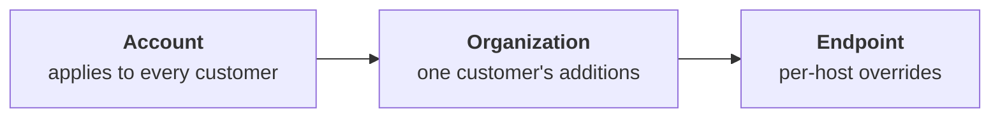

The first thing to know about Huntress at the engineer level: most of it is *not* policy-configured by the partner. The SOC's detection logic, the Process Insights ruleset, the ITDR detection set, those are managed by Huntress. What the partner does configure, deliberately, are the Managed Antivirus settings (Defender policies) and the exclusions across the estate. Get those right and the detection layer above them works as intended. Get them wrong and the SOC is investigating noise generated by your own configuration.

## What's policy-driven, what isn't

| Concern | Who owns the configuration |
|---|---|
| EDR / Process Insights detection logic | Huntress SOC (not partner-configurable) |
| ITDR detection logic | Huntress SOC (not partner-configurable) |
| Managed Defender policy (Audit vs Enforce, settings) | Partner, with Huntress Recommended Defaults to inherit |
| Managed Defender exclusions (paths, processes, extensions) | Partner |
| Ransomware Canary file rollout | Partner (on by default; can be disabled) |
| Host isolation triggers and bulk-isolate actions | Partner can act; SOC can also isolate during investigation. Per-host isolation is on the Agent overview; bulk-isolate (whole-Organization) is gated to Account-level Admin and is the right tool when the SOC's escalation describes an outbreak across multiple endpoints. |
| Process Insights detections themselves | Huntress (raised as Incident Reports) |

The mental model: the partner controls Defender's posture (what to scan, what to leave alone) and the on-endpoint surface (canaries, isolation), and the SOC sits on top of all of that watching for the things Defender misses or that span endpoints.

## The exclusion inheritance model

Managed AV exclusions inherit at three levels, broadest at the top:

Three levels, three jobs:

- **Account.** Genuinely cross-customer needs. The MSP's RMM agent path, perhaps a backup product the MSP standardises on. Anything here applies to every customer.
- **Organization.** Customer-specific applications. The bookkeeping suite Able Moose runs but Riverbend Legal doesn't.
- **Endpoint.** One-off, surgical, time-bounded carve-outs. A developer machine running an unsigned binary while we sort out an installer.

Exclusions apply within roughly an hour, often faster. When two levels overlap, the more specific one wins.

<Callout type="warn" title="Avoid Account level unless absolutely necessary">
Per the Exclusions article, Huntress explicitly discourages Account-level entries. Each one expands the silenced surface across every customer, including ones that don't run the application that justified it. Even when three customers genuinely need the same exclusion, prefer three Organization-level copies (or a same-Path different-Process variant) over one Account-level entry.
</Callout>

The Defender exclusion modal is the one place new mistakes get made. The screenshot below is the *Endpoint-level* form (the title says so); the *Organization* and *Account* equivalents look almost identical, except they target a customer or the whole MSP instead of a list of endpoints. Path / Process / Extension is the type selector across all three.

<AnnotatedScreenshot
  src="/img/huntress/add-exclusion-modal.png"
  alt="Create Endpoint-Level Exclusion Settings modal showing the Endpoints picker with Helios selected, three Exclusion Type rows for Path, Process and Extension, a risky-exclusion warning banner, and the acknowledgement checkbox above Submit"
  caption="Read this modal in order: scope is fixed by the title, endpoints are picked, exclusion rows are added, the warning explains the red highlights, and the acknowledgement gates Submit."
  aspect="878/641"
>
  <Hotspot client:load x={28} y={5} label="1" title="Scope is fixed by the modal title" purpose="Endpoint-Level here.">
    The Account- and Organization-level modals have nearly the same fields but no Endpoints picker, and they apply much more broadly. Read the title before you start typing.
  </Hotspot>
  <Hotspot client:load x={12} y={28} label="2" title="Endpoints picker" purpose="Which machines this applies to.">
    Multi-select; one or many endpoints. The narrowest scope on offer — pair it with a specific path or process for a surgical carve-out.
  </Hotspot>
  <Hotspot client:load x={14} y={50} label="3" title="Exclusion Type column" purpose="Path / Process / Extension.">
    Process is the narrowest. Path is mid-broad (a directory and everything under it). Extension is the broadest, almost never the right answer.
  </Hotspot>
  <Hotspot client:load x={58} y={57} label="4" title="Red-highlighted entries are risky" purpose="The portal flags broad patterns." tone="warning">
    Highlighted rows match Huntress's risky pattern (broad path, common process, common extension like .exe). The portal lets you proceed, but only via the acknowledgement below.
  </Hotspot>
  <Hotspot client:load x={5} y={88} label="5" title="Risk-acknowledgment checkbox" purpose="Gates Submit for risky entries." tone="warning">
    Forced tick when the type / scope combination is risky. A deliberate action, not a click-past — paste the ticket reference into the description field on the parent exclusion list afterwards.
  </Hotspot>
  <Hotspot client:load x={92} y={95} label="6" title="Submit" purpose="Commits the exclusion." tone="success">
    Exclusion takes effect within roughly an hour. Confirm by re-running the Defender scan that produced the original detection.
  </Hotspot>
</AnnotatedScreenshot>

## Three categories, one risk model

Per the Exclusions article, Defender exclusions break into three types:

| Type | What it excludes | Risky when |
|---|---|---|
| **Path exclusion** | A directory and all files beneath it | Excluding `C:\Users\<user>\Documents` or `C:\Temp` (commonly-targeted user paths). |
| **Process exclusion** | A specific process executable | Excluding `winword.exe`, `outlook.exe`, anything an attacker would gladly use as a host. |
| **Extension exclusion** | All files of an extension globally | Excluding `.zip`, `.exe`, `.dll`, `.xlsx` (attacker-friendly file types). |

The dashboard prompts to acknowledge risk when an exclusion looks dangerous. That prompt is the moment to ask "do we *need* this, or is it a vendor's lazy default we should push back on?"

## A discipline for adding an exclusion

<StepThrough client:load>
<Step title="Confirm the alert is the exclusion problem">
Before excluding anything, read the Defender detection or the Huntress incident report. If the alert is on a legitimate business app, the exclusion is the right tool. If the alert is on something the user doesn't recognise, you are about to silence a real detection. Don't exclude.
</Step>
<Step title="Be as specific as possible">
A specific path beats a parent directory. A specific process executable beats an extension. Lean toward Endpoint or Organization scope; only push to Account when three or more customers genuinely need the same exclusion.
</Step>
<Step title="Document why">
The exclusion description is the breadcrumb future-you reads when wondering "why is this here?" Reference the ticket, the customer, the vendor application, the date.
</Step>
<Step title="Set a review date if it's risky">
A risky exclusion (broad path, common process, common extension) goes on the quarterly review list. If the customer no longer needs the application that justified it, the exclusion is dead weight that increases attack surface.
</Step>
</StepThrough>

## Audit vs Enforce mode

Defender management has two modes per the Recommended Default Settings article:

- **Audit Mode.** Huntress reports on the current Defender posture but does not modify anything. New endpoints come into the platform with their existing settings recorded.
- **Enforce Mode.** Huntress applies the policy (Recommended Defaults at Account level, plus any partner-set overrides). New endpoints inherit the active policy.

The partner-side decision: most MSPs run Enforce Mode in production so policy is consistent across the customer base. Audit Mode is useful during onboarding (you can see what's already configured before you change anything) and for customers with unusual local configurations that need preservation while you negotiate the change.

<Callout type="warn" title="Tamper Protection isn't partner-managed">
Per the Managed AV documentation, Defender's Tamper Protection status is *visible* in the Huntress dashboard but not *managed* by Huntress. The endpoint itself controls Tamper Protection (via Group Policy, MDM, or local config). If you want Tamper Protection on across the estate, you set it through Intune, GPO, or whatever channel the customer uses for endpoint management; Huntress will report on it.
</Callout>

## A worked decision: Able Moose Accounting (mid-market)

Able Moose has grown to 120 staff across three offices. Their bookkeeping suite drops a database file in `C:\AbleMooseAcct\db\` and Defender keeps quarantining a recompile of one of its DLLs.

<DecisionTree client:load
  startId="ex1"
  nodes={[
    { type: "question", id: "ex1", prompt: "Is the alert on a legitimate Able Moose application?", choices: [
      { label: "Yes, confirmed", next: "ex2" },
      { label: "Not sure", next: "investigate" },
    ]},
    { type: "question", id: "ex2", prompt: "What's the narrowest exclusion that fixes the alert?", choices: [
      { label: "Path exclusion on the specific subdirectory", next: "ex3" },
      { label: "Process exclusion on a specific .exe", next: "ex3" },
      { label: "Broad path or extension", next: "dont" },
    ]},
    { type: "question", id: "ex3", prompt: "How many other customers run the same software?", choices: [
      { label: "Just Able Moose", next: "org-level" },
      { label: "Three or more across the customer base", next: "account-level" },
    ]},
    { type: "outcome", id: "org-level", label: "Organization-level exclusion", tone: "success",
      body: "Add a path exclusion at the Organization level for Able Moose Accounting only. Description includes the ticket reference, the vendor name, and the file purpose." },
    { type: "outcome", id: "account-level", label: "Prefer per-Organization copies over Account-level promotion", tone: "warn",
      body: "Huntress discourages Account-level exclusions. Even with three customers needing the same entry, the safer pattern is three Organization-level copies (or a same-Path different-Process variant). Promote to Account level only when the per-Org pattern is genuinely unworkable, and document why." },
    { type: "outcome", id: "dont", label: "Don't apply this exclusion", tone: "warn",
      body: "Broad path or extension exclusions undo too much protection. Push back on the vendor for a more specific path or a signed binary." },
    { type: "outcome", id: "investigate", label: "Don't exclude until you know what it is", tone: "warn",
      body: "Investigate the file. Use VirusTotal, the file's signing certificate, the customer's vendor. An exclusion on something you can't identify is a security regression." },
  ]}
/>

<Checkpoint slug="huntress-l2-checkpoint-exclusions" client:load />

## What this is NOT

- **Not a way to silence Process Insights detections.** Defender exclusions affect Defender. Process Insights, the SOC-side analysis, doesn't run from a partner-configurable exclusion list. If a Process Insights detection is wrong, that's a SOC Support conversation, not an exclusion.
- **Not the same as ITDR exclusions.** ITDR licensing is per active billable user (those Microsoft itself bills for). Per the ITDR FAQ, you can't exclude a user from ITDR licensing for security reasons; the model treats every user as a potential attack vector.

<Callout type="info" title="Sources">
[Managed Antivirus Interface and Basic Settings](https://support.huntress.io/hc/en-us/articles/4404005198867-Managed-Antivirus-Interface-and-Basic-Settings), [Microsoft Defender Recommended Default Settings](https://support.huntress.io/hc/en-us/articles/4404012729747-Microsoft-Defender-Recommended-Default-Settings), [Exclusions for Managed Microsoft Defender Antivirus](https://support.huntress.io/hc/en-us/articles/4404005108371-Exclusions-for-Managed-Microsoft-Defender-Antivirus), [Huntress Managed ITDR Frequently Asked Questions](https://support.huntress.io/hc/en-us/articles/9687697854739-Huntress-Managed-ITDR-Frequently-Asked-Questions).
</Callout>
