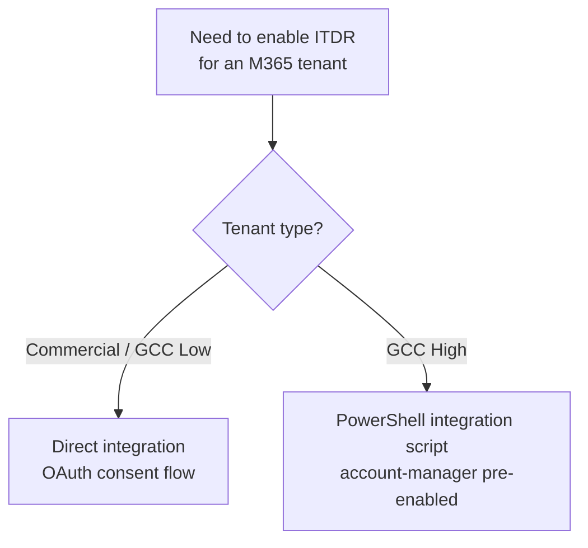

ITDR, Identity Threat Detection and Response, is the Huntress module that watches a Microsoft 365 tenant for the things an EDR agent can't see: malicious inbox rules, suspicious sign-ins, rogue OAuth apps, identity containment when an account is compromised. Enabling it is a five-minute click-through *if* the prerequisites are met. Most failures are prerequisite failures, not enablement failures.

## What ITDR actually watches

Per the Identity Security Assessment article, the assessment surfaces four categories:

- **Licenses and Entities.** What identities exist, which are billable, where they're signing in from. Unused identities are an attack vector.
- **Rogue Applications.** Third-party or custom OAuth apps tied into M365 with elevated or risky permissions, including legitimate apps misused by attackers and custom apps an attacker built to persist in the tenant.
- **Shadow Workflows.** Malicious inbox rules and workflows that auto-forward or delete messages to hide attacker activity.
- **Unwanted Access.** Suspicious logins from unusual locations, on unmanaged devices, or through anonymising services.

The SOC investigates ITDR signals the same way it investigates EDR signals; confirmed compromise produces an incident report. SOC analysts have the ability to disable a compromised account directly via the integration's permissions.

## What's in the Identity Security Assessment Report

The first report lands by email within 24 hours of a successful integration. It's the customer's identity-hygiene baseline:

- **Identity inventory.** Active users, guests, shared mailboxes, service accounts. Anything that hasn't been cleaned up shows here.
- **MFA gaps.** Accounts without MFA, accounts with weak MFA factors, conditional-access exclusions.
- **Legacy auth.** Where IMAP, POP, basic SMTP-AUTH, or other legacy protocols are still enabled. Each one is a credential-stuffing surface.
- **Risky permissions.** Roles assigned more broadly than needed, third-party app consents granted at admin scope, app permissions granted without expiry.
- **Third-party / OAuth app inventory.** Every app that has tenant or user consent, sorted by permission class.

Read it before the customer does. The first report on an established tenant routinely lights up; brief the customer's contact in advance so the conversation is "here's the baseline we're going to work through together," not "your tenant is on fire."

## The two integration paths

Most MSPs use the direct integration, an OAuth consent grant by a Global Admin. GCC High (US government high-side cloud) uses a separate PowerShell-based path that the partner's Huntress account manager has to enable first.

The direct path itself splits three ways depending on how the MSP holds the customer's M365:

| Path | When | What it changes |
|---|---|---|
| **CSP partner integration** | The MSP is the customer's CSP (sells M365 to them) and uses partner relationships in M365. | Some onboarding steps run via the partner relationship; otherwise behaves like direct OAuth. |
| **Non-CSP direct** | The MSP manages the tenant but isn't the CSP. | Standard OAuth consent by the tenant's Global Admin. The most common path for MSPs that resell through non-CSP arrangements. |
| **Manual / Non-Partner** | The MSP doesn't hold a partner relationship in M365 (e.g. a customer's tenant where the MSP only does security). | Documented separately. Same OAuth consent flow, no partner-relationship moves. |

Pick deliberately at onboarding. The wrong pick is recoverable (unmap and re-integrate) but burns the customer's Global Admin time twice.

## The direct-integration prerequisites

Before clicking *Add Tenant*:

- **An admin-level Huntress portal user.** ITDR integration is gated to Account Admin.
- **A Microsoft 365 user with the Global Administrator role.** OAuth consent for the Huntress app requires it.
- **Audit logs enabled in Microsoft 365.** Huntress will attempt to enable them during onboarding if disabled.
- **At least one active Exchange Online license** in the tenant.
- **Exchange Admin Role Group "Organization Management"** must contain Audit Logs, Mail Recipients, Organization Configuration, Transport Rules, and Role Management roles, with Exchange Administrator assigned. This is the Microsoft 365 default; if a previous admin removed roles, Huntress will attempt to restore them.

## What permissions get granted

The Huntress Managed ITDR Permissions Breakdown article enumerates every Graph permission requested. The categories worth understanding:

| Category | Examples | Why |
|---|---|---|
| Read scopes for users, sign-ins, audit logs | `User.Read.All`, `AuditLog.Read.All`, `SecurityIncident.Read.All` | Log and event ingest. The basic detection inputs. |
| Inbox rule and Exchange management | Exchange role group + `Mail.ReadWrite` | Enumerating malicious inbox rules and remediating them. |
| Auth-method management | `UserAuthenticationMethod.ReadWrite.All` | Resetting authentication methods during account containment. |
| Account disable | `User.EnableDisableAccount.All` | Disabling a compromised account during SOC response. |
| Future Identity Security Posture (ISPM) | Several `*.ReadWrite.All` permissions tagged "Future Use" | Permissions Huntress reserves for upcoming ISPM features. |

The customer-facing conversation: yes, Huntress is asking for broad permissions, and yes, those permissions allow account disablement. That capability is the product. If the customer balks, the alternative is "we'll know your accounts are compromised, but we can't act."

## The integration walk

<StepThrough client:load>
<Step title="Open the Integrations page in the Huntress portal">
Hamburger menu, Integrations. Click *+ New Integration*. Pick Microsoft 365.
</Step>
<Step title="Select the Huntress Organization to map">
The dropdown lists every Organization under the account. Pick the one that corresponds to this M365 tenant. Tick the *Generate a security assessment* box (auto-creates the Identity Security Assessment Report after onboarding).
</Step>
<Step title="Sign in as the tenant's Global Admin">
Click the Microsoft sign-in button. Authenticate as the tenant's Global Admin (an account that exists *in that tenant*, not in the MSP's tenant). Consent to the Huntress app's permissions.
</Step>
<Step title="Wait for data to flow">
Per the docs, data may take up to 24 hours to appear, longer for legacy tenants. The first Identity Security Assessment Report generates within 24 hours after a successful onboarding and emails to the user who integrated the tenant.
</Step>
<Step title="Verify in the ITDR dashboard">
Navigate to the ITDR dashboard, click *View all Events* and *View all Users* on the tenant. Events should be flowing, users enumerated. If 24 hours pass with no data, re-check audit logging in the M365 admin centre and the Exchange role group.
</Step>
</StepThrough>

## Common gotchas at enable time

| Symptom | Likely cause | Fix |
|---|---|---|
| Sign-in fails for the integration consent | The account doesn't actually have Global Admin, or browser extensions interfere | Confirm Global Admin in M365 admin centre. Try Incognito with extensions disabled. |
| 24 hours pass, no data | Audit logging disabled or roles missing | Check the M365 Audit Log status; check Organization Management role group; confirm at least one Exchange Online license. |
| Customer's MFA shows Disabled in Huntress despite using a third-party MFA product | Huntress reads MFA state from Microsoft Graph; Microsoft-managed MFA factors register on the user object, third-party MFA products often don't surface there. | Document the third-party MFA in the customer's runbook; Huntress's MFA column may not reflect it. Confirm the user has at least one Microsoft-registered MFA factor (Authenticator, Windows Hello, FIDO key) for the column to populate. |
| Need to map a tenant not in the MSP's CSP | Direct integration supports this | Use Manual / Non-Partner integration; documented separately. |
| Need to re-grant or update permissions | Existing tenant, new permissions added | Reauthorize in the Integrations page; an Account-level Admin signs in as a current Global Admin (M365) or Super Administrator (GWS). |
| Need to re-map a tenant to a different Huntress Organization | Wrong Organization picked at integration time, or customer reorganisation | Unmap, then create a new integration mapping with the right Organization. |

## The "all users billable" model

Per the ITDR FAQ, you can't exclude individual users from ITDR. Huntress treats every user as a potential attack vector, and bills only for what Microsoft bills for (excluding guests and most shared mailboxes). A customer pushing back on "we don't need ITDR on this service account" is asking for a reduced-coverage carve-out the platform doesn't offer; the right answer is to explain the model rather than fight the platform.

## A worked enablement: Able Moose Accounting (mid-market)

Able Moose has a single M365 tenant, ~120 active users, M365 Business Premium, Global Admin held by the office manager.

<StepThrough client:load>
<Step title="Pre-flight">
Confirm the tenant is Commercial (not GCC High), confirm Global Admin access, confirm Audit Log is on, confirm Organization Management has the required roles. Spend ten minutes on this; it saves the half-day debugging later.
</Step>
<Step title="Map to the right Huntress Organization">
Able Moose Accounting already exists as a Huntress Organization for the EDR agents. Map the M365 tenant to that same Organization so EDR and ITDR share the customer view.
</Step>
<Step title="Run the integration">
Direct integration, OAuth consent, tick *Generate a security assessment*. Sign in as the Global Admin.
</Step>
<Step title="Tell the customer to expect the assessment report">
The first Identity Security Assessment lands by email within 24 hours. Brief the customer's primary contact: it's normal, it shows the baseline, anything red on the first one is what we're going to work through together.
</Step>
<Step title="Monitor the dashboard">
Once events are flowing, the SOC starts surfacing signals. Most early signals on a new tenant are "users signing in from places we now know about", over a couple of weeks the SOC builds the baseline.
</Step>
</StepThrough>

<Checkpoint slug="huntress-investigations-checkpoint-itdr" client:load />

## What this is NOT

- **Not Exchange content scanning.** Per the FAQ, Huntress does not pull email subject or content data. ITDR sees inbox-rule and audit-log events; the bodies of emails stay where Microsoft hosts them.
- **Not historical detection.** ITDR detects existing malicious inbox rules but not historical malicious logins. If a tenant was compromised six months before onboarding, ITDR won't retroactively flag the original sign-in.
- **Not a free Identity Posture product.** The ISPM-tagged permissions are for future capabilities. Today's product is detection and response on identity events; posture management is forthcoming, not currently delivered.

<Callout type="info" title="Sources">
[Get Your Identity Security Assessment Report](https://support.huntress.io/hc/en-us/articles/45217874597011-Get-Your-Identity-Security-Assessment-Report), [What is ITDR](https://support.huntress.io/hc/en-us/articles/30274195702547-What-is-ITDR), [Huntress Managed ITDR Frequently Asked Questions](https://support.huntress.io/hc/en-us/articles/9687697854739-Huntress-Managed-ITDR-Frequently-Asked-Questions), [Huntress Managed ITDR Permissions Breakdown](https://support.huntress.io/hc/en-us/articles/22274296335891-Huntress-Managed-ITDR-Permissions-Breakdown), [Direct Microsoft 365 Integration for Huntress Managed ITDR](https://support.huntress.io/hc/en-us/articles/15953218260627-Direct-Microsoft-365-Integration-for-Huntress-Managed-ITDR), [Reauthorize Huntress Managed ITDR Integration](https://support.huntress.io/hc/en-us/articles/22105037960979-Reauthorize-Huntress-Managed-ITDR-Integration), [Remap a Tenant in Huntress Managed ITDR](https://support.huntress.io/hc/en-us/articles/26614312998419-Remap-a-Tenant-in-Huntress-Managed-ITDR).
</Callout>
