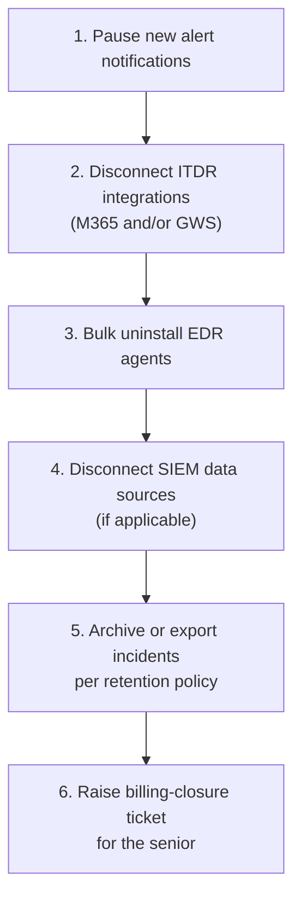

Offboarding goes wrong in two ways. The fast way: someone deletes the organisation first and discovers the agents still phoning home, the ITDR still ingesting, and three months of incident history vapourised. The slow way: someone uninstalls the agents but leaves the ITDR connected, and the customer (now exited) keeps generating identity incidents into your queue for months. The sequence below avoids both. The order is not a preference; it is the way each step makes the next one cleaner.

## The six steps, in order

### 1. Pause new alerts

Before anything else, configure the org so incoming Incident Reports don't generate the comms storm a live customer's would. Re-route notifications for this customer to a triage queue rather than the customer's own contacts.

Pause first because every subsequent step generates signals. ITDR disconnect can trigger a *service disconnected* event. Bulk uninstall will generate a flood of agent-offline alerts. Without the pause, those signals fan out to the customer who has just left. The pause costs 30 seconds; the cleanup if you skip it costs a customer-relationship apology.

### 2. Disconnect ITDR integrations

For each ITDR tenant connected to this customer (M365, Workspace, or both), disconnect the integration cleanly. Lesson 10 covers this. The disconnect stops new identity telemetry flowing and removes the OAuth grant on the customer's side.

ITDR is second because identity has a bigger blast radius than endpoint. While the agents are still running, endpoint coverage continues on a known-shrinking footprint, so the SOC still has endpoint signals to triage if something happens before uninstall.

### 3. Bulk uninstall agents

Push the bulk-uninstall job via the RMM. Lesson 9 covers it. Agents fall off the portal as they receive the uninstall command. Reconcile the same way you reconciled coverage on the way in (lesson 6); a few endpoints will resist and need follow-up.

Uninstall is third because the ITDR is disconnected and the identity surface is closed. The agents are the long-tail surface, uninstall in bulk, chase the stragglers.

### 4. Disconnect SIEM data sources

If the customer was on Managed SIEM, disconnect each ingestion source (agent-based, HEC, API). This stops ingestion volume and is also a billing-relevant step on per-source pricing. Your MSP's SIEM runbook covers it.

SIEM is fourth because SIEM data flows in from sources that include the agents and the ITDR integrations. Those are disconnected, so SIEM volume is already dropping. The disconnect formalises it and stops API-based ingestion that doesn't depend on the EDR or ITDR layers.

### 5. Archive or export incidents per retention policy

The customer's historic incidents (closed and otherwise) are records. Your MSP has a retention policy that says what to do with them at offboarding, archive within Huntress, export to PSA or to a customer-facing handover bundle, or both.

Archive is fifth because incidents stop being generated once the previous steps complete. Doing the archive after the platform has gone quiet means you are not racing against new incidents that would arrive mid-export.

### 6. Raise a billing-closure ticket for the senior

The senior owns the commercial wrap-up. Once the technical steps are done, raise a ticket in the PSA or your billing system flagging that the customer is technically offboarded and ready for billing-side closure. The senior handles the subscription-cancellation side with Huntress, the contractual closure, and any decision on whether to permanently deactivate the organisation later.

Billing closure is last because every prior step is reversible if discovered to be premature (*"oh wait, the contract extended"*). The billing closure is the step that says, irreversibly, the customer is gone.

## What is *not* in this sequence

**Permanent organisation deletion.** Removing the org from the portal is not part of standard offboarding. The senior decides, usually weeks or months later, whether to deactivate the org. Most MSPs leave the org in an archived state so historic incidents stay discoverable for the customer's record-retention period. Doing it yourself, on the same day as the uninstall, is the irreversible mistake the sequence is structured to avoid.

**Lifting branding, white-label, or notification customisations.** These usually inherit from the partner level and don't need per-customer cleanup. If your MSP has documented per-customer customisations, those land in the senior's wrap-up.

<Callout type="warn" title="Order discipline beats memorisation">
Reorder the steps and you create avoidable problems. Skip a step and you leave a quiet half-state that bites somebody in three months. The discipline is not memorising the steps; it is running them in order, every time. Most MSPs run a physical checklist; use it.
</Callout>

## A worked ticket: end-of-month exit

Able Moose Accounting's account manager messages you: *"We just lost Able Moose, they're moving providers end of month. Please get them offboarded, they want their stuff gone by Friday."*

Scheduling the bulk-uninstall job for Friday as the starting move is wrong. Bulk uninstall is step 3 of 6. Starting from step 3 means steps 1 and 2 didn't happen, notifications still fan out to the customer (so the agent-offline floods hit their inbox), and the ITDR integration stays connected past Friday (still ingesting from a customer who is gone). Deleting Able Moose from the portal *to be definitely gone* is worse, permanent org deletion is not on the sequence, the senior owns the call, and you have made the rest of the offboarding harder (the agents still installed will phone home and re-create state, the ITDR will report a missing org, incident history is lost).

The right first move is two things at once. Confirm the offboarding with the senior (the account manager isn't necessarily the senior with authority to authorise it; lesson 1's commercial-decisions boundary applies), then start the sequence at step 1, pause new alert notifications for Able Moose.

Three days later, you have paused alerts, disconnected ITDR, and bulk-uninstalled. The portal shows 4 of 198 agents still online, the four that resisted uninstall and need follow-up. Friday is tomorrow. The account manager pings: *"Are we done? Can I tell Able Moose they're off?"*

The answer isn't *yes, 194 of 198 is close enough*, the four are still phoning home and the sequence has more steps. It isn't *push the bulk-uninstall a second time on the four and declare done* either, resistant agents need per-endpoint follow-up, and even with all four off, SIEM, archive, and billing are still left. The right answer names what is left: four resistant agents to chase, SIEM disconnect if applicable, incident archive, billing closure ticket. Give a realistic estimate (maybe Monday). The account manager's job is to manage Able Moose's expectations; you give them the real picture.

## Common mistakes

- **"Uninstalling agents is offboarding."** It is one of six steps. Doing it alone leaves ITDR live, SIEM ingesting, notifications fanning out, and the org commercially open. Half-done offboardings are the most common state to inherit.
- **"I can skip the pause-alerts step if I'm fast."** No. Other steps generate signals; without the pause, those signals reach the customer who has left.
- **"Deleting the org is the final step."** Permanent deletion is not on the sequence at all. The senior owns the decision, usually weeks later.

<Checkpoint slug="huntress-operations-checkpoint-offboarding-sequence" client:visible />
