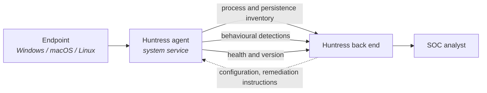

Most of this course's lessons are about agents not behaving the way you expect. Install fails. Agent goes offline. Version drifts. Uninstall doesn't take. The fastest way to diagnose any of them is to carry a model of what the agent does. With it, the failure mode usually tells you the fix.

## What the agent is

The Huntress agent is a lightweight service that runs as a system process on a supported endpoint. It collects telemetry about what's happening on the host, packages it up, and sends it over an encrypted connection to Huntress's back end. It isn't a scanner in the AV sense; it doesn't sit between every file open and decide whether to block. It watches for the signals the SOC cares about (persistence in the form of autoruns, scheduled tasks, services; suspicious process behaviour; lateral-movement indicators; ransomware-shaped activity) and reports them.

The agent runs in the background. Users don't see a tray icon, popups, or scan progress. The endpoint owner usually doesn't know it's there unless they go looking.

## What flows where

Telemetry out, configuration and remediation instructions back. The traffic profile is bounded: process and persistence snapshots, behavioural detections, health and version checks, and acknowledgements when a remediation runs. The agent does not ship file contents, user documents, or keystrokes. When a customer asks "what does it send?" the runbook should point at the published list.

Supported platforms are **Windows**, **macOS**, and **Linux** on recent versions of the supported distributions. Out of scope: legacy operating systems past end-of-support, embedded devices, network appliances, mobile (iOS, Android). Lesson 16 covers what to do when an install fails because the OS is out of scope.

## Installation and registration are two separate steps

This is the distinction techs miss most often. The two steps fail separately, and most of the lessons that follow exist because of the gap between them.

**Installation** happens on the endpoint. The MSI or installer package runs, the service is created, the binaries land in the documented path, the service starts. From the RMM's view the install job succeeded.

**Registration** happens after installation, when the agent reaches the Huntress back end for the first time. The agent uses the **organisation key** bundled with the installer to enrol against a customer organisation. The portal records the new agent and starts treating it as a managed endpoint.

A successful install does not mean a successful registration. An agent can install cleanly, fail to register (blocked outbound, wrong org key, captive portal at install time), and sit on the endpoint as a dormant service. The RMM is happy; the portal shows no new agent.

<Callout type="warn" title="The dormant-installed-not-registered state">
RMM reports "install successful" on 200 endpoints; the Huntress portal shows 180. Installation succeeded on all 200; 20 are stuck at registration. That's the gap to work, not "the install failed." The next tech finds a workstation with no telemetry that everyone thought was protected.
</Callout>

## A worked diagnostic

A senior asks you to confirm Huntress is on `SRV-DC02` at Contoso. You check the customer's Agents view. `SRV-DC02` isn't in the list. The senior says: *try the RMM, check whether the install ran*.

<DecisionTree client:load
  title="Where did the gap open?"
  description="The portal not listing the host means registration is missing. The RMM log tells you whether installation got there at all. Two different fixes; pick the right one by checking RMM first, then the endpoint."
  startId="root"
  nodes={[
    { type: "question", id: "root", prompt: "What does the RMM say about the install job for SRV-DC02?", choices: [
      { label: "No install job recorded, or the job failed mid-run", next: "noinstall" },
      { label: "Install job ran cleanly with exit code zero three days ago", next: "ran" },
    ]},
    { type: "question", id: "ran", prompt: "You log on to SRV-DC02. Is the Huntress service running, and what do the local install logs show about its first phone-home attempt?", choices: [
      { label: "Service running, local logs show repeated phone-home failures", next: "network" },
      { label: "Service running, no clear phone-home failure but the org key in the installer doesn't match Contoso's expected key", next: "wrongkey" },
    ]},
    { type: "outcome", id: "noinstall", label: "Install never landed, push from the RMM", tone: "info",
      body: "The install isn't done yet. Run lesson 13's single-endpoint deploy procedure; verify both the RMM exit code AND the portal afterwards." },
    { type: "outcome", id: "network", label: "Registration is blocked, work lesson 17", tone: "warn",
      body: "The install succeeded; the network path to Huntress is what's broken. Lesson 17 (blocked outbound) is the diagnostic. Don't re-push the install; that repeats the same condition." },
    { type: "outcome", id: "wrongkey", label: "Wrong org key, plan a clean re-install", tone: "warn",
      body: "The agent installed against the wrong organisation. Uninstall (lesson 21), then re-install with the correct key per lesson 13. Document the wrong-key event in the PSA so the next tech recognises the pattern." },
  ]}
/>

## Misconceptions to drop

- **It's an AV agent, just a different brand.** The Huntress agent runs alongside AV and does different work. AV decides whether to block a file at access time; the Huntress agent watches behaviour and persistence. Both can be on the endpoint without conflict.
- **If the install succeeded the agent is working.** Installation and registration are separate. The portal answers "is it registered"; the RMM only answers "did the binary land."
- **The agent phones home everything on the endpoint.** It phones home a bounded, documented set of telemetry. The published list is the right thing to send a customer asking.

When an endpoint problem lands on your queue, the first two questions are always *is the agent installed* and *is the agent registered*. The rest of the course hangs off those.

<Checkpoint slug="huntress-operations-checkpoint-agent-architecture" client:visible />
