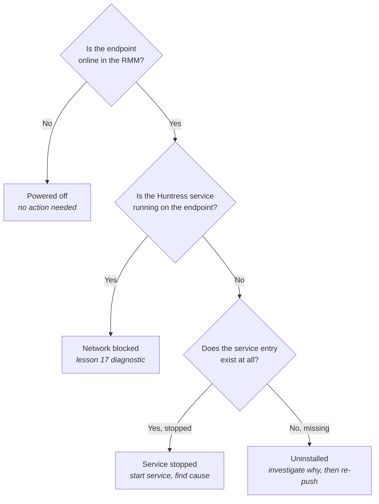

*Agent offline* is a single status in the portal that hides four different problems with four different fixes. The tech who treats every offline the same way (re-push the install, reboot, escalate) burns hours getting nowhere on three of the four causes. The skill is recognising which cause this offline is, in under two minutes, so the right diagnostic path opens immediately.

## The four causes

**Powered off.** The endpoint is shut down, hibernating, or sleeping. The agent can't phone home because nothing is running. This is the most common cause and the easiest to recognise. *Signal:* last-seen timestamp lines up with end-of-day or a known downtime window. *Fix:* none needed. The agent checks in when the endpoint comes back.

**Service stopped.** The endpoint is powered on, but the Huntress service isn't running. Stopped manually, crashed, killed by another security product, or didn't start after a reboot. *Signal:* the endpoint shows online in the RMM, but Huntress shows offline. RMM and Huntress disagreeing about the same endpoint is the canonical service-stopped fingerprint. *Fix:* start the service. If it stops again immediately, look at the local event log (AV interference, service-dependency, crash) before looping on restarts.

**Network blocked.** The endpoint is powered on, the agent service is running, but outbound connectivity to Huntress is broken. New firewall rule, broken proxy config, DNS misconfiguration, captive portal, VPN that doesn't allow split traffic, ISP outage. *Signal:* online in the RMM, Huntress service running locally, agent's local log shows phone-home failures. *Fix:* lesson 17's diagnostic.

**Uninstalled.** The agent isn't on the endpoint anymore. Deliberate (a user removed it, an admin removed it during troubleshooting, a software-deployment tool removed it as cleanup) or inadvertent (an AV product removed it as a perceived threat, a sysprep image wiped it). *Signal:* endpoint online in the RMM, Huntress service entry doesn't exist on the endpoint, install path empty. *Fix:* re-deploy via the RMM, but investigate *why* it was uninstalled first. If AV removed it, you'll have the same problem on re-install (lesson 14); if a user did it, that's a customer-side conversation.

## The two-question diagnostic

The whole diagnostic is a minute of work. Doing it before reaching for any fix saves the half-hour of trying the wrong fix and confirming nothing changed.

## Patterns to watch for

- A workstation that shows offline on Friday at 5pm and online on Monday at 9am. Powered off; no action.
- A 24/7 production server that shows offline despite showing online in the RMM. Service stopped or network blocked; check the service first.
- A workstation that shows offline a day after an OS or AV update. Could be service-stopped (the update killed the service) or uninstalled (the AV update removed the agent). The service entry tells you which.
- A whole site showing offline at once. Network-blocked at the site level (firewall change, ISP outage) until proven otherwise. Mass simultaneous offline rarely means mass simultaneous uninstall.

## Misconceptions to drop

- **Offline means the agent is broken.** Most offlines are powered off. Don't reach for a fix before confirming the endpoint is up.
- **If RMM and Huntress both say offline, the endpoint is just off.** Usually true, but a network outage that blocks both RMM and Huntress reachability looks the same. Cross-check with another monitoring signal if one's available.
- **Service-stopped agents can be fixed by re-installing.** Sometimes. Re-installing without finding out why the service stopped is shotgun debugging. The service stopped for a reason; find it.

## A worked ticket: Able Moose Accounting

The portal shows three offline agents in Able Moose's organisation, offline for more than 24 hours: `WS-AMOOSE-RECEPTION01`, `SRV-AMOOSE-APP02`, and `WS-AMOOSE-EXE04`. Able Moose's IT contact pings you: *we're noticing offlines in our weekly review, can you sort them?*

The wrong first move is *re-push the install to all three*. Three different endpoints, three potentially different causes, one indiscriminate fix. Re-pushing to a powered-off endpoint queues a job that runs when it comes online; that tells you nothing. Re-pushing to a network-blocked endpoint installs again and still doesn't register. The right first move is the two-question diagnostic on each one. Two minutes of categorisation saves an hour of misapplied fixes.

The results: `WS-AMOOSE-RECEPTION01` is powered off (the receptionist has been away for two weeks, the customer confirms). `SRV-AMOOSE-APP02` is online in the RMM, the Huntress service is running, the agent log shows phone-home failures. `WS-AMOOSE-EXE04` is online in the RMM, the Huntress service entry doesn't exist at all.

The action set: leave the receptionist's workstation alone (powered off, no action). Treat `SRV-AMOOSE-APP02` as network-blocked per lesson 17. Investigate *why* `WS-AMOOSE-EXE04` is uninstalled before re-pushing. The executive's laptop is exactly where AV-removed-it or user-removed-it is plausible; re-pushing without finding out repeats the failure. Each cause gets the right path.

<Checkpoint slug="huntress-operations-checkpoint-four-causes-offline-agent" client:visible />
