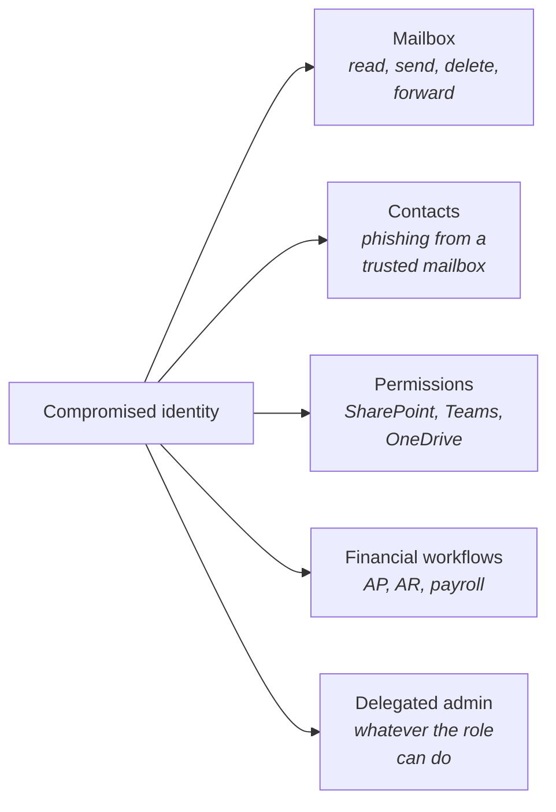

ITDR looks like EDR with different vocabulary. The incidents, recommendations, remediations, and isolation analogues are all present. The temptation is to bring the EDR tempo across. That misses the central thing. **Identity has the biggest blast radius on the platform.** The same minute of attacker access on an identity does more damage than on a typical endpoint, and the compromise playbook is sharper for it.

## The radius is measured in users, not hosts

An EDR incident is mostly bounded to one host. The attacker has to do active work to spread. An identity incident is bounded by what the user can reach times how fast an attacker can act:

Mailboxes are read in seconds. Forwarding rules apply immediately. Phishing emails to contacts can be sent within minutes. The damage compounds before anyone notices.

## Three ways the response shape changes

**Faster default actions.** EDR's containment action is isolation, strong but reversible without lasting impact on the endpoint. ITDR's containment includes session revocation, password reset, and MFA reset. These are destructive by design. They kick the user out of their own account at the same time they kick the attacker out. The trade-off is accepted because the alternative, letting the attacker keep working while you verify, has higher cost.

**Less waiting for user verification.** On a High EDR incident with user-verify in the Recommendation, you call the user, confirm, then act. On many ITDR incidents the SOC's Recommendation leads with "revoke sessions, reset password," and user verification (was that you?) happens after the lockout. The sequence is reversed. The lockout is cheap to reverse on confirmation. The cost of waiting is higher.

**Wider escalation triggers.** Multi-user signals on the same tenant, admin-credential involvement, and OAuth grants from suspicious sources push the incident toward tenant-wide-compromise territory (lesson 14) faster than equivalent EDR patterns push toward Critical.

## What stays the same

The keystone rules from the Beginner course still apply. The SOC has done the analysis. The tech reads the Recommendation. Second-guessing or acting on context instead of the Recommendation is the cardinal mistake. The aggressiveness of the response model doesn't lower the bar on those.

Single-identity playbook execution is in scope for the helpdesk. Tenant-wide response is not.

## A worked ticket: Able Moose Group

A High-severity ITDR Incident Report lands. User: `bob.smith@example.com`. Bob is Able Moose Group's CFO. Summary: sign-in from an unusual country, followed within four minutes by an inbox rule that forwards mail with "invoice" in the subject to an external address. Recommendation: revoke sessions, reset password and MFA, remove the malicious inbox rule. Bob is in a board meeting and unreachable for the next two hours.

<DecisionTree client:load
  title="CFO unreachable, exfiltration in progress"
  description="The aggressiveness in lesson 1 is most legible on the exec-unreachable case. The inbox rule is forwarding payment mail externally. Every minute of waiting is more mail leaving. The lockout is cheap to reverse if the user confirms the activity was theirs; the exfiltration would not be."
  startId="root"
  nodes={[
    { type: "question", id: "root", prompt: "Recommendation calls for the full playbook. Bob is in a board meeting, unreachable for two hours.", choices: [
      { label: "Wait until Bob is reachable to verify before acting", next: "wait" },
      { label: "Execute the Recommendation now, brief his IT manager or EA about the lockout", next: "act" },
      { label: "Revoke sessions only; hold the rest until reachable", next: "partial" },
    ]},
    { type: "outcome", id: "act", label: "Execute now, comms in parallel", tone: "success",
      body: "Right answer. The cost-of-waiting is high. The aggressiveness is the trade the Recommendation has weighed. The lockout is reversible on confirmation; the exfiltration would not be. The IT manager or EA gets the heads-up so the CFO has a credential handoff ready when he's reachable." },
    { type: "outcome", id: "wait", label: "Cost-of-waiting too high", tone: "bad",
      body: "Wrong. The inbox rule is already forwarding payment-related mail externally. The SOC has classified the activity (impossible-travel plus immediate malicious rule). Two hours of waiting is two hours of exfiltration. Acting per the Recommendation is the trade." },
    { type: "outcome", id: "partial", label: "Partial response leaves the door open", tone: "warn",
      body: "Wrong middle path. Session revocation alone doesn't address the inbox rule, the password (which the attacker may have), or the MFA. Partial response gives the attacker time to re-establish via the credentials they already hold." },
  ]}
/>

<Callout type="warn" title="Owning the action with the user afterwards">
When Bob comes out of the board meeting and calls in annoyed, the apology framing is wrong. The action was right. Name the trade-off honestly: the SOC saw sign-in from an unusual country plus an inbox rule forwarding payment mail externally; every minute of waiting was more mail leaving; the lockout was reversible, the exfiltration would not have been. Have the password handoff ready as the next step. Hiding behind the SOC ("they made the call, I executed") weakens the customer's trust in the action you took.
</Callout>

<Checkpoint slug="huntress-judgement-and-identity-checkpoint-identity-bigger-blast-radius" client:visible />
