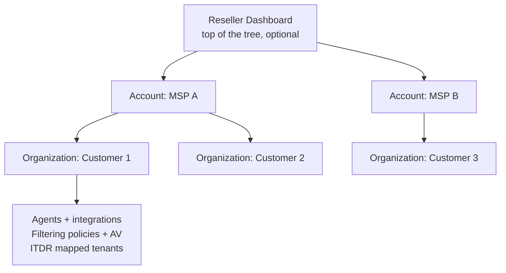

Huntress's multi-tenant model has three layers, not two. The MSP knows about Account and Organization; the Reseller layer above Account is the one that matters when Huntress is sold through a parent vendor (or when a large MSP is structured to resell into multiple sub-MSPs). Getting the layer model right at the top means RBAC, billing, and ticket routing scale instead of breaking.

## The shape

Per the Reseller Dashboard documentation, Resellers can hold multiple Accounts, and each Account holds multiple Organizations. Most MSPs are a single Account; the Reseller layer applies when Huntress is purchased through a distributor, a master-MSP, or when a company runs sub-brands as separate Accounts. Account is the unit of *billing* and *roles*; Organization is the unit of *customer*.

## The roles, layer by layer

Per the Huntress Portal User Permissions article:

### Account-level roles

Account-level users can see the Account and any Organizations their role allows. Admin and Security Engineer can access any Organization under the Account; other roles are scoped to assigned Organizations.

| Role | Can do |
|---|---|
| **Admin** | Everything. Billing, account-level users, integrations, SIEM, SSO, all security actions. No functional restrictions. |
| **Security Engineer** | Almost full security control: approve / reject Assisted Remediation, isolate / de-isolate hosts, view incident reports, view and manage exclusions, bulk Defender actions, act on Escalations. No billing or account administration. |
| **User** | Limited incident management. View-only on most settings. |
| **Finance** | View and manage billing and invoices. No security actions. |

The portal also exposes scoped roles for provisioning, marketing-asset access, and read-only views. Their exact privilege boundaries can drift between releases, so when designing role assignments check the current Huntress Portal User Permissions article for the live matrix rather than memorising it.

### Organization-level roles

Org-level users see *only* their assigned Organization. The role matrix mirrors the account-level structure, with Admin and User as the most common roles for customer self-service.

The Account-level Admin / Security Engineer role is *also* what gates the Request SOC Support button on Critical incident reports. If a tech needs to use that button and doesn't have the role, the right move is escalation, not a role bump.

## Three RBAC anti-patterns

### 1. Customer admins promoted to Account-level Admin

Tempting when a customer-side IT lead asks for "full access to your portal so I can help myself." The permission they want is Account-level Admin or Security Engineer, which makes them able to see every other customer in your portfolio. Don't. Customer-side users go in their Organization, scoped to that Organization, with whatever Org-level role is appropriate. Cross-customer visibility is yours, not theirs.

### 2. Shared Huntress credentials across the helpdesk team

A single shared `huntress@msp.example` login means the audit trail says "huntress@msp.example approved this remediation" instead of "Sarah." When the next remediation goes wrong, nobody knows who made the previous call. Per-tech accounts; SSO if the MSP runs an IdP.

### 3. Forever-Account-Admin held by the founder

A single person holding the only Account-level Admin role is a hostage scenario waiting to happen. They leave, they go on holiday, they get hit by a bus. Two patterns to avoid this:

- **At least two named Account-level Admins**, both with their own MFA, both documented in the MSP's runbook.
- **A break-glass admin account** stored in the password vault with a procedure for activation that requires sign-off from a second senior. Used only in true lockout scenarios.

## What partner-access looks like in the field

Three patterns recur:

| Pattern | Customer-side users | MSP-side users |
|---|---|---|
| **MSP-managed (default)** | None | All admins at MSP Account level. |
| **Co-managed** | Customer staff with Admin or User role on their own Organization. | MSP staff at Account level. |
| **Customer-managed with MSP fallback** | Customer staff hold Admin in their Organization. | MSP retains an Account-level Admin seat for emergencies and SOC liaison. |

Pick deliberately at onboarding. Document the pattern in the customer's PSA. Drift between patterns happens because somebody added a customer user "just for one thing" and never removed them.

## Reseller-specific surface

The Reseller Dashboard adds account creation, trial management, and contract subscription as the Reseller-level moves:

- **Add an Account.** Creates a new MSP Account beneath the Reseller, starts a trial.
- **Subscriptions.** Set Support Type (Huntress Supported vs Partner Supported), Number of Systems to Protect, Billing Interval (Annual vs Monthly).
- **Activate.** Once the contract is added, click Activate. Reseller-side billing kicks in.

The Support Type matters: *Huntress Supported* means Huntress's SOC handles the front line; *Partner Supported* means the Reseller handles incident response and Huntress is the detection layer underneath. Resellers who qualify for Partner Supported see it as an option; those who don't only get Huntress Supported.

## The Account-level Admin escape hatch

If SSO breaks, MFA breaks, or the Account-level Admin gets locked out, the documented recovery is:

- A second Account-level Admin signs in with their own credentials and resets the lockout.
- If no second Admin exists, contact Huntress Product Support, they can verify identity through other channels.

The short version: never have only one Admin. The slightly less short version: have at least two Admins with their own MFA, document who they are in the MSP runbook, and rotate when staff change.

## A worked architecture: Able Moose Group (enterprise)

Able Moose Group is now 1,800 staff across 14 acquired sub-firms. The sub-firms are mostly independent operationally; they share a parent identity in Huntress because they share the MSP relationship.

<StepThrough client:load>
<Step title="Account vs Organizations">
The MSP itself is one Account. Each sub-firm is its own Organization. 14 Organizations under one Account. EDR agents tag to the right Organization via the deployment script's Organization Key (per sub-firm).
</Step>
<Step title="MSP-side roles">
Three named MSP-side Account-level Admins (the senior MSP staff covering Huntress operations, with cross-Organization visibility). Five Security Engineers (the rest of the helpdesk seniors). Junior helpdesk staff: Account-level User (view + limited incident management) or Read-only depending on the role.
</Step>
<Step title="Customer-side roles">
Each sub-firm's IT lead gets an Org-level Admin on their own Organization, no cross-sub-firm visibility. Customer-side staff who only need report visibility get Org-level Read-only.
</Step>
<Step title="Audit and rotation">
Quarterly review: who has Account-level Admin, do they all still work here, do they all still need it. Same for Org-level admins on the customer side. Names that show up "I haven't logged in for 6 months", remove the role.
</Step>
</StepThrough>

<Checkpoint slug="huntress-platform-ops-checkpoint-tenancy" client:load />

## What this is NOT

- **Not policy templating across Organizations.** Defender exclusions inherit through Account -> Organization -> Endpoint within the Managed AV product, but that's a single-product inheritance, not a generic "policies cascade across the tenant tree." Each module has its own scoping rules.
- **Not a way to share telemetry between Accounts.** Two Accounts under one Reseller are separate billing and detection entities. The Reseller dashboard sees the Accounts but doesn't aggregate their telemetry into one cross-Account view.

<Callout type="info" title="Sources">
[Huntress Portal User Permissions](https://support.huntress.io/hc/en-us/articles/4404012728083-Huntress-Portal-User-Permissions), [Dashboard Navigation for Resellers](https://support.huntress.io/hc/en-us/articles/4404005136531-Dashboard-Navigation-for-Resellers), [Move Agents Between Organizations](https://support.huntress.io/hc/en-us/articles/4404012577299-Move-Agents-Between-Organizations), [Using Account Keys, Organization Keys and Agent Tags](https://support.huntress.io/hc/en-us/articles/4404012734227-Using-Account-Keys-Organization-Keys-and-Agent-Tags).
</Callout>
