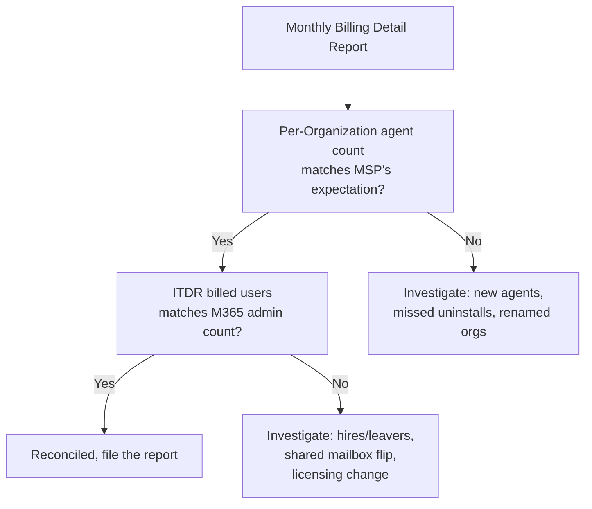

Huntress bills the MSP Account; the MSP rebills its customers. The reconciliation problem is "did the agent count we got billed for match what we expect, and does what we expect match what we're rebilling?" Three failure modes show up: agents that decommissioned but are still counted, Organizations that were renamed and now look like new ones to the rebilling pipeline, and ITDR's per-user count drifting against the M365 license count.

## The two billing notifications

Per the Update Billing Contact article, Huntress sends two distinct billing emails each month:

- **Payment receipt (invoice).** The dollar amount charged. From Huntress's payment processor, sent to the primary account contact.
- **Billing Detail Report.** A breakdown of agents by Organization. This is the reconciliation document. Goes to the addresses configured in *Billing Emails* under Settings.

The Billing Detail Report is what you reconcile against. Update the Billing Emails to your MSP's accounts team or a dedicated reconciliation alias; the technical default is the account-creation email, which usually isn't the right place.

The portal shows live per-Organization agent breakdown and links through to past invoices, but the full reconciliation happens against the emailed report, not the live portal view. The two can disagree by a few days at month boundaries — trust the report for what was billed, the portal for what's there now.

## The agent-counts-billed model

Per the agent-removal article, the count of billed agents equals the count of agents currently associated with the Account, minus any that have been remote-uninstalled. Two specifics:

- **Wiped or decommissioned endpoints** still count until they're remote-uninstalled from the portal. *Remote uninstall is the action that removes them from billing*; an agent that's offline forever is still a billed agent until removed.
- **Unresponsive** is a derived state: agents that haven't called in for 45 days. The portal lets you bulk-uninstall all unresponsive agents from the Account dashboard, which is the documented hygiene step.

A monthly "uninstall all unresponsive" sweep is the simplest reconciliation discipline. Customers who have laptop turnover but haven't told the MSP show up here.

## ITDR billing, the per-billable-identity model

Per the Huntress Billable and Non-billable Identities article, ITDR bills per *Microsoft-billable identity* in the tenant. That is not the same as the raw user count. Huntress runs its own SKU exclusion list across roughly 800 reviewed Microsoft SKUs, and identities whose only license is on the exclusion list are non-billable to ITDR. The current excluded categories include:

- **Shared mailboxes** (no licensed user attached).
- **Room and resource mailboxes** (meeting rooms, equipment).
- **Unlicensed admin accounts** (break-glass and similar).
- **Device licenses** (assigned to devices, not people).

What that means for reconciliation: don't compare against the customer's *user* count from the M365 admin centre. Compare against Huntress's Billing Detail Report, then sanity-check against the customer's *Microsoft billable identity* count if needed. Huntress has a separate "Incorrect Billable Identity Users Count" article for the cases where the two genuinely disagree; that article walks the dispute path.

The drift cases that catch MSPs:

- Service accounts that *do* hold a paid Microsoft license count toward ITDR billing too. A leaver who kept their license is still a billable identity.
- Shared-mailbox conversion. A user account converted to a shared mailbox by the customer's licensing cleanup drops out of the ITDR billable count, sometimes a month later than the customer expects.
- New-tenant onboarding mid-month. ITDR billing starts when the integration is active, not the start of the calendar month.

A reconciliation discipline: pull the Billing Detail Report for the Organization, compare with the Microsoft billable-identity count, and document any variance you can't explain.

## Reseller billing

For Resellers, billing is at the Reseller level with subscription contracts per Account. Per the Reseller Dashboard, each contract has:

- **Support Type:** Huntress Supported or Partner Supported.
- **Number of Systems to Protect:** the agreed minimum that aligns to a price tier.
- **Billing Interval:** Annual (paid up-front for the year) or Monthly.

Annual contracts have a flat monthly cost; over-count above the agreed minimum is the place where surprise charges turn up. Resellers who are growing fast want their reconciliation pipeline to catch over-count *before* the annual renewal conversation.

## A reconciliation routine

The monthly walk:

<StepThrough client:load>
<Step title="Pull the Billing Detail Report">
The CSV breakdown comes by email. Open it; sort by Organization.
</Step>
<Step title="Sweep Unresponsive agents">
From the Account dashboard, Unresponsive count -> select all -> Uninstall. Anything in the report that this would have caught next month is now caught this month.
</Step>
<Step title="Check for missing or renamed Organizations">
Organizations renamed mid-month sometimes split into a new line on the next report if the rename cascaded oddly. The fix is usually a portal-side cleanup, but flag it before the invoice cycle.
</Step>
<Step title="Cross-check ITDR identities to Microsoft billable-identity count">
For each customer with ITDR, compare the Huntress ITDR billed count (from the Billing Detail Report) to the customer's Microsoft billable-identity count, after subtracting Huntress's excluded SKUs. Treat anything above a small tolerance as worth investigating. The 5% / 10% thresholds an MSP runs internally are operational guidance for "investigate vs escalate", not a Huntress-prescribed rule; pick whatever your finance team can act on.
</Step>
<Step title="Update the customer-side rebill">
Whatever pricing tool the MSP uses (the PSA's contract module, a custom spreadsheet), update the rebill counts to match the reconciled Huntress counts. Pricing drift gets noticed by customers when the next invoice doesn't match the previous one.
</Step>
</StepThrough>

## What surprises an MSP at renewal time

| Surprise | Cause |
|---|---|
| Year-end true-up much higher than expected | Annual contract minimums; running steadily over the minimum without renegotiating mid-year. |
| One customer's count won't go down | Decommissioned endpoints never remote-uninstalled. The "unresponsive sweep" backlog. |
| ITDR count creeps without anyone hiring | Service accounts that picked up paid licences during a M365 cleanup; legacy accounts still consuming Exchange Online licenses. |
| New agents bill in an Organization the customer claims doesn't exist | Wrong Organization Key in a deployment script during a rollout. The agents are billing against a typo'd Org. |

All of these are catchable by a disciplined monthly reconciliation. None are catchable by waiting for the annual renewal conversation.

<Checkpoint slug="huntress-platform-ops-checkpoint-billing" client:load />

<Callout type="info" title="Sources">
[How do I Update my Huntress Managed Endpoint Detection and Response Billing Contact](https://support.huntress.io/hc/en-us/articles/4404005170579-How-do-I-Update-my-Huntress-Managed-Endpoint-Detection-and-Response-Billing-Contact), [How do I Start a Huntress Subscription](https://support.huntress.io/hc/en-us/articles/4404005014931-How-do-I-Start-a-Huntress-Subscription), [How do I remove an agent so that I am no longer billed for it](https://support.huntress.io/hc/en-us/articles/4404012681875-How-do-I-remove-an-agent-so-that-I-am-no-longer-billed-for-it), [Uninstalling the Huntress Agent](https://support.huntress.io/hc/en-us/articles/4404005116435-Uninstalling-the-Huntress-Agent), [Huntress Managed ITDR Frequently Asked Questions](https://support.huntress.io/hc/en-us/articles/9687697854739-Huntress-Managed-ITDR-Frequently-Asked-Questions), [Dashboard Navigation for Resellers](https://support.huntress.io/hc/en-us/articles/4404005136531-Dashboard-Navigation-for-Resellers).
</Callout>
