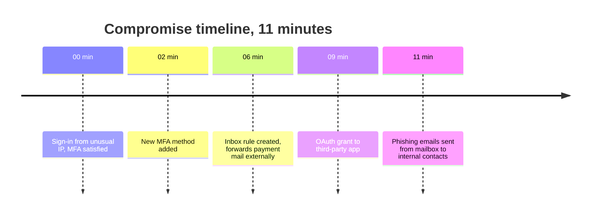

ITDR Incident Reports have the same skeleton as EDR reports (covered in the reading-an-incident-report lesson), but the Evidence and the Timeline view look different and tell a different story. **EDR Evidence is mostly process-shaped. ITDR Evidence is mostly event-shaped:** sign-ins, rule creations, OAuth grants, MFA changes. The Timeline view is what stitches those events into a coherent attack story.

## The familiar skeleton

The structure from the Beginner course holds:

- **Header.** Severity, surface (ITDR), the affected identity (a UPN like `alice@example.com`), customer organisation, incident ID, analyst.
- **Summary.** The analyst's plain-language statement of what happened.
- **Evidence.** The raw events.
- **Recommendation.** The action zone.
- **Affected entity.** The identity (or identities) the Recommendation applies to.

Read in the same order: header, Recommendation, verify entity, Summary if needed, Evidence as context. The disciplines from the Beginner course carry across unchanged.

## ITDR Evidence: event classes

ITDR Evidence consists of events on the identity surface, each with its own timestamp and source:

| Event class | What it shows |
|---|---|
| Sign-in events | Timestamp, source IP, geolocation, client type (browser, mobile app, IMAP), MFA used or not, success or failure |
| Mailbox events | Rule creation, rule modification, forward configuration, mail-flow changes |
| MFA events | Methods added or removed, phone numbers changed, devices enrolled |
| OAuth events | Grants to third-party apps, scope of access, when the grant happened |
| Identity-attribute changes | Password resets, role changes, license changes |

The story comes from the sequence. A single event is a data point. The order of events is the compromise narrative.

## The Timeline view

The Incident Report Timeline lays out events chronologically. For a typical identity compromise, the Timeline might show:

Reading the Timeline as a sequence makes the compromise visible at a glance. It also maps directly to the playbook: the sign-in means revoke sessions, the password means reset, the MFA method means review and remove, the inbox rule means remove, the OAuth grant means revoke.

## Three habits for reading the Timeline

**Read top-to-bottom in order.** The events compound. Reading in order shows how the attacker chained actions. Jumping around loses the causal thread.

**Notice gaps.** A gap between events does not mean the attacker stopped. It often means the next event fell outside what the SOC ingested. A clean, complete compromise story rarely has long gaps. A gap is worth flagging, especially after a high-impact action followed by silence.

**Map events to playbook steps.** Each event class maps to a specific playbook step (lessons 9 through 13 in this course). The Timeline tells you which steps the compromise covers and which you can skip.

<Callout type="info" title="Timeline is context, not the action">
The Recommendation still drives the action. Using the Timeline to argue with the Recommendation is the same second-guessing failure from the Beginner course. The Timeline is what the analyst weighed. The Recommendation is the disposition.
</Callout>

## Reading for customer comms

The Timeline makes the post-incident customer conversation specific rather than vague. Instead of "we saw activity," you can say: "At 2:14pm there was a sign-in from an unusual IP, and within 11 minutes the attacker had added their own MFA method, set up a mail-forwarding rule, granted access to an external app, and started sending phishing emails to your contacts. We contained at 2:25pm and the playbook was complete by 2:34pm."

The customer hears the speed of the attacker and the speed of the response in the same breath. That specificity builds trust faster than a vague summary.

## When to escalate from the Timeline

Three patterns push above the helpdesk ceiling:

- The Timeline shows multiple identities in the same tenant. Tenant-wide territory. Bump.
- The Timeline shows admin-credential or admin-role events (role changes, license changes, tenant-level configuration). Bump.
- A gap that does not make sense: the attacker did a high-impact action and then there is a long silence. May be an ingestion gap. May be ongoing. Surface to senior before acting on the Recommendation.

## A worked scenario

High-severity ITDR Incident Report on `marketing.intern@example.com`. Timeline: seven events over eleven minutes. Sign-in from Vietnam at 11:03, MFA method added at 11:05, inbox rule created at 11:08, OAuth grant to `MailSync-Free` at 11:10, three internal emails sent between 11:12 and 11:14. Recommendation: revoke sessions, reset password and MFA, remove inbox rule, revoke OAuth grant.

<DecisionTree client:load
  title="Marketing intern compromise: what is your first move?"
  description="The OAuth grant might look like a legitimate tool the intern signed up for. The Timeline tells a different story: the grant is in the compromise chain, not standalone. The Recommendation has already classified it."
  startId="root"
  nodes={[
    { type: "question", id: "root", prompt: "The Recommendation calls for the full compromise playbook. What do you do first?", choices: [
      { label: "Investigate the OAuth grant to see whether the intern signed up for a tool legitimately", next: "investigate" },
      { label: "Execute the Recommendation per the playbook, document, reach the manager", next: "execute" },
      { label: "Wait for the intern to be reachable because she is not a senior user", next: "wait" },
    ]},
    { type: "outcome", id: "execute", label: "Execute per the playbook", tone: "success",
      body: "Standard ITDR compromise response. The Timeline confirms the pattern. The intern's seniority does not gate the response; lesson 1's blast-radius point applies to any compromised mailbox." },
    { type: "outcome", id: "investigate", label: "Second-guessing the SOC", tone: "bad",
      body: "The OAuth grant sits in the Timeline as part of the compromise chain, not as a standalone event. Re-investigating what the Recommendation has already classified is the same mistake from the Beginner course." },
    { type: "outcome", id: "wait", label: "Seniority does not gate the response", tone: "bad",
      body: "Even an intern's compromised mailbox phishes everyone she emails. The cost of waiting is high regardless of the user's role." },
  ]}
/>

<Checkpoint slug="huntress-judgement-and-identity-checkpoint-reading-itdr-incident-report" client:visible />
