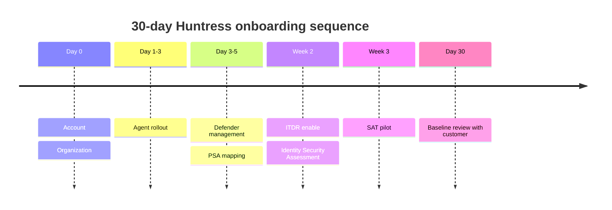

A new customer onboarding either takes a half-day for a tech who's done it twenty times, or two weeks of painful phone calls because somebody started the ITDR consent before the Organization existed in Huntress and now the integration mapped to the wrong place. The difference is the order. This is a sequence each step of which depends only on the previous one.

## The 30-day shape

Five phases, in order. Skipping forward is what breaks deployments.

## Phase 1, the Organization (Day 0)

The customer needs to exist in Huntress before agents try to register. Two approaches:

- **Pre-create the Organization** by adding an agent first under the chosen Organization Key. The platform creates the Organization automatically.
- **Pre-create the Organization in the portal** via Organizations -> Add Organization. Useful when the deployment is going to take days and you want the customer represented.

Either way, decide the canonical name *now*. If the PSA already has the customer as "Able Moose Accounting Pty Ltd", make the Huntress Organization match exactly. Do not normalise to "Able Moose"; the PSA Auto-Map relies on exact name match.

Confirm:

- Organization name matches PSA company name.
- Organization Key (the short identifier used at install time) is decided. Pick something without spaces.
- The MSP's customer record is documented: the customer's primary contact, after-hours contact, and named technical lead.

## Phase 2, agent rollout (Day 1-3)

The Beginner course covered the install. At scale, two extras:

<StepThrough client:load>
<Step title="Pre-flight the deployment script">
Account Key in the RMM as a global custom field or script variable, not hard-coded. Organization Key from the customer's site / company name. Optional Agent Tags for site-of-office, environment, or asset class.
</Step>
<Step title="Pilot deployment to a small group">
Five to ten endpoints from the customer's IT team's own machines. Watch them register. Confirm EDR Version populates within an hour. Look for Defender status problems before the rollout hits production.
</Step>
<Step title="Production rollout">
Phase across the customer's office hours so the install bandwidth doesn't disrupt working users. Check the Agents page after each batch.
</Step>
<Step title="Confirm count">
Total agents in Huntress matches what you expect to bill the customer for, with a small allowance for offline endpoints that haven't checked in yet.
</Step>
</StepThrough>

## Phase 3, Defender management and PSA mapping (Day 3-5)

Once agents are registered, Managed AV starts reporting Defender state. Walk it before flipping anything.

- **Audit Mode for the first few days.** Read the existing exclusions, the existing scan schedules, the current Compliance state.
- **Decide the cut to Enforce.** Recommended Defaults at Account level for the MSP-wide baseline; Organization-level overrides for customer-specific quirks.
- **PSA integration mapping.** With the new Organization name aligned to the PSA, run Auto-Map. Confirm the new customer maps. Send a test ticket and resolve it; verify the close-loop status update reaches the PSA.

This is the right place to confirm the integrations are healthy *before* the SOC starts producing real incidents the customer's queue needs to receive.

## Phase 4, ITDR enable and Identity Security Assessment (Week 2)

ITDR enablement waits until the Organization is stable in Huntress. The integration maps the M365 tenant to a specific Huntress Organization, and re-mapping later is more friction than getting it right.

- Walk the prerequisites from the Intermediate course's ITDR lesson.
- Run the OAuth consent flow as the tenant's Global Admin.
- The Identity Security Assessment Report generates automatically within 24 hours of a successful integration and emails to the user who onboarded the tenant. Read it before the customer does.
- To regenerate the report after the fact (for example, if the original integrator left the MSP and never forwarded the email), go to Integrations > Edit Integration > the tenant's Actions menu, where the regenerate option lives.

Common Day-7 surprise: the assessment shows an existing malicious inbox rule, the customer didn't tell you about a previous incident, you've inherited an active compromise. This is normal, not unusual. Process it via the SOC.

## Phase 5, SAT pilot (Week 3)

SAT comes last because the prerequisite (allowlisting the phishing IPs/domains in the customer's email security) requires the customer's mail-side cooperation.

- Allowlist in M365 anti-spam policies and any third-party email security.
- Run a baseline phishing campaign to all staff. Generic scenario; no Assignments yet.
- Schedule the next two campaigns and pair them with assignments in the SAT calendar.

## Phase 6, the Day-30 review (the customer-facing milestone)

Thirty days in, the customer has:

- An EDR fleet that's been observed for a month.
- An ITDR integration that's settled.
- A baseline Identity Security Assessment Report.
- A Compromise Rate baseline from the SAT campaign.

The review meeting hits four points: what we found in the first 30 days (any incidents, ITDR signals), what we've done about them, what we'd recommend the customer change in their own controls (MFA gaps, M365 license hygiene), and what the next quarter looks like (next SAT campaigns, planned policy changes).

Without this review, onboarding ends with the customer thinking nothing happened. With it, the customer sees the value before the first quarterly review.

## A worked onboarding: Able Moose Group's 14 sub-firms

Able Moose Group is rolling Huntress to all 14 acquired sub-firms over two months. The MSP runs each sub-firm as its own Organization, and the team needs the playbook to be repeatable.

| Week | Action |
|---|---|
| 1 | Pre-create Organizations for sub-firms 1-7. Pilot agent rollout on each sub-firm's IT team. |
| 2 | Production agent rollout for sub-firms 1-7. PSA Auto-Map. |
| 3 | Defender Audit -> Enforce for sub-firms 1-7. ITDR enablement begins. |
| 4 | ITDR data settled for sub-firms 1-7. SAT allowlisting begun for the first wave. |
| 5 | Repeat Phase 1-2 for sub-firms 8-14. SAT baseline campaigns begin for sub-firms 1-7. |
| 6 | Phase 3-4 for sub-firms 8-14. |
| 7 | SAT campaigns continuing. ITDR settling for second wave. |
| 8 | First Day-30 review for sub-firms 1-7. Onboarding for sub-firms 8-14 in Phase 5-6. |

Each sub-firm gets the full playbook; the playbook never changes.

<Checkpoint slug="huntress-platform-ops-checkpoint-onboarding" client:load />

<Callout type="info" title="Sources">
[Install the Huntress Agent for Windows OS](https://support.huntress.io/hc/en-us/articles/4404005189011-Install-the-Huntress-Agent-for-Windows-OS), [Direct Microsoft 365 Integration for Huntress Managed ITDR](https://support.huntress.io/hc/en-us/articles/15953218260627-Direct-Microsoft-365-Integration-for-Huntress-Managed-ITDR), [Get Your Identity Security Assessment Report](https://support.huntress.io/hc/en-us/articles/45217874597011-Get-Your-Identity-Security-Assessment-Report), [PSA Automatic Mapping](https://support.huntress.io/hc/en-us/articles/25435297047827-PSA-Automatic-Mapping), [Manage Phishing Campaigns](https://support.huntress.io/hc/en-us/articles/10962618849171-Manage-Phishing-Campaigns), [Microsoft Defender Recommended Default Settings](https://support.huntress.io/hc/en-us/articles/4404012729747-Microsoft-Defender-Recommended-Default-Settings).
</Callout>
