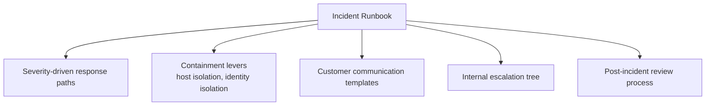
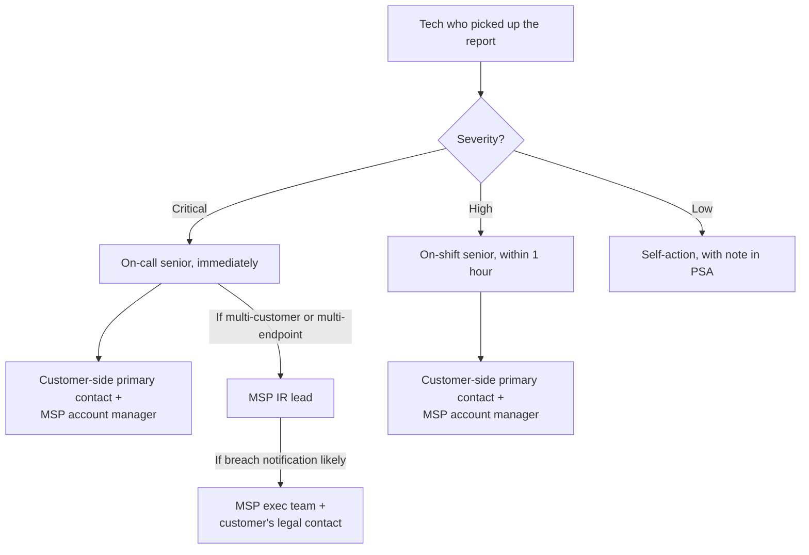

The Beginner course covered "what to do when one report lands." This lesson is the layer above: how the MSP runs incident handling at scale, with multiple parallel customers, escalation paths that survive personnel turnover, and customer communication that doesn't depend on one tech remembering the right thing to say at 2am.

## The runbook surface

A complete incident-handling runbook for Huntress incidents has five components:

Each component is a written document, not a tribal-knowledge convention. New staff inherit them; existing staff don't have to remember them at 2am.

## Severity-driven response paths

Map each Huntress severity to a response time, an owner, and a checklist:

| Severity | Response time | Initial owner | Decisions in scope for the initial owner |
|---|---|---|---|
| **Critical** | Immediate, 24x7 | On-call senior | Approve Assisted Remediation. Initiate host isolation if not already in place. Activate customer communication tree. Use Request SOC Support callback. |
| **High** | Within 1 hour during business; next business day for after-hours | On-shift senior | Approve Assisted Remediation. Decide if host isolation is appropriate. Hand off customer communication to the named account manager. |
| **Low** | Within the working day | Next available helpdesk | Acknowledge, walk the manual-or-no remediation, resolve. Note in customer's monthly report. |

The response time is *time to first action*, not time to full resolution. The on-call senior responding to a Critical at 2am is approving Assisted Remediation and isolating the host; the full post-incident write-up is daylight work.

## Containment levers

Two distinct ones, and they get confused when they shouldn't.

### Host isolation (EDR-side)

Per the Bulk Host Isolation article, isolation makes the endpoint unreachable from partner networks while keeping it reachable from Huntress for SOC investigation. Two scopes:

- **Per-host.** Single Agent overview page, Isolate button. Used for the typical confirmed-compromise pattern.
- **Bulk.** Account-Admin-only. From Organizations, select Organizations -> Isolate Host. Used for an active outbreak across multiple endpoints, with a SOC Escalation describing the scope.

Don't release isolation reflexively. The release is "we have completed remediation and the host is clean"; it should be done after Assisted Remediation completes, not before.

### Identity isolation (ITDR-side)

Per the ITDR FAQ, the SOC analyst can disable a compromised M365 account directly via the integration's permissions. The MSP's role:

- The SOC has already disabled the account during a confirmed identity compromise.
- The MSP confirms the disable, communicates with the customer about the affected user, and follows the manual-remediation steps in the report (rotate refresh tokens, invalidate session cookies, reset MFA, review what the attacker accessed).

Identity-disable is more disruptive to the user than host-isolate is to a workstation; build customer communication into the runbook for this case especially.

## Customer communication during an active incident

The first communication isn't optional and isn't ad-hoc. The runbook holds three templates:

- **Initial notification.** Sent to the customer's primary contact within the first hour of a Critical incident. "We have a confirmed security incident on [host/identity]. We have already taken [containment action]. Here's what we know, here's what we're doing in the next 4 hours."
- **Status update.** Every 4 hours during an active Critical incident, even if there's nothing new. Silence is worse than "no change since last update."
- **Resolution.** Sent within 24 hours of the incident being resolved. Summarises what happened, what was done, what the customer should do next (rotate credentials they suspect were exposed, brief their staff, etc.).

These are templates with placeholders, not free-form. A senior under pressure at 2am should fill in placeholders, not draft a customer email.

## Internal escalation tree

Names get out of date. Roles don't. The tree is by role; the names are in a separately maintained on-call rota.

The tree stops at the customer's legal contact for a reason. Breach notification timelines, regulatory obligations, and outbound communication to affected parties beyond the MSP relationship are the customer's legal team's call. The MSP runbook hands those off; it does not try to be the legal team.

## Post-incident review

Within five working days of resolution, a written post-incident review covering:

- Timeline (signal time, SOC report time, MSP first action, containment time, resolution time).
- What worked.
- What didn't.
- What changes (technical, process, communication) prevent or shorten this class of incident next time.

The temptation to skip the review is strong, the incident is over, the team's tired, the customer's relieved. Skip it once and the same class of incident hits next quarter and nobody remembers what to do. Three actions per review, written down, tracked to completion.

## A worked Critical: Able Moose Group's finance team

A Critical Incident Report lands at 11pm on a Wednesday: the SOC has detected attacker tradecraft against the finance director's account at one of Able Moose Group's sub-firms (Subfirm-7), with malicious inbox rules auto-forwarding to an external address and signs of ongoing session-hijack activity.

<StepThrough client:load>
<Step title="On-call senior picks up within 5 minutes">
Reads the report. The SOC has already disabled the finance director's M365 account (identity isolation). The malicious inbox rule has been removed. Remediation plan includes manual steps (rotate refresh tokens, invalidate session cookies, MFA reset, audit recent mailbox activity for forwarded data).
</Step>
<Step title="Initial customer notification">
Initial template populated. Sent to Subfirm-7's primary contact and CC'd to Able Moose Group's CIO. "Confirmed identity compromise on [user]. The account is disabled. We are walking through Huntress's remediation plan. Next update by 3am."
</Step>
<Step title="Walk the manual remediation">
Token revocation in Entra ID. Sign-in sessions invalidated. MFA factors reset. Mailbox activity audit pulls the inbox-rule history and the access patterns of the previous 7 days. Notable: forwarded emails included two invoice exchanges, the customer needs to know.
</Step>
<Step title="Status update at 3am">
Template populated. "Containment complete. Identifying the data the attacker had access to before account disable. Initial finding: two invoice email threads were forwarded externally. We will brief in detail at 9am."
</Step>
<Step title="Morning handoff and customer briefing">
On-call senior briefs the day team. Account manager joins the customer briefing at 9am. Customer's CFO is informed about the invoice exposure; their fraud-prevention process kicks in.
</Step>
<Step title="Resolution and post-incident review">
Account re-enabled with new MFA factors after customer-side verification of the user. Resolution email sent. Post-incident review scheduled for the following Monday.
</Step>
<Step title="Post-incident review actions">
Three actions: (1) Subfirm-7 finance team gets a targeted SAT campaign on session-hijack scenarios; (2) the runbook's auto-forward-detection check is added to monthly customer reviews; (3) the customer rotates the invoice-exchange counterparty's contact email, since the attacker now has a valid relationship to spoof.
</Step>
</StepThrough>

<Callout type="info" title="Sources">
[Bulk Host Isolation Release of a Huntress Organization](https://support.huntress.io/hc/en-us/articles/19301652261907-Bulk-Host-Isolation-Release-of-a-Huntress-Organization), [Manually Remediate Active Incidents](https://support.huntress.io/hc/en-us/articles/5684644332179-Manually-Remediate-Active-Incidents), [Requesting SOC Support for Incident Reports](https://support.huntress.io/hc/en-us/articles/35542397154835-Requesting-SOC-Support-for-Incident-Reports), [Huntress Managed ITDR Frequently Asked Questions](https://support.huntress.io/hc/en-us/articles/9687697854739-Huntress-Managed-ITDR-Frequently-Asked-Questions), [What is the Huntress Managed Security Platform](https://support.huntress.io/hc/en-us/articles/15125647051923-What-is-the-Huntress-Managed-Security-Platform).
</Callout>
