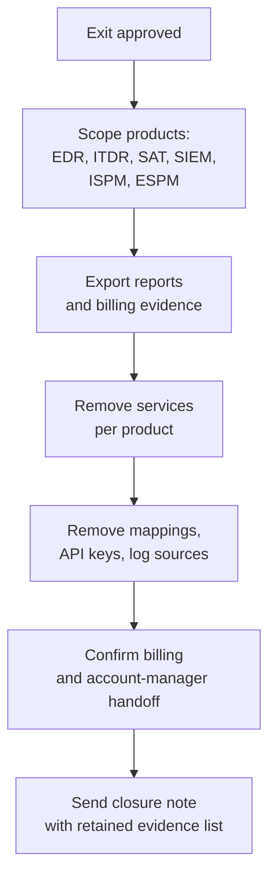

Huntress is rarely one switch. A customer may have EDR agents, ITDR, SAT, Managed SIEM, PSA routing, API credentials, billing contacts, and retained reports. Offboarding means closing each product path in a planned order, then proving the customer and the MSP agree on what ended.

## The offboarding map

Deleting an Organization removes the services tied to that Organization. Use that only when the exit scope is truly the whole customer and the MSP has the authority to remove all products.

## Product-by-product closure

| Product path | Closure move | Verification |
|---|---|---|
| **EDR agents** | Use portal remote uninstall or bulk remote uninstall. For wiped devices, remove the agent from the dashboard so incidents close and billing stops. | Agent no longer appears as billable; uninstall action recorded. |
| **ITDR** | Remove the integration or unmap the tenant from the integration. | Integration mapping no longer shows the customer tenant. |
| **SAT** | Close campaigns, export final status, remove routing or allowlisting notes from the customer runbook. | No active campaigns remain for the customer. |
| **Managed SIEM / log sources** | Disconnect sources and document where logs continue to live, if the customer keeps a separate SIEM. | No new source data arrives under the Huntress customer. |
| **PSA / email routing** | Remove organization mapping, email routing, and any customer-specific ticket rules. | Test incident or mapping view no longer targets the customer. |
| **API / MCP credentials** | Revoke or rotate keys used by customer-specific automations. | Secret store and API Credentials page match. |

## Customer-exit runbook

<StepThrough client:load>
  <Step title="Confirm exit scope">
    Decide whether the customer leaves Huntress entirely or only one module. Write the scope in the PSA ticket. Whole-Organization deletion is a different risk from removing one ITDR mapping.
  </Step>
  <Step title="Export retained evidence">
    Pull Incident Reports, Billing Detail Report data, agent count snapshots, Identity Security Assessment reports, and any SAT results the contract says the customer keeps. Do this before you remove services.
  </Step>
  <Step title="Remove endpoint coverage">
    Use Remote Uninstallation for online endpoints and bulk uninstall for selected groups. For wiped or decommissioned endpoints, remove them from the dashboard to close associated incidents and stop billing.
  </Step>
  <Step title="Remove cloud integrations">
    For ITDR, delete the whole integration when no mapped tenants remain, or unmap the specific tenant when other customers still use it. Record who approved the Microsoft 365 consent removal.
  </Step>
  <Step title="Close routing and automation">
    Remove PSA mappings, email incident routing, SIEM/log-source mappings, API jobs, and MCP access that used customer-specific keys. Rotate shared keys if the customer had access to them.
  </Step>
  <Step title="Confirm billing and account-manager handoff">
    Contact the account manager for billing concerns after technical removal. Update the PSA contract and attach proof that the service stopped.
  </Step>
  <Step title="Send the closure note">
    Tell the customer what was removed, what evidence was retained, which logs or reports will no longer update, and who owns monitoring after the exit date.
  </Step>
</StepThrough>

## What this is NOT

- **Not a way to bypass incident response.** If an incident is active, finish containment and customer communication before product removal.
- **Not the customer's M365 offboarding.** Huntress can unmap or remove ITDR integration. The customer or MSP still owns Entra users, mailbox state, MFA, and licensing.
- **Not a billing-only ticket.** Billing follows technical state. Remove agents, mappings, and services first, then reconcile.

<Checkpoint slug="huntress-platform-ops-checkpoint-offboarding" client:load />

<Callout type="info" title="Sources">
[Huntress Product Offboarding Guide](https://support.huntress.io/hc/en-us/articles/51332785737235-Huntress-Product-Offboarding-Guide), [Uninstalling the Huntress Agent](https://support.huntress.io/hc/en-us/articles/4404005116435-Uninstalling-the-Huntress-Agent), [Remove the Managed ITDR Integration](https://support.huntress.io/hc/en-us/articles/19750597284371-Remove-the-Managed-ITDR-Integration), [Huntress REST API Overview](https://support.huntress.io/hc/en-us/articles/4780697192851-Huntress-REST-API-Overview).
</Callout>
