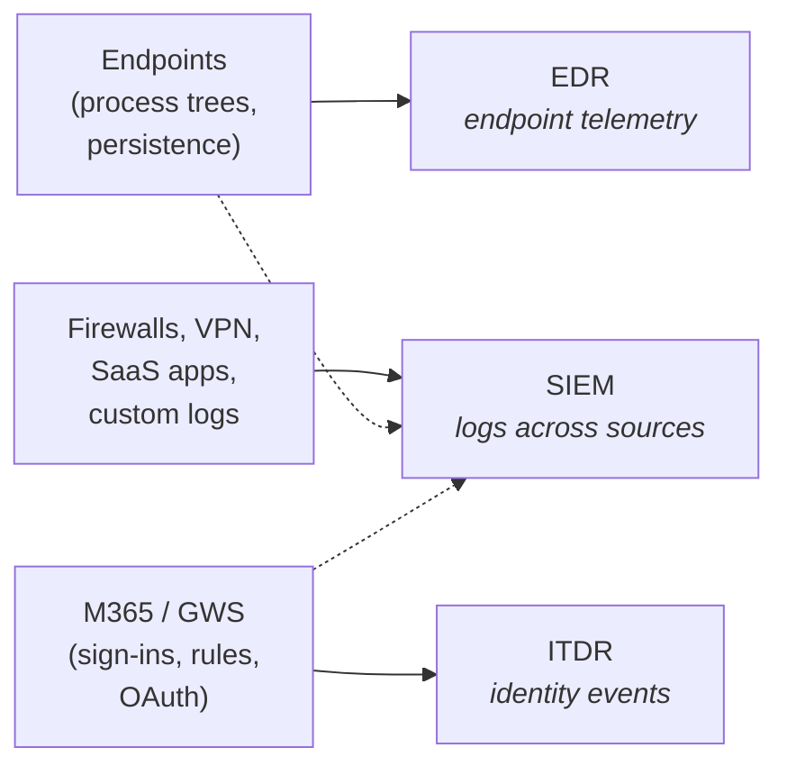

<Callout type="info" title="Optional product, optional course">
Managed SIEM is an optional Huntress product. If your MSP doesn't subscribe to SIEM, this segment of the course (lessons 17 through 24) doesn't apply day-to-day, and you can skim or skip ahead to the comms and judgement lessons. Come back to it if your MSP adds the product later. The rest of the course is unaffected.
</Callout>

The skill in this lesson is recognising that SIEM doesn't ask you to learn a new way of working. It asks you to learn what SIEM *sees* that EDR and ITDR don't, and to apply the same SOC-Recommendation discipline to log-shaped Evidence. The cardinal rules from the foundations course carry across unchanged.

## What Managed SIEM is

A SIEM, Security Information and Event Management system, ingests logs from many sources and looks for security-relevant patterns across them. Huntress's Managed SIEM is the third product surface alongside EDR and ITDR. It ingests from three categories of source (covered in the next lesson), and it is SOC-managed in the same sense the other two surfaces are. The partner doesn't own alert triage. The SOC writes and tunes the detections. Incident Reports arrive with Recommendations.

The commercial model is per-data-source with predictable pricing, in contrast to per-event-volume pricing common elsewhere in the market. That distinction matters less for the helpdesk seat than for the account-manager seat, but it explains why "add this source" is a senior decision: every source has a recurring price tag.

## What SIEM adds that EDR and ITDR miss

The three surfaces see different things.

EDR sees what the agent sees on an endpoint. ITDR sees what M365 and Google Workspace report about identities. SIEM sees logs across sources the other two don't reach: the customer's network firewall, the VPN concentrator, the HR SaaS, a custom application's audit feed. The dotted arrows are real too, SIEM can also ingest broader Windows Event Logs and broader M365 audit logs alongside what EDR and ITDR consume.

Three concrete things SIEM catches that the other surfaces can't:

- **Cross-source correlation.** A service account showing up at an odd hour in a Windows Event Log, again in a firewall log allowing an outbound connection somewhere it shouldn't reach, again in an application log running a database query against customer records. None of the three is conclusive alone. SIEM puts them together.
- **Sources outside EDR and ITDR's coverage.** Firewall logs, VPN session logs, HR-system login logs. EDR and ITDR never see these.
- **Pre-endpoint signal.** EDR's agent runs on the endpoint. If an attacker is at the perimeter, in a SaaS app, or on the VPN without a foothold on a managed endpoint, EDR is blind to them. SIEM ingesting firewall, VPN, or SaaS logs catches pre-endpoint movement.

## The response model is the same

When a SIEM Incident Report lands it has the same skeleton you already know: header, summary, evidence, recommendation, affected entity, analyst. Severity bands are the same Low / High / Critical. The SOC has triaged before the report reaches you. The action zone is the Recommendation; the Evidence is context. Acting on the Evidence in place of the Recommendation is the same cardinal mistake in a different costume.

The new content in this course is data-source-shaped, the three ingestion mechanisms (next lesson), the data-source-health diagnostic, the runbook for adding a source, and the SIEM-specific ceiling. Everything else rides on the disposition you've already built.

<Callout type="warn" title="One thing that does change: where actions land">
SIEM Recommendations frequently direct actions on surfaces outside the Huntress portal: a firewall block, a SaaS admin change, an identity-provider session revoke. The six-step response flow is the same; the keys are in more pockets. The MSP's per-surface runbooks are what tell you the exact action to take.
</Callout>

## Common misconceptions to drop before lesson 18

- *SIEM is an alternative to EDR or ITDR; you pick one.* They are complementary. Customers running all three see across endpoints, identities, and log sources together.
- *SIEM means I have to learn to write detections.* Managed SIEM means Huntress owns detection writing and tuning. Detection authorship is firmly above the ceiling. You respond to Incident Reports.
- *SIEM is for enterprises; smaller MSPs don't need it.* Per-source pricing makes Managed SIEM reachable for smaller customer bases than traditional event-volume-priced SIEMs.

## Decision walkthrough

A High SIEM Incident Report lands. Customer: Able Moose Group, the enterprise persona. Source: `firewall-edge-01`. Title: outbound traffic to a known-bad destination from an internal IP that maps to `WS-AMG-FINANCE-04`. Recommendation: review the affected host, check for EDR signals on it, and approve a block at the firewall per the documented network-blocking runbook.

<DecisionTree client:load
  title="First SIEM ticket of the shift: which disposition?"
  description="The ticket is SIEM-tagged and the Evidence shape is unfamiliar, but the question being asked of you is the same question every Huntress Incident Report asks. The tree below sorts the right read."
  startId="root"
  nodes={[
    { type: "question", id: "root", prompt: "How do you read this ticket?", choices: [
      { label: "SIEM is unfamiliar, escalate to senior on principle", next: "escalate" },
      { label: "Read the Recommendation in the standard order, run the firewall block per the runbook, cross-check EDR for the named host", next: "standard" },
      { label: "Start by investigating the destination IP to confirm it really is known-bad", next: "investigate" },
    ]},
    { type: "outcome", id: "standard", label: "Standard flow, surface variations only", tone: "success",
      body: <>Right read. The reading order, the Recommendation discipline, and the cross-surface verification carry across from EDR and ITDR. The action lands on a firewall instead of an endpoint; the disposition is the same.</> },
    { type: "outcome", id: "escalate", label: "Escalating on unfamiliarity hides the work", tone: "bad",
      body: <>The lesson is explicit that the disposition carries across surfaces. Escalating on first-SIEM-ticket nerves passes work the helpdesk owns to a senior who already trusts you to run it.</> },
    { type: "outcome", id: "investigate", label: "Re-investigating the SOC's classification", tone: "bad",
      body: <>The SOC classified the destination as known-bad before the report reached you. Re-deriving that judgement is the second-guessing failure from the foundations course, applied to a new surface. Read the Recommendation. Act per the runbook.</> },
  ]}
/>

The second decision is what happens *after* the firewall block goes in and the EDR check returns clean. The Recommendation asked you to check EDR; it didn't ask you to isolate. The right close is to document the EDR-clean finding in the Incident Report note and close the SIEM incident as remediation-complete. SIEM's value-add is precisely catching pre-endpoint signal before EDR has a chance to see it, so absence of an EDR incident doesn't override the SIEM Recommendation, and adding an unilateral EDR isolation goes beyond what the SOC asked for.

## What to do with this

When the next SIEM Incident Report lands, read it with the standard skeleton in mind: header, Recommendation, affected entity, summary if needed, then Evidence as context. The Evidence will look like log lines instead of process trees or sign-in events. The Recommendation may direct actions on more than one surface. The rest of Course 7 unpacks the source model, the diagnostics, and where the ceiling sits when the platform's tuning knobs come into view.

<Checkpoint slug="huntress-judgement-and-identity-checkpoint-what-managed-siem-is" client:visible />
