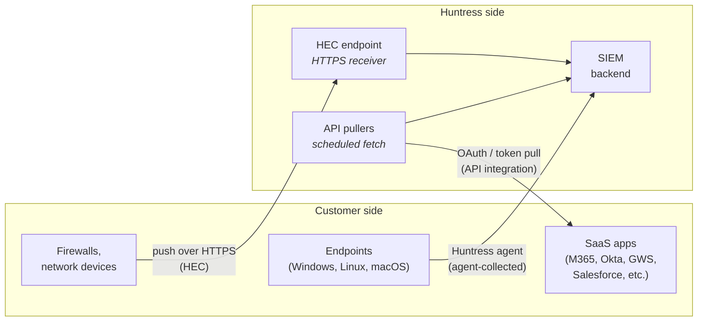

Every SIEM source uses one of three ingestion mechanisms. Knowing which mechanism a source uses tells you what "healthy" looks like for it, what fails first when it goes quiet, and which runbook applies when you need to act. Knowing the mechanism first turns a half-hour of confused diagnostics into a five-minute check.

## The three mechanisms, one diagram

The shape that matters: **agent-collected pushes**, **HEC pushes**, **API pulls**. Three different directions, three different auth models, three different failure modes.

### 1. Agent-collected

The Huntress agent already on the endpoint, the same agent doing EDR, also forwards log data when SIEM is enabled for the customer. Windows Event Logs (Security, System, Application, PowerShell Operational, Sysmon if installed), Linux `auditd` and `journald`, macOS logs where supported. The agent reads OS-native logs and ships them over the same encrypted channel it uses for EDR telemetry. No separate collector lives on the endpoint.

Healthy state: agent online, SIEM module enabled for that endpoint, the OS-level log service itself running. Typical failures: the agent is offline (four causes from the agent-architecture lesson), the SIEM module isn't licensed for the endpoint, or the underlying Windows Event Log service has stopped or `journald` has hit a disk-quota wall.

### 2. HEC, HTTP Event Collector

A Huntress-side HTTPS endpoint that accepts events pushed by the customer's sources. Firewalls and other network devices send via syslog through a forwarder that bridges syslog to HEC. Linux servers without the agent ship log shippers configured against the HEC URL. Custom applications post structured events directly.

Healthy state: the source can reach the HEC URL, the auth token is valid, events are streaming at the source's expected volume. Typical failures: the network path is broken (firewall rule change, ISP issue, DNS), the auth token has been revoked or expired, the source's logging configuration has stopped sending after a device restart, or the source is genuinely silent rather than broken.

### 3. API integrations

SaaS sources expose audit logs via vendor-specific APIs. Microsoft 365 (the broader Office 365 audit logs beyond what ITDR consumes), Google Workspace, Okta, Duo, Azure, AWS, GCP, and audit-logging-capable SaaS apps. The integration uses an OAuth grant or API token issued once by the customer's admin, and Huntress pulls on a schedule from there.

Healthy state: authentication is current, the SaaS API is reachable, pulls complete on the documented cadence. Typical failures: the token has been revoked or expired (the most common API-integration failure), the customer disabled audit logging in the SaaS admin console, the SaaS vendor's API changed in a way that breaks the integration briefly, or rate-limiting / quota issues throttle pulls.

## Telling the mechanism from the source name

The portal labels each source's mechanism, but the source-name convention also gives it away.

| Example source name | Mechanism |
|---|---|
| `SRV-EXAMPLE-DC-01-WindowsEventLog` | Agent-collected (hostname-prefixed) |
| `Firewall-PaloAlto-HEC-Edge01` | HEC ingestion (contains HEC and a device reference) |
| `Example-M365-Office365Audit` | API integration (SaaS app name, no hostname) |

When a source-name doesn't fit those shapes, open the portal's data-source view and read the mechanism label directly. Don't guess.

## Why the mechanism is the first question

Two scenarios make this concrete.

**Data-source health diagnostics.** A source has gone quiet. The mechanism tells you where to look: an agent fault (the four-cause check from the agent-architecture lesson), an HEC network or forwarder issue, or an API integration auth failure. Running the wrong runbook against the wrong mechanism wastes the same half-hour every time.

**Source-addition runbooks.** Adding an agent-collected source on an already-onboarded endpoint is mostly a portal toggle. Adding an HEC source involves customer-side device configuration. Adding an API integration involves an OAuth-consent flow with the customer's admin. Three different runbooks; the right one is chosen by mechanism.

## The peer's claim about agent-collected sources

A peer says: *if the Huntress agent is online, all agent-collected SIEM sources from that endpoint are healthy by definition*. It's mostly true, with one trap. A healthy agent can still have a broken local log source. Windows Event Log service stopped. `journald` disk full. A scheduled task that's been disabling Sysmon. The agent reports source health separately from agent health, and the portal will show the source as unhealthy even while the agent itself is green. Read both signals, not just one.

A second peer adds: *HEC and API integrations are kind of the same thing, both are network-based*. They share HTTPS as transport, and that's where the resemblance ends. HEC is the customer's source pushing into Huntress; API is Huntress pulling from a SaaS. Different auth models, different failure surfaces, different fix paths. Diagnosing one as if it were the other sends you into the wrong runbook with confident steps.

## Decision walkthrough

The customer's IT manager messages: *we're not seeing any sign-in events in your SIEM view from yesterday*. The customer's tenant has 60 agent-collected Windows Event Log sources (one per endpoint), one HEC source (a Palo Alto firewall syslog bridge), and three API integrations (M365 Office 365 audit, Okta SSO, Microsoft Defender for Cloud).

<DecisionTree client:load
  title="Which sources do you check first?"
  description="The complaint is about sign-in events specifically. The right scoping question is which mechanism owns sign-in visibility for this customer, not how many sources can be checked sequentially before lunch."
  startId="root"
  nodes={[
    { type: "question", id: "root", prompt: "Where do you start?", choices: [
      { label: "Check all 64 sources sequentially to be thorough", next: "shotgun" },
      { label: "Check Okta and M365 API integrations first; agent-collected Windows Event Logs second for local sign-ins", next: "scoped" },
      { label: "Tell the customer their SSO is broken", next: "blame" },
    ]},
    { type: "outcome", id: "scoped", label: "Scoped diagnostic, mechanism first", tone: "success",
      body: <>Right read. Sign-in events live primarily on the SSO integration (Okta) and secondarily on the Windows Event Log for local sign-ins. The 60 endpoint sources only need a glance once the SaaS integrations are confirmed.</> },
    { type: "outcome", id: "shotgun", label: "Sequential check is the slow path", tone: "warn",
      body: <>64 sources checked blindly will turn up the answer eventually. By that point you've burned an hour the customer can feel. Mechanism-first scoping is the cheap shortcut.</> },
    { type: "outcome", id: "blame", label: "Wrong attribution, expensive in the conversation", tone: "bad",
      body: <>The signal points at the Huntress-to-Okta pull, not at the customer's Okta operation. Users are still signing in; we're just not ingesting the events. Telling the customer their SSO is broken misattributes the fault and damages the relationship.</> },
  ]}
/>

You check the Okta integration and the status is *Authentication failed*, with the last successful pull from before the gap. The mechanism is the API auth path, and the fix is re-authentication per the runbook. Whether the re-auth is in your scope or your senior's depends on your MSP's runbook scoping for SaaS integration auth, the same pattern you saw on the M365 ITDR connection lesson. Don't tell the customer their Okta is broken. The auth fault is on the integration, not on Okta.

## What to do with this

Whenever a SIEM source appears in your work, ask the mechanism question first. The portal answers it for you, but the source name usually does too. The next four lessons assume you've already classified the source by mechanism; the rest of the diagnostic and the runbook choice falls out of that classification.

<Checkpoint slug="huntress-judgement-and-identity-checkpoint-data-source-model" client:visible />
