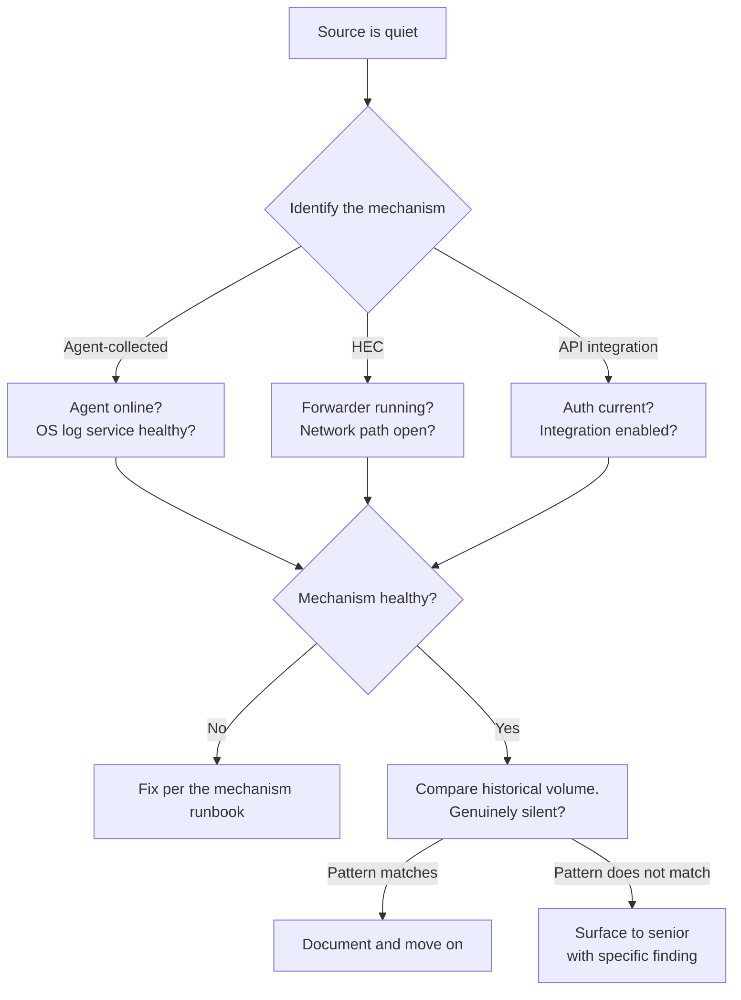

A SIEM source that goes quiet creates a blind spot the SOC may not catch until much later. The portal shows each source's last-event timestamp. A gap there is the signal. The skill in this lesson is reading the gap, mapping it to the source's ingestion mechanism, and picking the right diagnostic path. Five common causes. Each has its own fix. Running the wrong diagnostic wastes a half-hour.

## The five common causes

**1. Agent offline (agent-collected sources).** The Huntress agent that ingests the logs is itself offline. Maps to the four-cause diagnostic from the agent-architecture lesson (powered off, service stopped, network blocked, uninstalled). Signal: the source's host shows offline in the EDR Agents view too.

**2. Syslog forwarder broken (HEC sources).** The forwarder that translates the source's native logging to HEC HTTPS has crashed, lost its config, or had its network path broken. Signal: other HEC sources are healthy, but this one (or this group routed through the same forwarder) has gone quiet.

**3. API credential expired (API integrations).** The OAuth token or API token has expired, been revoked, or been disabled. Signal: integration status shows "Authentication failed" with the last successful pull predating the expiry.

**4. Integration disabled (API or HEC).** Someone has disabled the integration in the Huntress portal or in the source's admin console. Signal: status shows "Disabled" rather than failed auth. The disable timestamp is in the portal audit log.

**5. Source genuinely silent (any mechanism).** The source has nothing to send. A firewall that only forwards security-relevant events may produce nothing at 3am on a Sunday. A SaaS source idle over a holiday weekend may generate zero events. Signal: all mechanism checks pass, but no events. This is the diagnosis-by-elimination case.

## The diagnostic order

Mechanism first. Always. The mechanism determines which checks to run, which runbook to follow, and which fix path applies. Skipping this step and running the wrong mechanism's diagnostic is the most common waste-of-time mistake.

## Per-mechanism diagnostics

**Agent-collected:** Run the four-cause check on the agent's host. If the agent is healthy and the source is still quiet, check whether the OS-level log service on that host is running (Windows Event Log service stopped, `journald` disk full, Sysmon disabled by a scheduled task).

**HEC:** Check the forwarder's health per the runbook. Check the network path: can the forwarder reach the Huntress HEC endpoint? Check whether the HEC token has been revoked (rare, usually deliberate).

**API integration:** Check the integration's status in the portal. For auth failure: re-auth per the runbook (often scoped as senior-touch work, same pattern as earlier SaaS-integration lessons). For disabled: check the audit log for who disabled and when, then re-enable per the runbook. For authenticated-but-empty: the source may be genuinely silent.

## Genuinely silent vs. broken

Not every quiet source is broken. A firewall that filters to security-relevant events only may be legitimately quiet during a low-traffic window. A SaaS source that the customer doesn't use over a weekend holiday produces zero events.

The mechanism-health checks distinguish broken from quiet. When the agent is online, the forwarder is running, and the integration is authenticated and enabled, but there are no events, compare against historical volume for that time of day or week. If the pattern matches a known quiet window, document the finding and move on.

<Callout type="warn" title="Scope of the fix vs. scope of the diagnostic">
The diagnostic is always in your scope. The fix may not be. If your MSP scopes SaaS-integration re-authentication as senior-only, hand the specific re-auth task to the senior: "Okta API integration on customer X, auth-failed since timestamp Y." Diagnostic yours; fix may be theirs.
</Callout>

## Decision walkthrough

The customer's IT manager messages: "Our weekly security review noticed we haven't seen firewall logs in your SIEM dashboard for the last day." Source `acme-firewall-hec` shows last event 25 hours ago, status "No recent events." Other HEC sources are fine. Agent-collected and API sources are fine.

<DecisionTree client:load
  title="Firewall source has gone quiet"
  description="The source name tells you the mechanism (HEC). Other HEC sources are healthy, so the failure is specific to this source or its forwarder, not a platform-wide HEC problem."
  startId="root"
  nodes={[
    { type: "question", id: "root", prompt: "Where do you start?", choices: [
      { label: "Re-authenticate the HEC source immediately", next: "reauth" },
      { label: "Check the forwarder health and network path per the HEC runbook", next: "diagnose" },
      { label: "Tell the IT manager their firewall is broken", next: "blame" },
    ]},
    { type: "question", id: "diagnose", prompt: "Forwarder is running. Logs show TLS connection refused against the HEC endpoint. Customer says nothing changed. Next step?", choices: [
      { label: "Bump immediately because TLS refusal is above diagnostic scope", next: "premature" },
      { label: "Check the HEC endpoint URL for changes and the perimeter firewall for blocking rules, then bump with a specific finding if still unresolved", next: "thorough" },
    ]},
    { type: "outcome", id: "thorough", label: "In-scope diagnostic with a specific bump", tone: "success",
      body: "Right read. You ran the in-scope diagnostic, checked the endpoint URL and perimeter rules, and bumped with a specific finding the senior can act on." },
    { type: "outcome", id: "premature", label: "Premature escalation", tone: "warn",
      body: "Defensible if your runbook scopes it that way, but the endpoint URL check and perimeter rule check are in scope and take five minutes." },
    { type: "outcome", id: "reauth", label: "Wrong fix mode for HEC", tone: "bad",
      body: "HEC does not use OAuth the same way as API integrations. Re-auth is not the right fix, and you have not diagnosed the actual cause." },
    { type: "outcome", id: "blame", label: "Wrong attribution", tone: "bad",
      body: "The source has gone quiet on the Huntress collection side. That could be forwarder, network, or token. Telling the customer their firewall is broken misattributes the fault." },
  ]}
/>

<Checkpoint slug="huntress-judgement-and-identity-checkpoint-data-source-health" client:visible />
