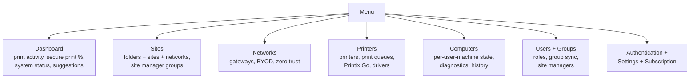

The customer's Printix Home is at `customer-name.printix.net`. Sign in with your Microsoft, Google, Okta, OneLogin, or OIDC account, and you land on the Administrator. Knowing where things live is the cheapest possible triage skill.

## The seven menu items

The five rows you'll touch on the helpdesk:

- **Dashboard.** Period-windowed counters: print activity, Printed in black, Printed 2-sided, Save-O-Meter (uncollected pages), Secure print percentage. The window options are Last 7 days, Last 14 days, or Last 4 weeks. First place to look when a customer asks "is Printix even being used?"
- **Printers.** Every registered printer with its three-letter ID (the **ASD**, **BNM**, **CVB** identifiers Printix auto-assigns), its queues, Printix Go status, and the network it lives on. Printer properties is where you replace, rename, or retire a device.

The Printers page is the single most-used surface during triage:

<AnnotatedScreenshot
  src="/img/printix/printers-page.png"
  alt="Printix Administrator Printers page showing a list of printers with three-letter IDs, names, status icons, network, and Printix Go state"
  caption="The three-letter ID is the canonical name. Status, Network, and Printix Go columns are the three you scan during triage."
>
  <Hotspot client:load x={20} y={28} label="1" title="Three-letter ID" purpose="The canonical printer identifier.">
    Auto-assigned at registration. Printed on the printer's QR / NFC sign so users can scan to find the right queue. Survives renames.
  </Hotspot>
  <Hotspot client:load x={50} y={28} label="2" title="Printer name" purpose="Human-friendly label.">
    The customer's chosen name. Convention: combine the location with the role, for example "Reception".
  </Hotspot>
  <Hotspot client:load x={75} y={28} label="3" title="Network" purpose="Where the printer lives.">
    Tells you which Site / Network owns the device. A user on a different Network won't see it unless their queues are configured to.
  </Hotspot>
  <Hotspot client:load x={90} y={28} label="4" title="Status" purpose="Online or error indicator.">
    First place to look when a ticket says "the printer's broken." If it's offline here, the issue is on the LAN before it's in Printix.
  </Hotspot>
</AnnotatedScreenshot>
- **Computers.** Each user's workstation with the Printix Client on it. Per-machine **Diagnostics** tab shows queue counts, printer errors, and proxy status. Per-machine **History** tab shows recent jobs and tasks. This is where you confirm the agent is actually online before chasing user error.
- **Users.** Every signed-in user with their role (System manager, Site manager, User, Guest, Kiosk user) and sign-in method. User properties is where roles get changed.
- **Authentication.** Which sign-in methods are enabled (Microsoft Entra ID, Google, Okta, OneLogin, OIDC, Active Directory, Sign in with email). Touch only with explicit change-control authority; flipping these affects everyone in the tenant.

The two you'll mostly read but rarely change:

- **Sites and Networks.** How the customer's offices and IP ranges map to print routing. Beginner-course scope: just know how to find the right Site for a user's ticket. Design lives in the Intermediate course's first lesson.
- **Settings.** Tenant-wide knobs: secure print defaults, print rules, Printix Go configurations, capture workflows, mobile print, home office, SNMP, webhooks. Beginner-course scope: don't change without authorisation.

<Callout type="tip" title="The header is the canonical check">
The Printix Home name (`acme.printix.net`) appears top-left. When MSP staff jump between customer tenants, that header is the only reliable "am I in the right tenant?" check before any change. Make checking it a reflex.
</Callout>

## A worked ticket: Able Moose Accounting

Sarah at Able Moose Accounting opens a ticket: *"My laptop says it's printing to Reception ASD but nothing comes out. Did the printer break?"*

(Reception ASD is the canonical Printix order: name then three-letter ID. The Printix App's history view sometimes lists the ID first; both refer to the same printer.)

<StepThrough client:load>
  <Step title="Confirm tenant in the header">
    Sign in to `ablemoose.printix.net`. Confirm the header reads "Able Moose Accounting" before doing anything.
  </Step>
  <Step title="Check the printer">
    Menu, then Printers. Find Reception ASD in the list. Status column tells you Online or has an error. If it's offline, the issue is on the LAN, not in Printix.
  </Step>
  <Step title="Check Sarah's computer">
    Menu, then Computers. Search for Sarah's hostname. Status, the Printix Client version, and the Type (Laptop / Desktop) tell you whether the agent is alive. Open the Diagnostics tab to see if jobs are flowing.
  </Step>
  <Step title="Check the printer's recent History">
    Back on the printer's page, the History tab is the audit trail of who printed what and whether it succeeded. If Sarah's job appears there with a successful state, the print server (well, Printix) did its part. The job is at the printer.
  </Step>
</StepThrough>

The point of this ticket isn't the answer (it usually turns out to be a paper jam or an out-of-toner state nobody told the user about). It's the muscle memory: header first, then Printers, then Computers, then History.

<Checkpoint slug="printix-fundamentals-checkpoint-console" client:load />

## What this is NOT

- **The Administrator is not the user-facing app.** End users do not sign in here. Their app is the Printix App at `customer-name.printix.net` (web) or the mobile apps for Android and iOS. Treat the Administrator as MSP-only.
- **Printix Home and Printix Partner Portal are different consoles.** Partner Portal lives at `partner.printix.net` and lists tenants. Don't confuse "I can see the customer" in Partner Portal with "I'm administering the customer" in their Printix Home.

<Callout type="info" title="Sources">
[Dashboard](https://docshield.tungstenautomation.com/Printix/en_US/help/admin/Printix_admin/c_administrator_dashboard.html), [Sites](https://docshield.tungstenautomation.com/Printix/en_US/help/admin/Printix_admin/t_administrator_sites.html), [Authentication](https://docshield.tungstenautomation.com/Printix/en_US/help/admin/Printix_admin/t_administrator_authentication.html), [Computer Diagnostics tab](https://docshield.tungstenautomation.com/Printix/en_US/help/admin/Printix_admin/c_computer_diagnostics.html), [Roles](https://docshield.tungstenautomation.com/Printix/en_US/help/admin/Printix_admin/c_roles.html).
</Callout>
