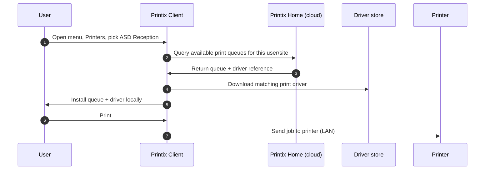

Adding a printer in Printix is a two-stage idea: the printer has to exist in the tenant (registered, with a print driver in the Printix driver store), and the user's computer has to know about the matching print queue. Both happen via the Printix Client, but who triggers it depends on the customer's policy.

## The path, one diagram

Two things that make Printix's add-printer story different from a plain Windows print server:

- **Three-letter printer ID.** When a printer registers, Printix auto-assigns a unique three-letter code (`ASD`, `BNM`, `CVB`) and appends it to the printer name. So a printer the user calls "Reception" appears in the Printix Client as `Reception ASD`. The same ID lives on the printer's QR-code / NFC sign, so users can scan to find the right queue.

Printix exposes a Word-template printer ID sign you can print and tape to each device. It carries the printer name, three-letter ID, and a QR code:

<AnnotatedScreenshot
  src="/img/printix/printer-id-sign.png"
  alt="Sample Printix printer ID sign, a printable A4 page with the printer's name, three-letter ID, and a QR code"
  caption="One sign per printer. Users with the Printix App scan the QR code instead of guessing which CVB is which."
>
  <Hotspot client:load x={50} y={20} label="1" title="Printer name + ID" purpose="The same name as the Administrator Printers page.">
    The user reads the name first, the QR scan resolves to the same queue.
  </Hotspot>
  <Hotspot client:load x={50} y={65} label="2" title="QR code" purpose="One-tap add for users on the Printix App.">
    Generated from the printer's tenant identity. Reprint when a printer is replaced or renamed; the old QR resolves to the wrong device.
  </Hotspot>
</AnnotatedScreenshot>
- **Driver delivery is automatic.** The first time the Printix Client adds a queue, it pulls the matching driver from the customer's Printix driver store. <cite>"The Printix Client...automatically uploads print drivers and puts them in your Printix driver store."</cite> The technician didn't ship a driver to the laptop.

## The three add-printer paths

| Path | Who does it | When |
|---|---|---|
| **Printix Client menu, self-service** | The user | Default for SMB customers; the most common path |
| **QR / NFC scan from the Printix App** | The user, walking past the printer | When the customer wants frictionless onboarding |
| **Administrator, Add printer** | A System manager or Site manager | When discovering a new physical printer for the first time, or onboarding a print server |

The frontline technician's lever is usually the user-side path: walk the user through their Printix Client menu. The Administrator path is for adding a printer that doesn't exist in the tenant yet, and it lives behind the Administrator's Printers page:

<AnnotatedScreenshot
  src="/img/printix/add-printer-form.png"
  alt="Printix Administrator Add printer dialog with fields for hostname or IP, location, and registered to network"
  caption="Add printer is the technician path. Hostname or IP plus the network is the minimum; everything else (drivers, queues) follows once Printix can talk to the device."
>
  <Hotspot client:load x={50} y={30} label="1" title="Hostname or IP" purpose="How Printix reaches the device.">
    Resolvable hostname or static IP. A DHCP-only printer will work but the registration drifts when the lease changes; static is the operational default.
  </Hotspot>
  <Hotspot client:load x={50} y={55} label="2" title="Network" purpose="Which Site / Network owns this printer.">
    Pick the Network the printer lives on. This is the link that decides which users see the printer when they're on that Network.
  </Hotspot>
</AnnotatedScreenshot>

## A worked ticket: Able Moose Accounting

Maya at Able Moose just got a new MacBook. Day one. The Printix Client signed her in automatically through Microsoft Entra. She opens a ticket: *"I can't see the warehouse printer. Reception is there but warehouse is missing."*

<StepThrough client:load>
  <Step title="Sanity check: is the warehouse printer in the tenant at all?">
    Sign in to `ablemoose.printix.net`. Menu, Printers. Search for "warehouse". CVB Warehouse is there, status Online. Good, the printer exists.
  </Step>
  <Step title="Walk Maya through the Printix Client">
    On her Mac she opens the Printix Client from the menu bar, selects Printers, then searches for "warehouse" or "CVB". The result list is filtered to printers she has access to.
  </Step>
  <Step title="Add and finish">
    Maya selects CVB Warehouse, then Add. The Printix Client downloads the driver and installs the queue. After a few seconds the row shows Installed. She selects Finish.
  </Step>
  <Step title="Verify with a test page">
    Maya prints a test page from the Mac's Printers & Scanners panel. The page comes out at the warehouse printer.
  </Step>
</StepThrough>

If a printer doesn't show in Maya's search, the cause is usually one of three things, in this order:

1. **Group access.** The print queue has Exclusive access enabled and Maya isn't in the right Microsoft Entra group. Check the print queue's Groups tab in the Administrator.
2. **Site mismatch.** The Printix Client decides which queues to offer based on the network the computer is on. A laptop home-office'd onto a residential gateway may not see office printers. Confirm Site / Network on the Computer properties page.
3. **Printer not active.** A queue marked inactive won't appear for users. Administrators can still see it (with a star ★ next to the printer ID), regular users can't.

<Checkpoint slug="printix-l1-checkpoint-add-printer" client:load />

<Callout type="info" title="Sources">
[How to add printers](https://docshield.tungstenautomation.com/Printix/en_US/help/admin/Printix_admin/t_how_to_add_printers_howto.html), [Identify the printer](https://docshield.tungstenautomation.com/Printix/en_US/help/user/Printix_user/c_identify_the_printer.html), [Add printers (user)](https://docshield.tungstenautomation.com/Printix/en_US/help/user/Printix_user/t_how_to_add_printers.html), [Features (driver store)](https://docshield.tungstenautomation.com/Printix/en_US/help/admin/Printix_admin/c_features.html).
</Callout>
