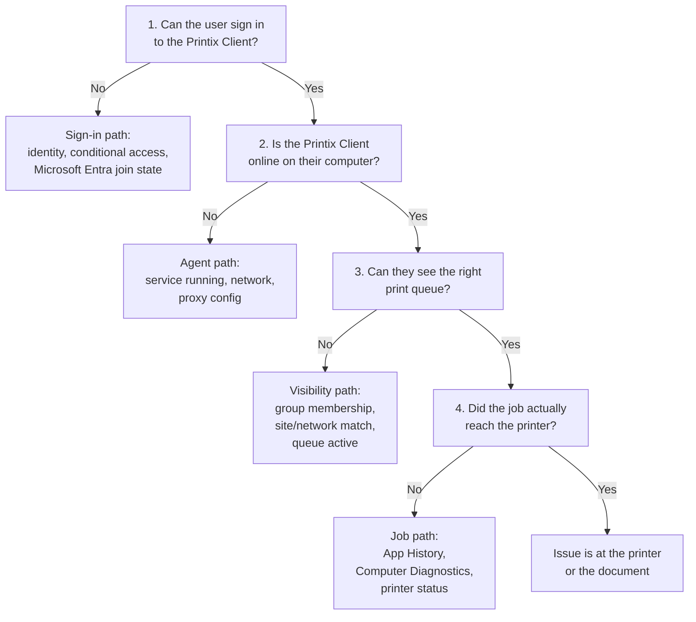

Most Printix tickets cluster into three buckets: the user can't sign in, the user can't see the printer they want, or the user submitted a job and nothing happened. Each bucket has a small set of likely causes, and the Administrator surfaces all of them. The trick is asking the right four questions in the right order.

## The four-question triage

Each question has a console move. None of them require touching settings.

### 1. Can the user sign in?

The Printix Client opens to a sign-in screen. If sign-in fails, three documented causes:

- **Conditional Access blocked them.** The error <cite>"Your sign-in was successful but does not meet the criteria to access this resource"</cite> means the customer's Microsoft Entra Conditional Access policy denied Printix. Outside frontline scope unless the customer has explicitly granted you the change.
- **Microsoft Entra join state.** On a Microsoft Entra-joined Windows 10 or 11 machine sign-in is supposed to be automatic. The first sign-in sometimes isn't, and a restart usually fixes it.
- **Loop back to sign-in page.** Repeated bouncing back to the sign-in page is its own documented troubleshooting path; collect logs and escalate.
- **PIN-code lockout at the printer.** A user who fails the 4-digit PIN at a Printix Go touchscreen three times has the PIN disabled. They have to re-enrol from the Printix App before card or PIN sign-in works again at the device.

### 2. Is the Printix Client online?

Menu, Computers, find the user's hostname. Status column says Online or Offline.

If Offline:

- The Printix Service might not be running. The user (or remote-management tool) restarts the service.
- The computer might not have Internet to `*.printix.net`. Check the customer's web proxy / firewall rules.
- For Mac, Jamf or Addigy may have updated the agent in a way that broke the install. Reinstall via the Software page.

### 3. Can they see the right print queue?

Open the Printix Client. Menu, Printers. The list is filtered by group membership and current network.

If the queue is missing:

- **Group access.** Printer's print queue properties has a Groups tab. Open Administrator, Printers, the printer, Print queues, the specific queue, Groups. Confirm the user's Microsoft Entra group is listed (and group sync is healthy).
- **Network mismatch.** The user's computer is on a network that doesn't have access to that printer. Computer properties shows the current network. If they're on a home network, this is expected; tell them to use Print Anywhere or Home Office printing if enabled.
- **Queue inactive.** Administrator-only printers show with a star ★ after the printer ID for admins, and don't show at all for users. Check the Print queue properties for the Active flag.

### 4. Did the job reach the printer?

Two log surfaces:

- **The user's Printix App History.** Print history for the last 30 days. If the document is missing, the user didn't actually submit (or submitted via Print Later and hasn't released yet).
- **The Computer's Diagnostics tab.** Per-machine counts since the last service restart, including **New** (jobs queued by the Printix Client) and **Printed in total** (jobs the client has actually delivered to a printer). If "New" went up but "Printed in total" didn't, the job is stranded somewhere between Printix Client and printer.

<Callout type="tip" title="Open the printer's History tab too">
The printer itself has a History tab in Administrator. It's the audit of who printed what at that printer. If the user's job appears with success there, the printer received and printed it. The complaint is then about output (paper, toner, jam), not about Printix.
</Callout>

## A worked ticket: Northwind Logistics

Northwind Logistics is a mid-market warehouse with shift work. A driver opens a ticket: *"I sent shipping labels to BNM Loading Dock at 6am, nothing came out, my shift's over."*

<StepThrough client:load>
  <Step title="Sign-in OK?">
    Driver signs in fine to the Printix Client. Skip question 1.
  </Step>
  <Step title="Computer online?">
    Administrator, Computers. Driver's tablet last reported online at 06:14. Currently Offline (driver took the tablet and left). The job was submitted, but Print Later jobs need the source computer up to release.
  </Step>
  <Step title="Queue visible?">
    Driver could see and select BNM Loading Dock. Skip question 3.
  </Step>
  <Step title="Job reached the printer?">
    BNM Loading Dock's History shows zero entries for the user that morning. Confirms the job never reached the printer; it was stuck on the offline tablet.
  </Step>
  <Step title="Resolve and prevent">
    The driver reopens the tablet on the dock network, the job releases, the labels print. Document the recurrence, escalate to the customer's account lead to enable Azure Blob Storage so shift workers don't have this exact problem next week.
  </Step>
</StepThrough>

<Checkpoint slug="printix-l1-checkpoint-triage" client:load />

## What this is NOT

- **Not a print-driver troubleshooting flow.** "Document is empty" or "garbled output" usually points at a print driver issue (wrong driver, missing tray, bad PDF processing). That's a different lesson, in the Intermediate course's driver-delivery section.
- **Not for Printix Go device-side issues.** When the user signs in fine on the touchscreen but a Capture or scan fails, that's vendor-specific (Brother, Canon, HP, Konica Minolta troubleshooting). Beginner course doesn't cover those.

<Callout type="info" title="Sources">
[Sign-in issues](https://docshield.tungstenautomation.com/Printix/en_US/help/admin/Printix_admin/c_ts_sign_in_issues.html), [Conditional Access criteria error](https://docshield.tungstenautomation.com/Printix/en_US/help/admin/Printix_admin/c_ts_your_sign_in_was_successful_but_does_not_meet_the_criteria_to_access_this_resource.html), [Computer Diagnostics](https://docshield.tungstenautomation.com/Printix/en_US/help/admin/Printix_admin/c_computer_diagnostics.html), [History - Print (Printix App)](https://docshield.tungstenautomation.com/Printix/en_US/help/user/Printix_user/c_app_history.html), [Network computers](https://docshield.tungstenautomation.com/Printix/en_US/help/admin/Printix_admin/t_network_computers.html).
</Callout>
