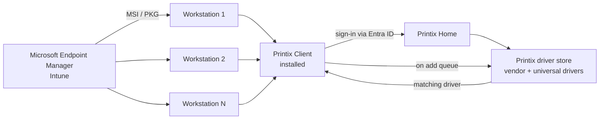

The Beginner course covered driver delivery from the user's view: the Printix Client downloads what it needs when a queue is added. This lesson is the operational design behind that, the choices an MSP makes once and the procedures that scale to 120 laptops without 120 ticket-and-USB-stick visits.

## The two delivery paths

Two stages. Both happen without a technician at the machine.

**Stage 1: Push the Printix Client.** The Printix Software page generates a per-tenant MSI for Windows or PKG for Mac. Microsoft Endpoint Manager (or Jamf, Addigy, Kandji, Intune for Education) ships it as a line-of-business app — Printix supplies the package, MDM is still the thing that delivers it to managed laptops. The MSI argument variants matter:

- **Sign in after installation.** Default; shows the sign-in dialog when the install finishes.
- **Sign in postponed until restart.** Used for Windows Autopilot scenarios where the install runs during initial provisioning. Only the Printix Service starts; the user signs in when they first use the machine. The computer doesn't appear in Administrator until that sign-in happens.

**Stage 2: The driver follows the queue.** Once the Printix Client is signed in, every time a user adds a print queue (self-service or group-deployed), the matching driver downloads from the customer's driver store automatically.

## Driver store, what's actually in it

The customer's Printix driver store is built up from two sources:

- **Discovered drivers from existing print servers or computers.** When a Printix Client is first installed on a workstation that already has printers, Printix uploads <cite>"signed and unique print drivers"</cite> from that machine to the driver store. Migrating an existing print server pulls every driver registered for that server's queues.
- **Vendor universal drivers.** Where no specific driver exists for a model, Printix can fall back to a vendor universal driver. The supported list covers most major OEMs (Canon, HP, Konica Minolta, Kyocera, Lexmark, Ricoh, Toshiba, Xerox, and others). The driver store auto-discovers drivers when each printer is first added; check the Drivers page in Administrator for the live inventory in your tenant rather than memorising the list.

The technician's job is keeping the driver store sane: removing drivers that aren't used, adding drivers for newly-acquired printers, and ensuring driver configurations (device settings: trays, duplexers, output bins; printing defaults: 2-sided, black-only) are right before the driver gets pushed to dozens of workstations.

## A worked deployment: Able Moose mid-market rollout

Able Moose is rolling Printix to all three offices. Pre-existing: a Windows Server 2019 print server in Sydney with twelve print queues. Plan: keep the print server up while Printix learns its drivers and queues, then decommission.

| Phase | Action | What happens |
|---|---|---|
| 1. Install Printix Client on the Sydney print server | One-time technician trip to the server | Printers, print queues, and drivers get registered in Printix Cloud; Network1 created with the server's gateway |
| 2. Deploy Printix Client via Intune to all Sydney laptops | Intune assigns the MSI to the "All Sydney users" group | Printix Client installs silently; users with Microsoft Entra-joined laptops get auto-sign-in |
| 3. Configure print drivers (trays, defaults, duplex) | MSP team works through Drivers in Administrator | Defaults like Print 2-sided and Print in black get set centrally |
| 4. Activate "Add print queue automatically" with groups | Tied to Microsoft Entra groups via the print queue's Groups tab | Users in a group get queues installed without self-service |
| 5. Decommission the Sydney print server | After a quiet week with no printing complaints | Take the server offline; <cite>"Unplug the network cable and leave it that way for a week or so"</cite> before decommissioning |

The point of phase 5 is documented Printix advice: leave the print server unplugged but recoverable for a week, see if anyone complains. If nobody does, decommission. If someone does, you plug it back in while you investigate.

<Callout type="warn" title="Don't overlap two Print Spoolers">
On a workstation where the Printix Client is taking over, make sure the Windows Print Spooler is allowed to start, but the workstation isn't also pointed at the old print server's shared queue. Two queues for the same printer (one direct via Printix, one via the print-server share) confuses users about which to print to. The Convert print queues setting in Printix Settings handles this case but is worth verifying.
</Callout>

## Driver-version trouble: the configurations table

Printix lets you maintain multiple "print driver configurations" on the same driver. Useful when one office wants Print 2-sided as the default and another office prints single-sided invoices. The configuration is selected per-print-queue, not per-user. A driver-config rollout looks like:

| Step | Where in Administrator |
|---|---|
| Add a new configuration to a driver | Drivers, the driver, the Configurations tab |
| Set device settings (trays, finishers) | Configuration's Device tab |
| Set printing defaults (duplex, mono) | Configuration's Printing tab |
| Apply the configuration to a print queue | Print queue properties, Configuration |
| Push the change to user workstations | Update print queues on computers (Intermediate-course operational task) |

<Checkpoint slug="printix-deployment-checkpoint-drivers" client:load />

<Callout type="info" title="Sources">
[Migrate print server to Printix Cloud](https://docshield.tungstenautomation.com/Printix/en_US/help/admin/Printix_admin/t_migrate_print_server_example.html), [How to deploy Printix Client with Microsoft Endpoint Manager](https://docshield.tungstenautomation.com/Printix/en_US/help/admin/Printix_admin/t_how_to_deploy_client_with_intune.html), [Microsoft integration / Endpoint Manager](https://docshield.tungstenautomation.com/Printix/en_US/help/admin/Printix_admin/t_features_microsoft_integration.html), [Components (driver store)](https://docshield.tungstenautomation.com/Printix/en_US/help/admin/Printix_admin/c_components.html).
</Callout>
