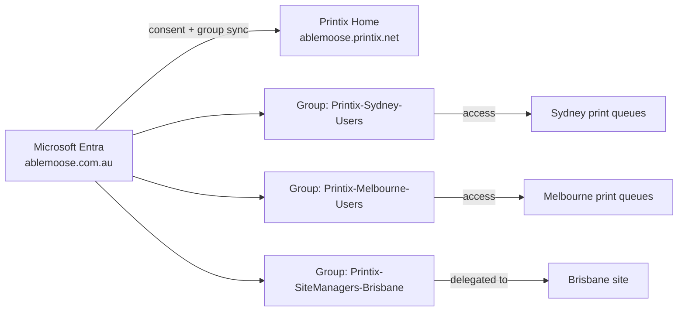

A Printix tenant has two identity surfaces: who can sign in (Authentication) and who can do what once signed in (Groups for printer access, Roles for admin scope). This lesson is the design and rollout of both for a customer who's federating with Microsoft Entra ID, Google Workspace, Okta, OneLogin, or a generic OIDC IdP.

## The seven sign-in methods

Seven, including email-and-password as the one to remove deliberately. From the Authentication page:

| Method | When to use | Notes |
|---|---|---|
| **Microsoft Entra ID** | Default for M365 customers | Auto-enabled if the tenant signed up via Microsoft AppSource / Azure Marketplace. Supports multiple Entra directories per Printix Home. |
| **Google Workspace** | Default for Workspace-anchored customers | Workspace, not gmail.com. Multiple Google domains per Printix Home. |
| **OIDC** | Generic OpenID Connect IdPs (custom, JumpCloud, Auth0, etc.) | Requires the IdP's metadata; Printix is the relying party. |
| **Okta** | Customers using Okta as their primary IdP | Multiple Okta domains supported. |
| **OneLogin** | Customers on OneLogin | Same shape as Okta. |
| **Active Directory** | On-prem AD federation, no cloud IdP | Niche these days; pre-cloud customers. |
| **Sign in with email** | Default but optional | Enabled by default. Remove it once the cloud IdP is wired up to avoid drift. |

For a Microsoft 365 customer the default and right answer is Microsoft Entra ID with email sign-in removed. <cite>"Passwords are handled entirely by Microsoft Entra ID."</cite> Printix doesn't store the password; it trusts the IdP's token.

## The global-admin gotcha

The most-missed prerequisite during onboarding is also the most documented:

> A Microsoft Entra ID account with the **global administrator** role is required to enable groups.

Same applies to Google: a Google Workspace administrator account is needed for group sync. Until group sync is enabled, you can authenticate users through the IdP, but you can't use Microsoft Entra or Google groups to control printer access. The Synchronize groups consent step on the Authentication tab pops a Microsoft sign-in dialog; it must be a global admin signing in there.

This is also where customers with split admin roles (the M365 admin can't get global, only User Administrator) hit a wall. Resolution is always the same: global admin signs in once, grants the consent, and never has to do it again. The site's authentication state then survives.

<Callout type="warn" title="Nested groups are not supported">
Printix's documentation is explicit: <cite>"Nested groups are not supported."</cite> If a customer's Microsoft Entra group "All Sydney" contains "Sydney Reception" and "Sydney Sales" rather than direct user membership, only the direct members of "All Sydney" itself will sync. Flatten the membership or use the leaf groups directly.
</Callout>

## Wiring up Microsoft Entra group sync, end to end

The five-step shape of the consent flow:

<StepThrough client:load>
  <Step title="Open Authentication, Microsoft Entra tab">
    Administrator, Authentication, then the Microsoft Entra ID tab. Confirm the directory you're connecting matches the customer's primary tenant. Multiple Entra directories are supported, each gets added separately.

    
  </Step>
  <Step title="Click Connect, sign in as global admin">
    Click Connect under Synchronize groups. The Microsoft sign-in dialog appears. The signing-in account must hold the Global Administrator role on the customer's tenant; User Administrator and other lower roles produce a "Could not verify group synchronization" error.

    
  </Step>
  <Step title="Wait for the first sync">
    Groups synchronise automatically at roughly 20-minute intervals. The first sync after consent can take a similar window. Don't troubleshoot a missing group inside the first 30 minutes; check again after the next sync cycle.
  </Step>
  <Step title="Verify groups appear in the Groups page">
    Administrator, Users, Groups. The Microsoft Entra groups now appear with member counts. If a group is empty when it shouldn't be, check whether it has nested groups (Printix doesn't traverse them) or has fewer than the expected direct members in Entra.
  </Step>
</StepThrough>

## Groups, what they actually control

Once group sync is on, two operational levers open:

| Lever | What it does | Where it lives |
|---|---|---|
| **Add print queue automatically** | When a user in the group signs in, the queue installs without self-service | Print queue properties, Groups tab |
| **Exclusive access** | Only users in the listed groups can use that print queue (other users don't see it) | Print queue properties, Groups tab |
| **Set as default printer** | The queue becomes the default for users in the group on their computers | Printer properties |
| **Site manager group** | Users in this group get the Site manager role on a Site or Folder | Sites, Site setup, Site manager groups |
| **Workflow access** | A Capture workflow is available to users in the group | Capture workflows, Workflow properties |

The pattern that scales: build groups around print-relevant boundaries, not org-chart boundaries. "Sydney-Reception-Printers" is more useful than "Marketing Department" because the printer-use rights map directly. Resist the temptation to bend M365's general-purpose security groups; create dedicated Printix-naming-scheme groups instead.

## A worked rollout: Able Moose three-office identity wiring

The naming scheme:

- `Printix-<office>-Users` for printer access
- `Printix-SiteManagers-<office>` for delegated admin

Conventions like this aren't pretty but they survive personnel changes. A new MSP technician in five years can read the group name and know the purpose without context.

<Checkpoint slug="printix-deployment-checkpoint-auth" client:load />

## What this is NOT

- **Not the role/RBAC matrix.** Printix's roles (System manager, Site manager, User, Guest, Kiosk user) are about what a user can do in the Administrator. Authentication is how they sign in; Roles is what they're allowed to do once signed in. The next lesson covers delegated management via the Site manager role.
- **Not MFA configuration.** MFA is configured in the IdP (Microsoft Entra ID, Google Workspace, Okta, OneLogin), not in Printix. Printix trusts whichever assurance the IdP gives it. If the customer needs MFA-required-for-print, that's a Conditional Access policy in their IdP.
- **Not the Partner Portal user list.** Users in the Partner Portal are MSP staff who can manage tenants. That list is separate from a tenant's own user list. The Advanced course covers the Partner Portal model.

<Callout type="info" title="Sources">
[Authentication](https://docshield.tungstenautomation.com/Printix/en_US/help/admin/Printix_admin/t_administrator_authentication.html), [How to enable Microsoft Entra authentication](https://docshield.tungstenautomation.com/Printix/en_US/help/admin/Printix_admin/t_how_to_enable_azure_active_directory.html), [How to enable Microsoft Entra groups](https://docshield.tungstenautomation.com/Printix/en_US/help/admin/Printix_admin/t_how_to_enable_azure_ad_groups.html), [Implementation checklist](https://docshield.tungstenautomation.com/Printix/en_US/help/implement/Printix_implementation/c_checklist.html), [Microsoft integration (Entra groups)](https://docshield.tungstenautomation.com/Printix/en_US/help/admin/Printix_admin/t_features_microsoft_integration.html).
</Callout>
