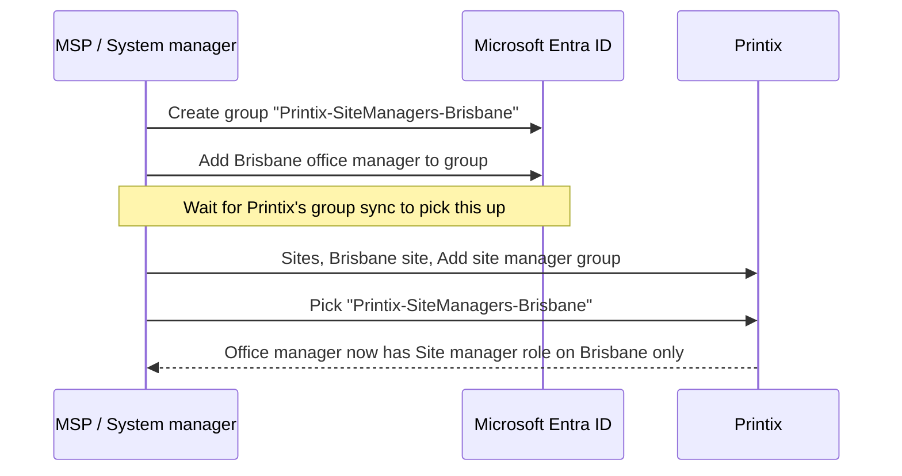

When a customer's local IT wants to add a printer at the Brisbane office without raising a ticket with the MSP, the right answer is delegation, not a shared System manager login. Printix's Site manager role exists for exactly this. It's the cleanest example of partial-trust delegation in the product. (This is *customer-side* delegation, scoping a person down inside their own tenant. How an MSP technician administers across many customer tenants is a Partner Portal problem, covered in the Advanced course.)

## The role matrix

Printix has five roles. Three matter for delegation:

| Role | Scope | Can do |
|---|---|---|
| **System manager** | Whole tenant | Everything: roles, billing, authentication, settings, every Site |
| **Site manager** | One or more Sites only | Add / modify / delete printers and queues, manage Groups for site-managed queues, see History for site-managed printers and computers |
| **User** | Self only | Print, Capture, Use Printix Apps. Cannot sign in to the Administrator |

(Plus Guest and Kiosk user, both narrower than User.)

Site manager is the only role that scopes down. Everything else is "all of the tenant" or "none of the Administrator."

## What a Site manager can and cannot do

The official permissions matrix is long. The vendor's own table is the canonical reference:

<AnnotatedScreenshot
  src="/img/printix/site-manager-permissions.png"
  alt="Printix Site manager role permissions matrix from vendor docs, showing rows for actions like Discover printers, Manage queues, Manage groups, See history, and No-access columns for Authentication, Subscription, other Sites"
  caption="Site manager scopes down per Site. Everything inside the managed Site is fair game; Authentication, Subscription, and other Sites are off-limits."
>
  <Hotspot client:load x={50} y={20} label="1" title="Yes for managed Sites" purpose="Where a Site manager has authority.">
    Discover printers, add or modify or delete printers and queues, manage Groups on site-managed queues, see History on site-managed printers and computers.
  </Hotspot>
  <Hotspot client:load x={50} y={55} label="2" title="No across the tenant" purpose="What's deliberately out of scope.">
    Tenant Settings (read-only, with no Analytics tab), Authentication, Subscription, other Sites, and the tenant-wide Drivers store. None of these are reachable.
  </Hotspot>
  <Hotspot client:load x={50} y={80} label="3" title="The Analytics exclusion" purpose="The most-cited Site manager limit.">
    Site managers see Settings as read-only with no access to the Analytics tab. Don't promise local IT they can configure Power BI; that's System manager only.
  </Hotspot>
</AnnotatedScreenshot>

Three notable specifics:

- **SNMP configurations.** A Site manager can see Global SNMP configurations and any SNMP configurations that have at least one of their managed networks. They can create, modify, and delete an SNMP config that *only* contains managed networks. They can't touch SNMP configs that span outside their scope.
- **Settings access.** Read-only on tenant Settings, with one exclusion: <cite>"No access to Analytics tab."</cite> Don't promise local IT they'll get to set up Power BI; that's a System manager move.
- **No way to elevate themselves.** A Site manager cannot grant themselves System manager rights. Role escalation is always done by an existing System manager, on User properties, by changing the Role field.

## The implementation pattern

Four-step rollout pattern that matches the Beginner course's add-printer pattern:

1. **Create the Microsoft Entra (or Google) group** with a Printix-naming convention.
2. **Add the people** who should hold the Site manager role to that group.
3. **Wait for group sync** to surface them in Printix.
4. **Attach the group as a Site manager group** on the Site or Folder in Administrator.

For a customer with multiple delegated sites, the convention scales:

| Group | Attached to | Effect |
|---|---|---|
| `Printix-SiteManagers-Sydney` | Sydney HO site | Sydney IT manages Sydney printers |
| `Printix-SiteManagers-Melbourne` | Melbourne site | Melbourne IT manages Melbourne printers |
| `Printix-SiteManagers-AU` | "Australia" folder | Country-level lead manages everything under Australia |

A user can be a Site manager on multiple sites by being a member of multiple groups, or by attaching one group to multiple sites. Pick whichever models the customer's actual delegation cleanly.

## A worked design: Able Moose with co-managed Brisbane

Brisbane is a 10-person Able Moose office. The office manager (Lin) handles printer issues directly because waiting on a Sydney-based MSP for a paper jam is silly. The MSP still owns Sydney and Melbourne entirely.

<StepThrough client:load>
  <Step title="Group plumbing">
    In ablemoose.com.au's Microsoft Entra, create a group "Printix-SiteManagers-Brisbane". Add Lin and her backup, Sam.
  </Step>
  <Step title="Wait for sync, then attach">
    Group sync runs roughly every 20 minutes; wait for the next cycle so the new group surfaces in Printix. Then open Sites, click the Brisbane site, choose Add site manager groups, pick "Printix-SiteManagers-Brisbane", and save.
  </Step>
  <Step title="Test by signing in as Lin (or have Lin sign in)">
    Lin signs in to ablemoose.printix.net. She sees the Administrator, but only Brisbane's printers, networks, and history. The Sites tree shows other sites greyed out (or hidden depending on view). Settings is read-only. Subscription is invisible.
  </Step>
  <Step title="Document the boundary">
    In the customer's PSA: "Brisbane Site manager: Lin and Sam. Scope: Brisbane site only. Non-scope: tenant-wide settings, authentication, billing, other sites." This is the document that prevents drift later.
  </Step>
</StepThrough>

The same pattern with a folder instead of a single site is used when the customer wants a regional lead with delegation across all the country's sites.

<Checkpoint slug="printix-deployment-checkpoint-delegation" client:load />

<Callout type="info" title="Sources">
[Roles](https://docshield.tungstenautomation.com/Printix/en_US/help/admin/Printix_admin/c_roles.html), [Site manager role detail](https://docshield.tungstenautomation.com/Printix/en_US/help/admin/Printix_admin/c_administrator_role_site_manager.html), [User properties (changing role)](https://docshield.tungstenautomation.com/Printix/en_US/help/admin/Printix_admin/t_administrator_user_properties.html), [Sites](https://docshield.tungstenautomation.com/Printix/en_US/help/admin/Printix_admin/t_administrator_sites.html), [How to work with sites](https://docshield.tungstenautomation.com/Printix/en_US/help/admin/Printix_admin/t_how_to_work_with_sites.html).
</Callout>
