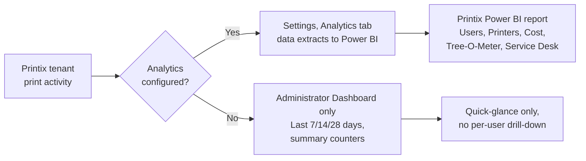

Customers buy Printix to retire a print server, but they keep paying for it because of what's measurable now that wasn't before. Pages per user. Cost per department. Save-O-Meter (uncollected jobs). The Beginner course showed the Dashboard counters; this lesson is the operational design behind reporting that survives quarterly reviews.

## The two reporting surfaces

The two surfaces serve different audiences:

- **The Administrator Dashboard.** Built into Printix Home. Needs no setup. Shows period counters: Print activity (pages over the period), Save-O-Meter (uncollected percentage, indicating secure-print effectiveness), Printed in black (mono ratio), Printed 2-sided (duplex ratio), Secure print (ratio of pages released through Printix App). Period selector: Last 7 days, Last 14 days, Last 4 weeks. Good for "is the tenant healthy?"; not enough for billing or cost-per-department.
- **The Printix Power BI report.** Vendor-supplied template for Power BI Desktop. Needs analytics enabled (Settings, Analytics tab) so Printix exports the data the template consumes. Multiple pages including Users - Overview, Printer - History, Cost, Tree-O-Meter, and Service Desk. (Tree-O-Meter shows trees-saved by 2-sided plus uncollected pages, using a Sheets Per Tree conversion.) This is where per-user, per-department, per-printer numbers live.

## Setting up reporting, in order

Three steps. Skip one and the rest don't work:

| Step | Where | What it does |
|---|---|---|
| 1. Enable Analytics | Settings, Analytics tab | Turns on the data extract Printix needs |
| 2. Set up Power BI | Power BI Desktop, open the Printix solution template | Connects the template to the customer's analytics extract |
| 3. Optionally, publish to Power BI Service | The Power BI service in M365 | Lets the customer view the report on the web with a Power BI Pro licence |

Power BI Pro is required to publish to the web. Power BI Desktop alone (free download) is enough to use the report on a single workstation.

## What the cost calculation actually does

The Power BI template doesn't read meter prices from your printer fleet. The administrator enters cost variables once when setting up the report. Those variables are the parameters the template's cost-per-page maths runs on:

| Variable | Meaning |
|---|---|
| Sheets Per Tree | Trees-saved equivalent for the Tree-O-Meter |
| Cost Per Mono Sheet | Toner cost for a black-and-white page |
| Cost Per Color Sheet | Toner cost for a colour page |
| Cost Per Sheet | Paper cost per sheet |
| Display Currency | What every cost column is rendered in |

The Printix doc is honest about the model: <cite>"it is not possible to accurately calculate the total cost of the printer environment, we can estimate the cost based on what is being printed through Printix."</cite> That's exactly what the report does. Pages printed times the per-page costs, with duplex factored in (one sheet for two pages). The output is a credible estimate, not a finance-grade ledger. Use it for trend-watching and chargeback, not for tax reporting.

<Callout type="warn" title="Currency change requires manual refresh">
The Display Currency parameter is part of the report's model. Changing it doesn't auto-refresh; you have to manually refresh the whole report after changing it. Otherwise costs render in the old currency.
</Callout>

## A worked rollout: Able Moose mid-market chargeback

Able Moose's CFO wants a quarterly chargeback model: each cost-centre (Audit, Tax, Advisory) pays for its own printing. Plan:

<StepThrough client:load>
  <Step title="Enable analytics">
    System manager opens Settings, Analytics tab, enables analytics.
  </Step>
  <Step title="Group users by cost-centre in Microsoft Entra">
    Three groups: "Printix-Costcentre-Audit", "Printix-Costcentre-Tax", "Printix-Costcentre-Advisory". Each user is in exactly one. (These are reporting groups, separate from the access groups from the previous lesson; named differently to avoid drift.)
  </Step>
  <Step title="Open the Printix Power BI template">
    Open in Power BI Desktop, connect to the analytics export, set Cost Per Mono Sheet ($0.05), Cost Per Color Sheet ($0.20), Sheets Per Tree (8333), currency AUD.
  </Step>
  <Step title="Use Users - Overview filtered by group">
    The Users page lets the CFO filter by Microsoft Entra group. Audit's totals, Tax's totals, Advisory's totals; the Cost page sums.
  </Step>
  <Step title="Schedule quarterly export">
    Power BI's quarterly schedule emails the CFO. Schedule the dataset refresh (and the email subscription) from the Power BI service; the MSP isn't in the loop unless something breaks.

    
  </Step>
</StepThrough>

The pattern: groups in Microsoft Entra do double duty for both access (previous lesson) and reporting (this lesson), but they're separate group sets so a name change for one doesn't break the other.

<Checkpoint slug="printix-l2-checkpoint-reporting" client:load />

## What this is NOT

- **Not real-time monitoring.** Both surfaces (Administrator Dashboard and Power BI report) lag actual print activity. The Dashboard updates when reloaded; Power BI on a schedule. Don't promise the customer minute-by-minute alerts; that's a webhooks scenario in the Advanced course.
- **Not a security audit log.** Printix has a History tab on printers, computers, and groups for operational audit. Compliance-grade audit logging is the customer's IdP and SIEM, not Printix's reporting surface.

<Callout type="info" title="Sources">
[Dashboard](https://docshield.tungstenautomation.com/Printix/en_US/help/admin/Printix_admin/c_administrator_dashboard.html), [How to interact with the Printix Power BI report](https://docshield.tungstenautomation.com/Printix/en_US/help/admin/Printix_admin/t_how_to_interact_with_power_bi_report.html), [How to use the Printix Power BI solution template](https://docshield.tungstenautomation.com/Printix/en_US/help/admin/Printix_admin/t_how_to_use_the_power_bi_template.html), [Microsoft integration / Entra groups](https://docshield.tungstenautomation.com/Printix/en_US/help/admin/Printix_admin/t_features_microsoft_integration.html).
</Callout>
