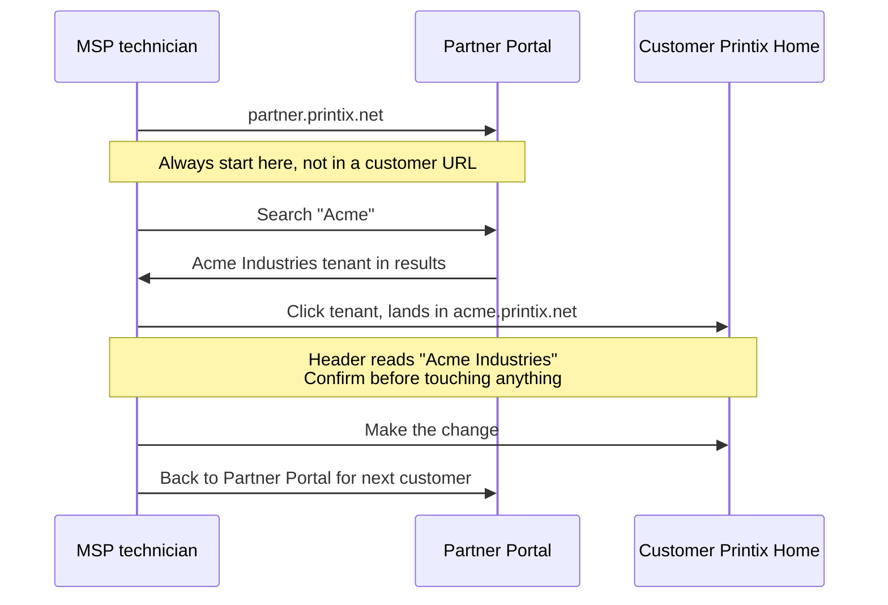

The Beginner and Intermediate courses lived inside one customer's Printix Home. This lesson is the layer above it: how an MSP runs Printix across many customers, what the Partner Portal does that the per-tenant Administrator doesn't, and the architectural seams that decide whether a 50-customer practice is sustainable or chaotic.

## The hierarchy in the Partner Portal

The Partner Portal exposes the layers as tabs across the top: Tenants, Resellers, Users, Dashboard. The Resellers tab shows the partner-of-partner relationships in real customer terms.

<AnnotatedScreenshot
  src="/img/printix/partner-portal-resellers.png"
  alt="Printix Partner Portal Resellers tab with a list of resellers and a column showing their tenant counts, plus an Add reseller button"
  caption="Partners hold resellers and tenants. Resellers hold their own tenants. Most single-MSP shops never use the Reseller layer; partner-of-partner is the use case."
>
  <Hotspot client:load x={10} y={15} label="1" title="Partner level" purpose="Top of the MSP hierarchy.">
    The partner is the MSP itself. Search, dashboard, billing roll up here. Cross-tenant search and tenant creation happen at this level.
  </Hotspot>
  <Hotspot client:load x={50} y={15} label="2" title="Resellers tab" purpose="For partner-of-partner relationships.">
    A Reseller is an organisation under a Partner that holds its own subset of tenants. Useful when an IT distributor sells Printix to other MSPs.
  </Hotspot>
  <Hotspot client:load x={50} y={45} label="3" title="Reseller row" purpose="Each one holds its own tenants.">
    Reseller-level subscriptions roll into the Partner master. Cancellation and invoice are per-Reseller, so the structure has to match the customer's commercial reality.
  </Hotspot>
  <Hotspot client:load x={90} y={15} label="4" title="Add reseller" purpose="Onboard a sub-MSP.">
    Partner-only action. The Reseller then handles its own tenant creation under the Tenants tab in their scope.
  </Hotspot>
  <Hotspot client:load x={70} y={45} label="5" title="Tenants column" purpose="Quick fleet sanity.">
    Mismatched counts vs PSA records mean name drift or stranded tenants. A periodic reconcile catches it before billing does.
  </Hotspot>
</AnnotatedScreenshot>

Three layers that matter:

- **Partner.** Top of the tree. The MSP itself. Lives at `partner.printix.net`. From here, MSP staff create new tenants, search across them, and see partner-wide dashboard counters (Active users, Paying users, Tenants).
- **Reseller.** A partner can add resellers underneath it: a different organisation that holds its own subset of tenants. Useful for tiered MSP arrangements, e.g. a parent IT services group with downstream regional MSPs. Most single-MSP shops never use the Reseller layer.
- **Tenant.** The customer's Printix Home. Each tenant is a fully isolated multi-tenant slice: its own users, sites, networks, printers, queues, and audit history. Tenants don't share state.

## The Partner Portal in practice

The Partner Portal's daily-use surface is small but critical:

| Function | Where | When you reach for it |
|---|---|---|
| **Create tenant** | Top of menu, "Create tenant" | New customer onboarding; pick the IdP (Microsoft Entra, Google, Email) and name the Printix Home subdomain |
| **Search tenants** | "Tenants" + search box | Finding a specific customer to administer |
| **Open Tenant in Printix Administrator** | Click the tenant name | Drops you into the customer's `<name>.printix.net` Administrator with your partner account |
| **Add system manager to a tenant** | Tenant properties, System manager tab | Adding an MSP technician's email as a System manager on this customer |
| **Manage subscription** | Tenant properties, Subscription tab | Start the paid subscription, change billing, cancel |
| **Move tenant to another partner** | Documented procedure | When a customer moves between MSPs |
| **Partner Portal Users** | Top-level Users page | Manage who in the MSP can access the Partner Portal itself |
| **Dashboard** | Partner Portal Dashboard | Active users / Paying users / Tenants over time, exportable as XLSX or CSV |

The Partner Portal does NOT do per-tenant printer or queue work. To touch a customer's sites, you click into their Tenant from the Portal, which lands you in their Printix Home Administrator. From there it's the same UI as the Beginner-course tour.

## The day-to-day operator pattern

Three rules that come from running the model in anger:

- **Start every shift in the Partner Portal.** Bookmarking individual `customer.printix.net` URLs and jumping straight in is how MSP technicians end up making changes in the wrong tenant. The Portal is the canonical entry.
- **Confirm the header in every tenant.** Same rule as the Beginner-course Administrator tour, except now you're crossing tenant boundaries multiple times per hour. The header reading is reflex.
- **Per-tech accounts, never shared.** Each MSP technician has their own Microsoft Entra (or Google, Okta, OneLogin) sign-in. Partner Portal Users page shows who has access; remove leavers there *and* in the IdP. Audit trails on tenant changes show the technician's email; shared logins blow that up.

## A worked customer-add: the Acme Industries onboarding

Acme is a new customer. Microsoft 365 anchored, single office, 40 staff. Plan from Partner Portal to first user printing:

<StepThrough client:load>
  <Step title="Create the tenant">
    Partner Portal, Create tenant. Acme Industries. Identity provider: Microsoft Entra ID / Office 365. Printix Home subdomain: `acme-industries.printix.net`. Decide trial or paid, attach the Acme contact as the initial system manager.

    
  </Step>
  <Step title="Add an MSP system manager">
    Tenant properties, System manager. Add the MSP onboarding tech's email so they can administer the tenant directly without bouncing through the Partner Portal each time.
  </Step>
  <Step title="Hand off to the implementation pattern">
    Within Acme's tenant, the work is the same as the Intermediate course's deployment lesson: enable Microsoft Entra group sync, design Sites and Networks, configure authentication methods, deploy Printix Client via Intune, configure secure print defaults.
  </Step>
  <Step title="Set the partner-side trial-to-paid trigger">
    On Tenant properties, Subscription tab, set "Start subscription after trial" so the trial doesn't lapse silently. If the customer needs more trial time, "How to extend a trial" is a Partner Portal action.

    
  </Step>
</StepThrough>

The handoff from Partner-Portal-level to tenant-level work is the seam that scales. Onboarding playbooks live at the Partner Portal layer. Customer-specific work (drivers, queues, groups, sites) lives inside the tenant.

<Checkpoint slug="printix-l3-checkpoint-tenancy" client:load />

## Operator anti-patterns

Three patterns to avoid, each born of taking a shortcut:

| Anti-pattern | Why it's tempting | What goes wrong |
|---|---|---|
| **Shared MSP login per tenant** | One account, one password, easier than provisioning per-tech access | Audit log shows "GenericMSP" on every change; nobody knows who broke what |
| **Tenant URL bookmarks instead of Partner Portal** | Faster click | Wrong-tenant changes; missing tenants when a new customer is added; no visibility into Subscription state |
| **MSP staff added to customer's Microsoft Entra group** | Lets the tech "see" the tenant via group sync | The right tool is Partner Portal access plus a tenant-level System manager seat. (Operator-experience anti-pattern, not vendor doc; the surface symptom is audit-trail confusion and ambiguity over whether the MSP user counts toward the customer's billed-user total.) |

## What this is NOT

- **Not the same as the customer's own Site / delegation model.** The customer's Site manager role (Intermediate course's fourth lesson) scopes a *customer-side* person down to part of their own tenant. Partner Portal scopes an *MSP-side* technician across multiple tenants.
- **Not a feature for cross-tenant data viewing.** Each tenant's Sites, printers, users, and history are isolated. The Partner Portal Dashboard shows aggregates (Active users count, Tenants count) but you can't, for example, run a Power BI report across multiple customers from the Partner Portal layer. That's a custom-API job (covered in the integration-and-automation lesson).
- **Not a billing console for end customers.** A customer's own subscription state (extend trial, change credit card, cancel) appears both inside the tenant's Subscription page and at the Partner Portal layer. The Partner Portal is the operator's view; the tenant view is what an internal customer admin sees.

<Callout type="info" title="Sources">
[Printix Partner Portal](https://docshield.tungstenautomation.com/Printix/en_US/help/partner/Printix_partner/c_partner_portal.html), [Partner](https://docshield.tungstenautomation.com/Printix/en_US/help/partner/Printix_partner/c_partner.html), [Partner Dashboard](https://docshield.tungstenautomation.com/Printix/en_US/help/partner/Printix_partner/c_partner_dashboard.html), [Tenants](https://docshield.tungstenautomation.com/Printix/en_US/help/partner/Printix_partner/t_tenants.html), [How to (Partner)](https://docshield.tungstenautomation.com/Printix/en_US/help/partner/Printix_partner/c_how_to.html), [Printix partner API](https://docshield.tungstenautomation.com/Printix/en_US/help/partner/Printix_partner/c_introduction.html).
</Callout>
