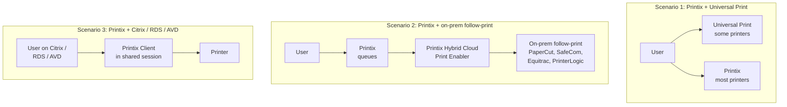
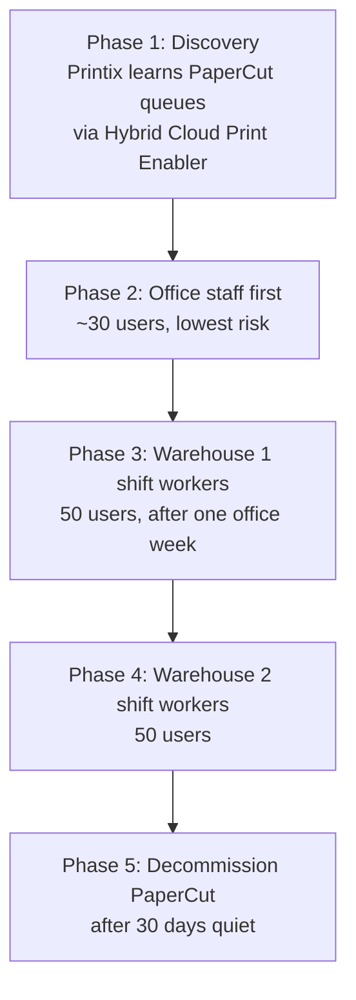

A pure cloud-print rollout assumes the customer has no legacy print investment to defend. Most enterprise migrations don't get that. They have an existing PaperCut, SafeCom, or Equitrac system, or they have Microsoft Universal Print already wired up for some printers. This lesson is the operator's map of those hybrid topologies and the components Printix offers for each.

## The three hybrid scenarios

Each scenario has a different decision tree, a different set of supported components, and a different migration playbook.

## Scenario 1: Printix + Microsoft Universal Print

Microsoft Universal Print is M365's own cloud print service. It does some of what Printix does (queue management, identity-anchored sign-in, Endpoint Manager deployment) but with much narrower printer support and no secure release out of the box.

Common reasons a customer ends up with both:

- The customer enabled Universal Print early on for a couple of HP Workpath printers, then later wanted secure release plus broader printer support and brought in Printix.
- A specific application or device that only supports Universal Print sits alongside the Printix-managed fleet.

Printix integrates with Universal Print: from the Microsoft Entra ID tab in Authentication you can enable the integration. The integration adds Printix's secure-print capability on top of Universal Print queues, so a customer can keep specific Universal-Print-published printers while still using the Printix App for release.

Before picking Universal Print as the primary stack, know its limits. The vendor's Universal Print integration documents three that bite during reporting:

- **One print queue per printer** in Universal Print. Multi-queue setups (different defaults per role, mono vs colour split) don't translate cleanly.
- **Jobs are tracked as 1 page** in Universal Print's own counters regardless of actual page count. Printix's analytics still see real page counts when the Printix overlay processes the job, but anything that bypasses the overlay reports as 1 page in UP's records.
- **Status nuances** between Cancelled and Completed in UP differ from Printix's own state machine; reconciling them in cross-stack reports needs explicit handling.

Verify these don't break the customer's reporting before committing to Universal Print as the primary stack.

| Decision | Pick Printix | Pick Universal Print | Pick both |
|---|---|---|---|
| Customer wants secure release | Yes | No | Printix overlay |
| Customer needs Brother / Canon / Konica Minolta MFP support | Yes | No | n/a |
| Customer is fully Microsoft Entra-joined and printers are HP Workpath | Either | Either | Either |
| Customer wants the smallest possible licensing footprint | Maybe | If just Microsoft, yes | Avoid |

**Default recommendation for a typical SMB or mid-market customer:** Printix as the primary stack. Universal Print only where a specific device or app requires it, with the Printix integration enabled to add secure release.

## Scenario 2: Printix + Hybrid Cloud Print Enabler

The Printix Hybrid Cloud Print Enabler (also called the Printix Redirector) bridges to existing on-premises follow-print or pull-print systems. Documented use case: <cite>"Enable printing to existing on-premises so-called Follow/Pull print queues from PaperCut, SafeCom, Equitrac, PrinterLogic, and similar printing solutions."</cite>

Why this matters for migration:

- The customer has a working PaperCut deployment with thousands of pre-existing queues, cost codes, and access rules.
- They can't do a flag-day cutover; the business will not survive a week-long printing outage.
- The Hybrid Cloud Print Enabler lets the on-prem system stay live during the Printix rollout. Users can be migrated in groups, and the legacy system can be retired as the last group moves over.

It also enables USB printing scenarios: a printer connected directly to a user's machine via USB can be exposed as a Printix-managed queue via the Redirector, without a print server.

The trade-off is operational complexity. Two systems running in parallel means two places to look when a user has trouble. Use the Hybrid Cloud Print Enabler with a documented sunset date, not as a permanent design.

## Scenario 3: Citrix, RDS, and Azure Virtual Desktop

Shared-desktop scenarios have their own Printix flavour. The Printix Client supports Citrix, RDS, and Azure Virtual Desktop sessions; it routes prints from inside the session correctly. There's a dedicated Printix Administrator topic ("Citrix and RDS", "Azure Virtual Desktop") with the configuration steps.

Two facts to know without going into the full setup:

- The Printix Client install pattern in shared desktops is different. Don't follow the laptop deployment guide. Refer to the Citrix/RDS/AVD-specific setup.
- Shared desktops complicate group-based queue deployment because multiple users use the same machine. Group-deployed default printers based on user-group membership work, but make sure you're testing with multiple test users not just one.

## A worked migration: Northwind Logistics

Northwind Logistics, mid-market warehouse, runs a 7-year-old PaperCut deployment with 60 printers across two warehouses. The MSP's mandate: replace it with Printix without a single missed shipping label.

The Hybrid Cloud Print Enabler is what makes phase 2 possible without breaking PaperCut for phases 3 and 4. Office staff get switched to native Printix queues; warehouse staff still use the legacy PaperCut paths via the Redirector until their phase. Each phase has a reversion plan: if printing breaks for the migrated group, point them back at PaperCut while you fix.

## A second pattern: Universal Print primary plus Printix overlay

For a customer who's already invested in Universal Print and wants secure release added rather than a stack swap, the rollout looks different. Northwind's smaller sister-org Northwind Office Services (head-office finance, 60 staff, all Microsoft Entra-joined laptops) is the right example: keep Universal Print, add Printix on top.

<StepThrough client:load>
  <Step title="Pick Universal Print as the primary stack">
    Confirm the printers in scope are Universal-Print-supported (mostly HP Workpath and Microsoft-validated MFPs). Confirm Universal Print is already deployed and printing for the user base. Don't switch primary stacks if it isn't.

    
  </Step>
  <Step title="Enable the Printix Universal Print integration">
    In Printix Authentication, Microsoft Entra tab, accept the Universal Print integration buttons. The integration grants Printix the permissions needed to overlay secure release on UP queues.
  </Step>
  <Step title="Add the secure-print overlay to specific UP queues">
    In Print queues, configure Print Anywhere with the Universal Print integration so jobs route through Printix for hold-and-release while still hitting the UP-published printer.

    
  </Step>
  <Step title="Verify and cut over a pilot user group">
    Pick 5 to 10 users, switch them to the Printix-overlay queues, validate Print Later and release-via-Printix-App work end to end. Watch the Printix Dashboard's Secure print percentage; it should climb as the pilot users adopt the App.
  </Step>
</StepThrough>

The architectural seam is explicit: Universal Print continues to publish the printer, Printix adds the queue-and-release behaviour the customer wanted. Reporting still has the Universal Print 1-page limitation noted above; design around it before promising chargeback numbers.

## What this is NOT

- **Not a permanent dual-stack.** Hybrid topologies are migration scaffolding, not architecture. A customer running Hybrid Cloud Print Enabler in production for two years has lost the operational benefit Printix sells. Set sunset dates.
- **Not the same conversation as enterprise ERP printing.** ERP-from-application stacks (SAP and similar) have their own integration paths and aren't covered by the hybrid topologies above. If a customer raises ERP printing during scoping, treat it as a dedicated workstream, not a sub-bullet of this migration.

<Callout type="info" title="Sources">
[Features (Universal Print, Hybrid, Citrix/RDS, AVD)](https://docshield.tungstenautomation.com/Printix/en_US/help/admin/Printix_admin/c_features.html), [Implementation checklist (Universal Print + Hybrid Cloud Print Enabler + Cloud Print API)](https://docshield.tungstenautomation.com/Printix/en_US/help/implement/Printix_implementation/c_checklist.html), [Components (Printix Redirector)](https://docshield.tungstenautomation.com/Printix/en_US/help/admin/Printix_admin/c_components.html), [Microsoft integration](https://docshield.tungstenautomation.com/Printix/en_US/help/admin/Printix_admin/t_features_microsoft_integration.html).
</Callout>
