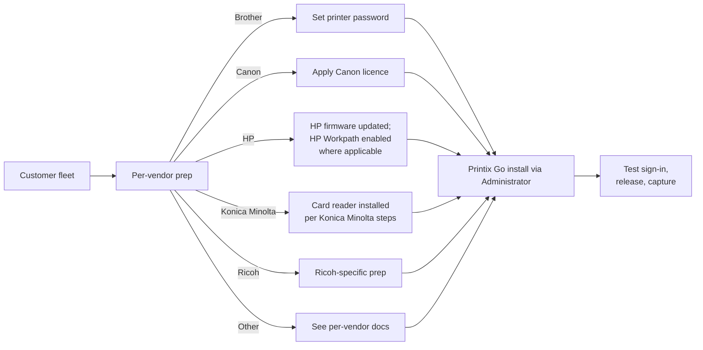
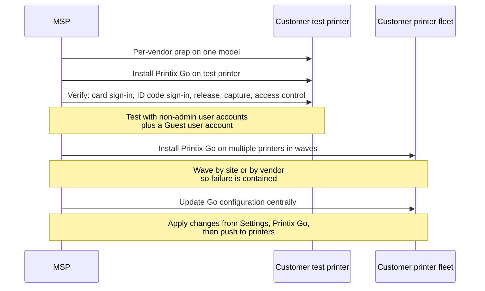

The Beginner course flagged Printix Go as "the on-printer release option, no phone needed." This lesson is the operator's playbook: when to deploy it, the per-vendor prep that has to happen on the device, what gets tracked, and the failure modes that matter when you're rolling it across hundreds of MFPs.

## The decision: when does Printix Go earn its place?

Printix Go is software installed directly on a supported MFP's touchscreen. It adds:

- **At-the-printer authentication.** Swipe a card or enter an ID code plus PIN. No phone required.
- **PIN-protected two-factor.** Card-only is one factor; card-plus-PIN is two-factor.
- **Per-function access control.** Lock down Copy, Email, Scan, Copy in colour to specific groups.
- **Capture from the touchscreen.** Scan to email, OneDrive, SharePoint, Connector, all initiated at the device.
- **Tracking of copy details** (paper size, page count) where the vendor supports it.

The scenarios where Printix Go is right:

- **Customers with shared printers in non-private spaces.** Reception MFPs, factory-floor printers, hospital ward stations. The "open the Printix App on your phone" path is friction; "swipe your badge" is not.
- **Customers requiring per-function access control.** Limiting copy / scan by department or role. The Printix App doesn't gate copy or scan; only Printix Go on the device does.
- **Customers with badge / card-reader investments.** Existing HID, MIFARE, or vendor-specific card readers can usually be re-used.

Where Printix Go is overkill:

- **Single-user printers.** A finance manager's desk printer doesn't need a Printix Go terminal.
- **Label / receipt / kitchen printers.** Anywhere "release after authentication" is the wrong workflow.
- **Customers without supported MFPs.** Printix Go's vendor list is broad but not universal; check before promising.

## The vendor support matrix

Printix Go is available for: Brother, Canon, Epson, Fujifilm, HP, HP Workpath, Konica Minolta, Kyocera, Lexmark, Ricoh, and Xerox. As of 6 July 2022 it ships enabled for all new and existing tenants, so the historical "apply for authorization" gate is gone.

Capability differences across vendors are real:

| Capability | Most vendors | Notable exceptions |
|---|---|---|
| Sign in with card | Yes | Vendor-model-list dependent |
| Register card from the device | Code + QR code | Xerox uses code only |
| Capture (scan to destination) | Yes | n/a |
| Tracking of copy details | Limited | Only HP and Ricoh in the matrix |
| Access control on copy/scan | Yes | Brother / Konica Minolta / Kyocera are "All functions"; HP / Lexmark / Xerox can do per-function |
| Remote control panel access | Yes | Canon, Epson, Fujifilm say No |

The upshot: don't promise a customer fine-grained per-function access on Brother. Don't promise tracking detail on Kyocera. Read the matrix in the docs against the customer's actual fleet before scoping the rollout.

## The per-vendor prep, in shape

Each vendor has its own preparation steps before Printix Go installs cleanly. They're documented in the Administrator help under "How to prepare \[vendor\] printer for Printix Go" and should be the first thing you do per device. Skipping prep is the most common cause of "Printix Go installation status is Failed" on the printer's Printix Go tab.

## The rollout pattern for a fleet

Three rules:

- **Test with the actual user roles.** A System manager will pass tests that fail for a plain User. Test with a User account, a Guest account if guests will use the printer, and the Site manager account for that site.
- **Wave the rollout.** Don't enable Printix Go on the entire fleet in one weekend. Do one site, watch, then expand. Cosmetic UI differences appear on real printers that didn't appear in the test lab.
- **Keep a fallback path during cutover.** Print Anywhere release via the Printix App still works on a printer that hasn't had Printix Go installed yet. So during the rollout, users can mix.

## A worked rollout: Able Moose Group enterprise reception MFPs

Able Moose Group (the Advanced-course persona, 1,800-person multi-tenant accounting consultancy with 14 acquired sub-firms) wants Printix Go on every reception MFP across the 14 sub-firms. Mostly Konica Minolta C658, with three older Brother MFC-J5945DW units.

<StepThrough client:load>
  <Step title="Per-vendor scope check">
    Konica Minolta C658 is on the Printix Go supported list with full features. Brother MFC-J5945DW is supported but each vendor has its own quirks. Pull the Card readers and cards doc for the Brother model, plus the per-vendor "Use Printix Go on Brother" page, before quoting the rollout to the customer.
  </Step>
  <Step title="Prepare one Konica Minolta and one Brother as pilots">
    Konica Minolta: install card reader per Printix's Konica Minolta prep guide. Brother: set printer password per Brother prep guide.
  </Step>
  <Step title="Install Printix Go on the two pilots">
    Administrator (in the appropriate sub-firm's Printix Home), Printers, the printer, Printix Go tab, install. Wait for Status to read Installed.
  </Step>
  <Step title="Test card and ID code sign-in">
    Pilot reception staff register a card (using the QR-code path) and an ID code. Validate: card sign-in works, ID code sign-in works, release works for a Print Later job, capture-to-email works.
  </Step>
  <Step title="Wave rollout sub-firm by sub-firm">
    Per sub-firm, prep all reception MFPs that day, install Printix Go that evening, communicate to staff next morning. Watch the History tab on each printer for failed sign-ins as the smoke test.
  </Step>
</StepThrough>

The reason for sub-firm-by-sub-firm waves rather than vendor-by-vendor is that each sub-firm is a separate Printix Home (per the multi-tenant administration lesson), so a Printix Go config change is per-tenant work.

<Checkpoint slug="printix-at-scale-checkpoint-rollout" client:load />

## What this is NOT

- **Not a card-reader specification document.** Each vendor has its own card-reader compatibility list; Printix Go works with most enterprise readers (HID, MIFARE) but the actual hardware decision lives in the customer's procurement. Don't promise a specific card type fits a specific MFP without checking.
- **Not Capture configuration.** Printix Go enables capture-from-the-touchscreen, but the destinations (OneDrive, SharePoint, email, Connector) are configured separately under Settings, Capture workflows. Capture is its own learning topic.

<Callout type="info" title="Sources">
[Printix Go supported printers and MFPs](https://docshield.tungstenautomation.com/Printix/en_US/help/admin/Printix_admin/c_go_supported_printers_and_mfps.html), [Printix Go troubleshooting](https://docshield.tungstenautomation.com/Printix/en_US/help/admin/Printix_admin/t_go_troubleshooting.html), [Printix Go Brother - How to](https://docshield.tungstenautomation.com/Printix/en_US/help/admin/Printix_admin/c_go_brother_how_to.html), [Use Printix Go on Brother printers](https://docshield.tungstenautomation.com/Printix/en_US/help/user/Printix_user/t_how_to_use_go_on_brother.html), [Printix Go enabled for all (2022 partner change)](https://docshield.tungstenautomation.com/Printix/en_US/help/partner/Printix_partner/c_partner_properties_go.html).
</Callout>
