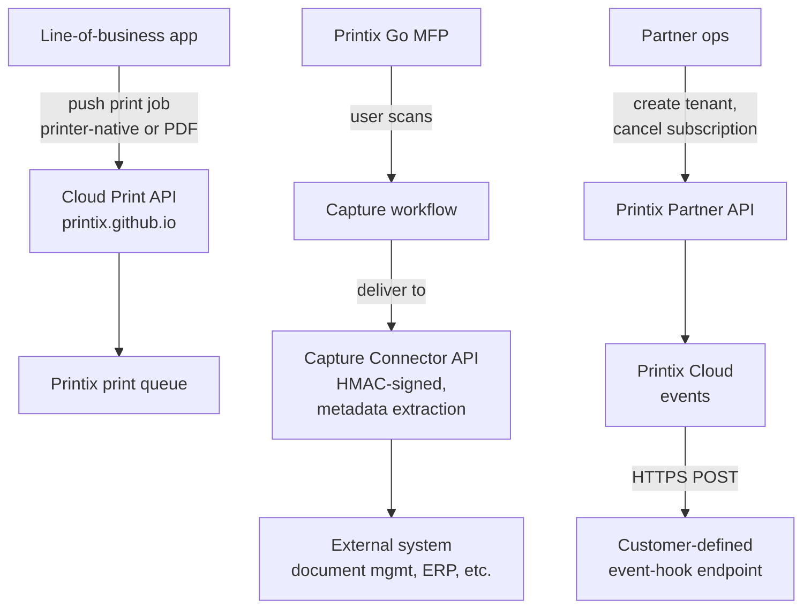

Once a customer is past pilot, the next conversation is automation. Push print jobs from a line-of-business app. Pick up scanned documents from a Capture workflow into a custom destination. React to events without polling the Administrator. Provision tenants programmatically because the MSP onboards two customers a week. Printix has four distinct API and event surfaces for these jobs, and they don't overlap.

## The four surfaces

Each surface answers a different question:

- **Cloud Print API.** "I have an application that should push a print job into Printix without a user clicking File, Print." Useful for invoice generation, order packing slips, scheduled reports.
- **Capture Connector API.** "I have a custom destination for scanned documents (line-of-business app, document management system, ERP)." The Capture workflow on the printer scans, OCRs, and delivers to a Connector that the customer's system retrieves via HMAC-signed HTTPS.
- **Event notifications (event hooks).** "I want to know when something happens in Printix without polling." Used for downstream automation: inventory tracking, billing aggregation, alert pipelines. Treat as an API-driven capability; check the docs for the current endpoint behaviour rather than relying on a fixed UI path.
- **Printix partner API.** "I want to provision tenants from my MSP automation system." Supported operations: create new tenant, get a single tenant including basic billing information, cancel a tenant's subscription.

## Cloud Print API: pushing jobs in

Documented at `printix.github.io`. The Cloud Print API is intended for applications that wish to push print jobs in printer-native or PDF format into a Printix print queue. Two real cases:

- **Backend-generated documents.** A customer's accounting system generates monthly statements at 2am and pushes them as a batch into Printix print queues for next-day collection. No human clicks Print; the API does.
- **Guest-user administration.** Same API surface includes managing guest users, useful for kiosk and reception workflows.

Authentication is per-tenant. The customer's Printix System manager generates an Application credential under Settings, Applications. The Applications page distinguishes credentials by their purpose, including:

- **Cloud Print API** for line-of-business apps pushing print jobs in.
- **Card manager** for badge / card management integrations.
- **Go registration** for non-Client Printix Go installs.
- **Workstation monitoring** for status integrations from external tools.
- **User manager** for user lifecycle integrations.

Each application type has its own scope. Treat the credential the same way you'd treat a Microsoft Entra app registration: rotate it, scope it, log its use.

## Capture Connector API: picking documents up

The Capture Connector pattern is more involved. The destination side (your customer's system) needs to:

1. **Be configured as a Capture workflow destination of type Connector** in Printix Settings.
2. **Implement HMAC-signed HTTP request handling.** Every API call from Printix carries `X-Printix-Timestamp`, `X-Printix-Request-Id`, and `X-Printix-Signature` headers. The destination verifies the signature against the shared secret before trusting the request.
3. **Pull metadata via the file-deliveries endpoint.** Printix's connector API exposes `/destination-connector/tenants/{tenantId}/fileDeliveries/{deliveryId}/metadata?query=...` for retrieving system metadata (deviceId, deviceLocation, deviceModelName, userEmail, userName, workflowName, workflowStartTime) plus any custom metadata fields.

The metadata pattern matters because it's how the customer's destination system links a captured PDF to a record (matter number, project key, client ID, etc.). The Capture workflow can collect those custom fields at the printer and the destination retrieves them with a single HMAC-signed call.

| Use case | What flows |
|---|---|
| Law firm: scan-to-matter | Lawyer scans, picks matter ID at touchscreen, document lands in matter's document folder with metadata |
| Logistics: scan-to-shipping-record | Driver scans the proof-of-delivery, deviceId + workflowStartTime are added to the shipping record |
| Healthcare: scan-to-patient | Receptionist scans, picks patient ID, document is filed in the EHR with the right metadata |

## Webhooks and event notifications

Printix exposes event notifications through its API surface so an external system can react to tenant events without polling the Administrator. Treat this as an event-hook capability rather than a single named UI surface; the precise admin path differs by tenant and changes over time, so check the API documentation for current endpoint behaviour and supported events. Use cases are the typical eventing ones:

- Aggregating print activity across many tenants into the MSP's own reporting.
- Triggering Microsoft Teams or Slack alerts on specific events.
- Integrating with a billing engine for usage-based charging.

Event notifications are not a replacement for the Connector API for capture; they're notifications, not document delivery. Don't build a capture pipeline on event hooks.

## Printix partner API: provisioning tenants

The Partner API is narrow but high-leverage. Supported operations: create tenant, get tenant (with basic billing information), cancel subscription. That's it.

The MSP value: tying tenant creation to your CRM or onboarding system. New customer signs the contract, automation creates the Printix tenant, an MSP technician gets a notification to start the in-tenant setup. No manual Partner Portal click.

What the Partner API doesn't do: configure inside a tenant. Sites, networks, printers, queues, drivers, all that lives behind the in-tenant Cloud Print API or manual administration. Don't expect to onboard a customer fully via the Partner API alone; it's the front-of-funnel only.

## A worked automation: Northwind Logistics scan-to-shipping

Northwind Logistics wants every proof-of-delivery scan to land in their shipping system as a PDF tagged with shipment ID and driver name. Plan:

<StepThrough client:load>
  <Step title="Configure a Capture workflow">
    In Printix Administrator, Settings, Capture workflows, create "Scan to Shipping". Destination type: Connector. Configure the workflow to prompt the user for shipment ID at the printer.
  </Step>
  <Step title="Stand up the Connector endpoint in Northwind's stack">
    Northwind's dev team writes an HTTPS endpoint that receives the file delivery, verifies the HMAC, and pulls metadata via the file-deliveries endpoint. The endpoint extracts shipmentId from the workflow's custom field and writes the PDF into the shipping record.
  </Step>
  <Step title="Test on one printer">
    Driver scans a paper proof-of-delivery, picks "Scan to Shipping" at the touchscreen, enters shipment ID. Within seconds the PDF appears in the right shipping record in Northwind's system.
  </Step>
  <Step title="Roll to all warehouse printers">
    Activate the workflow for all warehouse Printix-Go-enabled printers via Workflow properties, Make available to selected groups.
  </Step>
</StepThrough>

The architectural seam: Printix owns the print and capture; Northwind's system owns shipping. The HMAC-signed Connector API is the explicit handshake. No shared database, no polling.

All four surfaces have rate limits and distinct authentication scopes (HMAC for Connector, application credentials for Cloud Print API, partner credentials for Partner API). Read the docs before promising real-time anything; treat the API as eventually-consistent.

<Callout type="info" title="Sources">
[Cloud Print API (Components page)](https://docshield.tungstenautomation.com/Printix/en_US/help/admin/Printix_admin/c_components.html), [How to get started with Connector (Capture Connector API)](https://docshield.tungstenautomation.com/Printix/en_US/help/admin/Printix_admin/t_how_to_get_started_with_connector.html), [Implementation checklist (Cloud Print API + Hybrid Cloud Print Enabler)](https://docshield.tungstenautomation.com/Printix/en_US/help/implement/Printix_implementation/c_checklist.html), [Printix partner API (Partner introduction)](https://docshield.tungstenautomation.com/Printix/en_US/help/partner/Printix_partner/c_introduction.html), [Features (Cloud Print API)](https://docshield.tungstenautomation.com/Printix/en_US/help/admin/Printix_admin/c_features.html).
</Callout>
