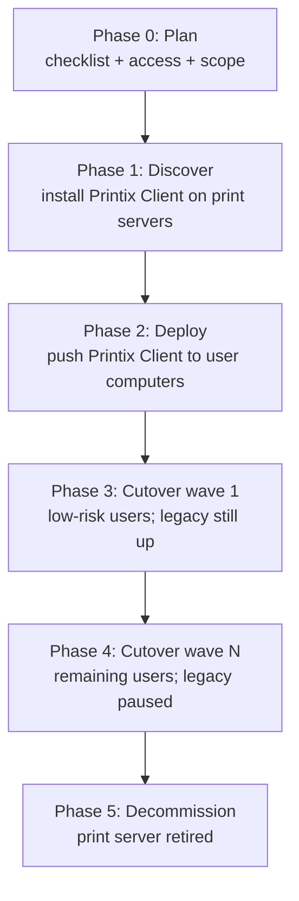

The advanced course closes on the engagement that pays for itself. A customer with multiple sites and one or more Windows print servers wants out. The MSP takes the project. This lesson is the playbook: the sequence that's worked, the gates between phases, and the specific failure modes that mark the difference between a clean retirement and a six-month-long operational hangover.

## The five phases

Each phase has a gate. Don't move to the next until the gate is met.

## Phase 0: Plan

Use Printix's Implementation checklist as the framework. Concretely, before any technical work:

- **Confirm the subscription.** Number of users, billing frequency, decision on Printix Implementation Pack (priority support up to 2 hours plus 12 months priority support).
- **Pick the Printix Home subdomain.** `customer.printix.net`. Use only A-z, 0-9, and `-`.
- **Decide authentication.** Microsoft Entra ID, Google, OIDC, Okta, OneLogin, or a combination. Confirm whoever will run group sync has the global admin role.
- **Map sites and networks.** From the Intermediate-course Sites lesson. Decide single-site or multi-site, BYOD or trusted-only, zero-trust if applicable.
- **List the legacy estate.** How many print servers, how many printers, how many users, which physical locations. Capture which printers are in scope and which are explicitly out of scope (label printers, kitchen receipt printers, etc.).
- **Decide on cloud storage.** Default Printix storage or customer-managed (Azure Blob Storage, Google Cloud Storage). Affects Print Later behaviour for users with offline computers.
- **Pick Printix Go scope.** Which MFPs will get Printix Go in this project; which won't. (Per the Printix Go rollout lesson.)

Output of Phase 0 is a written design document. Not a slide; a document the MSP and the customer both sign.

## Phase 1: Discover

Install the Printix Client on each existing print server. <cite>"During the discovery process, we automatically detect and register printers, print queues, and drivers in the Printix Cloud."</cite> What happens:

- Printers register in the customer's Printix Home.
- Print queues register with their existing names.
- Print drivers upload to the customer's Printix driver store.
- Printers get the three-letter Printix ID appended to their names.
- A Network is created in Printix matching the print server's gateway adapter. If two adapters were active during install (LAN + Wi-Fi), Network1 and Network2 appear; merge them if logically the same.

**Phase 1 gate**: every printer in scope appears on the Administrator's Printers page with a clean status (no "Missing print driver" or "Not responding"). Unregistered printers, if any, are dealt with via the Unregistered printers page.

## Phase 2: Deploy

Push the Printix Client to user computers via Microsoft Endpoint Manager (or Jamf for Mac). Refer to the Intermediate-course driver-delivery lesson for the MSI argument variants. While deploying:

- Configure print driver configurations (defaults: 2-sided, mono, paper trays, finishing).
- Enable Microsoft Entra group sync (or Google Workspace group sync).
- Attach groups to print queues for Add print queue automatically and Exclusive access where required.
- Configure secure print defaults: Print Later, Print Anywhere, mobile print, home office printing.

**Phase 2 gate**: Printix Client installed on at least 95% of user computers and showing Online in Computers. Stragglers (unenrolled or off-network laptops) flagged for direct intervention.

## Phase 3: Cutover wave 1

The bedrock principle, from Printix's own migration documentation: <cite>"Take the server offline. Unplug the network cable and leave it that way for a week or so. If no users complain, it is safe to decommission the print server."</cite>

But that's the *whole* server. Wave-based cutover means doing the same idea per group. For wave 1, pick a low-risk group: typically office staff in head office. Switch their print queues from the legacy server to Printix-direct queues. Communicate, watch the ticket queue, hold for at least three business days before declaring the wave clean.

| Wave check | Pass criteria |
|---|---|
| Print activity on Dashboard for the wave's printers | Within ±20% of the previous week |
| Tickets tagged "printing" from wave users | Below the agreed threshold (per design doc) |
| Save-O-Meter on Dashboard | Stable; sudden spike means jobs not being released |
| Printer History tabs | No unexplained failures on the wave's printers |

**Phase 3 gate**: wave 1 stable for the agreed window, no rollbacks needed.

### What wave 1 looks like in the console

The first wave is the most-watched. Concretely:

<StepThrough client:load>
  <Step title="Discover the printers in scope">
    Administrator, Printers, Discover printers. Pick the customer's network (Network1, Network2) from the dropdown and run discovery. Newly-found printers show under Unregistered until you register them.

    
  </Step>
  <Step title="Convert the print queues">
    On the Networks page, the Convert print queues column flips legacy print-server queues to Printix-native queues for the wave's users. The Networks page is the single screen that controls this; convert in the morning of cutover day so the wave's users land on Printix queues from their first sign-in.

    
  </Step>
  <Step title="Hold a quiet period">
    Three business days minimum. Watch the printer's History tab on the Administrator. Watch the wave-tagged queue in the PSA. If nothing material surfaces, wave 1 is clean.
  </Step>
  <Step title="Decommission the wave's legacy queues">
    Pause the legacy share for the wave's users. If the wave still looks clean after one week, decommission those legacy queues. Keep the legacy server itself online for later waves.
  </Step>
</StepThrough>

## Phase 4: Cutover wave N

Repeat wave 1's pattern with successively higher-risk groups: shift workers, executives, finance teams. Each wave has the same gate.

For customers with the Hybrid Cloud Print Enabler in play (covered in the hybrid topologies lesson), this is where it earns its keep. Users not yet in their wave still print to the legacy follow-print system via the Redirector. As waves complete, the Redirector's traffic decreases.

## Phase 5: Decommission

When all users are on Printix:

1. Verify the legacy server has zero recent print activity. Check its Windows Print Spooler logs.
2. Pause the legacy queues without uninstalling the server. Wait the agreed quiet period.
3. <cite>"Take the server offline. Unplug the network cable and leave it that way for a week or so."</cite> Confirm no support tickets cite a missing legacy queue.
4. Decommission. Power off, document the decom in the change record, retire the Windows Server licence.

If the customer also runs PaperCut, SafeCom, or similar, the same pattern applies. The Hybrid Cloud Print Enabler stays up until the last legacy queue is retired.

**Phase 5 gate**: server is off, legacy licences cancelled, the customer's runbooks updated, the post-mortem is filed.

## Failure modes that bite

Real migrations hit these. Have answers prepared:

| Failure | Cause | Mitigation |
|---|---|---|
| **Print Later jobs vanish** for shift workers who close laptops | Default storage is the user's computer; offline = stranded job | Enable customer-managed cloud storage (Azure Blob, Google Cloud) before the wave includes shift workers |
| **A specific application can't see Printix queues** | App expects shared Windows print queues from a server | Check whether the app supports IPP / direct printing; sometimes Hybrid Cloud Print Enabler bridges; sometimes app-team work needed |
| **Microsoft Entra Conditional Access blocks Printix sign-in for a group** | Customer's Conditional Access policy can affect Printix sign-in depending on tenant CA scope | Test in a pilot wave before broad cutover; coordinate with customer's identity team to either grant the exception or accept the user-set is out-of-scope for this rollout |
| **Print drivers are wrong after upload** | Discovery picked up an old or vendor-replaced driver | Update the driver in Drivers, push the change to print queues |
| **A network's gateway changed during the project** | Customer's network team made an unrelated change | Update the Network's gateway in Networks, or have users on the new gateway re-register |
| **Universal Print already published the same printer** | Customer enabled Universal Print earlier | Pick one stack as primary per printer; either disable the Universal Print publication or use the Printix integration to overlay |

## Post-migration validation

Two weeks after Phase 5, run a verification pass:

- Dashboard print activity over the last 14 days, compare against pre-migration baseline.
- Power BI report (if set up) shows expected per-user / per-department volumes.
- Printer History tabs show clean recent activity.
- No outstanding tickets tagged "printing" older than three days.
- Customer's PSA is updated with the new architecture diagram and the runbook entries (where to look up "user can't print" tickets, how to add a printer, who's the customer-side site manager).

The post-mortem isn't optional. It's where the next customer's migration gets faster.

<Checkpoint slug="printix-at-scale-checkpoint-migration" client:load />

## What this is NOT

- **Not a one-shift project.** A real customer with multiple sites and a print server is a four-to-eight-week engagement, not a weekend. Discovery, deployment, waves, and decommission each take their own time.
- **Not "lift and shift."** Printix is functionally similar to a print server but architecturally different. Pretending it's the same is what produces the over-engineered Site / Network designs the Intermediate course warned against.

<Callout type="info" title="Sources">
[Migrate print server to Printix Cloud](https://docshield.tungstenautomation.com/Printix/en_US/help/admin/Printix_admin/t_migrate_print_server_example.html), [Organization with multiple sites wants to eliminate print servers](https://docshield.tungstenautomation.com/Printix/en_US/help/admin/Printix_admin/t_multiple_sites_example.html), [Implementation checklist](https://docshield.tungstenautomation.com/Printix/en_US/help/implement/Printix_implementation/c_checklist.html), [Implementation guide](https://docshield.tungstenautomation.com/Printix/en_US/help/admin/Printix_admin/c_implementation_guide.html), [Next steps](https://docshield.tungstenautomation.com/Printix/en_US/help/admin/Printix_admin/c_setup_next_steps.html).
</Callout>
