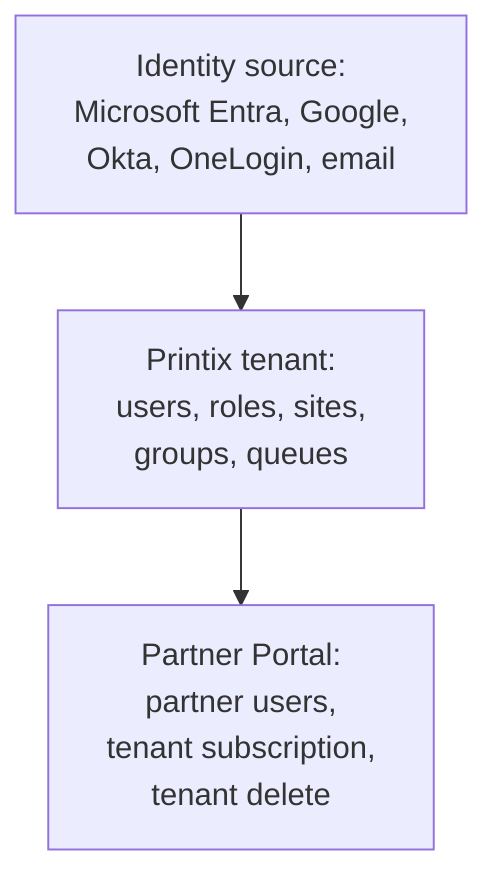

Printix offboarding crosses three layers: the customer's identity source, the Printix tenant, and the Partner Portal. If you remove only one layer, access or billing can linger in the other two.

## The three layers

For ordinary customer leavers, start in the identity source. For MSP staff leavers, start in the Partner Portal and customer tenant roles. For customer exits, work through all three.

## Leaver cleanup

| Leaver type | Primary cleanup | Printix check |
|---|---|---|
| **Customer employee** | Remove or disable in the customer's IdP and groups. | User disappears after group sync where supported, or delete the Printix user. |
| **Customer print admin** | Remove Site manager or System manager role, then remove IdP group membership. | User no longer has Administrator access. |
| **MSP technician** | Delete Partner Portal user and remove tenant System manager access if they were added inside a tenant. | Partner Portal Users and tenant Users both clear. |
| **Guest or Kiosk user** | Delete or disable the direct Printix user record. | User no longer signs in to Client, App, or Go. |

Printix documents that Microsoft Entra and Google group sync can delete users in Printix when the upstream user is deleted and group sync is enabled. Do not rely on that if the customer uses email accounts or a mixed identity model; verify the Printix Users page.

## Customer-exit runbook

<StepThrough client:load>
  <Step title="Export the operating evidence">
    Capture tenant status, active user count, users with System manager or Site manager role, sites, printers, queues, subscription state, and recent printer history. Store the export or screenshots in the PSA exit ticket.
  </Step>
  <Step title="Remove privileged people first">
    Remove MSP staff from Partner Portal access for the customer and remove any direct tenant System manager seats they hold. Confirm at least one authorised customer or MSP owner remains until the exit closes.
  </Step>
  <Step title="Clean customer leavers and roles">
    Remove customer leavers from IdP groups. In Printix Administrator, filter Users by role and confirm no departed user remains as System manager, Site manager, Guest, or Kiosk user.
  </Step>
  <Step title="Close print access">
    Remove groups from print queues where the customer is leaving the MSP service, then confirm users can no longer add managed queues. Keep printer history evidence if the customer needs a final reporting bundle.
  </Step>
  <Step title="Handle subscription state">
    Partner-created tenants bill through the partner. Record whether the subscription continues, cancels, or changes owner. Monthly cancellation runs to the end of the current agreement; annual cancellation goes through Printix finance.
  </Step>
  <Step title="Delete the tenant only when approved">
    Tenant deletion in the Partner Portal is permanent and requires the System manager role plus Partner Portal access, per the Delete tenant procedure. Type the Printix Home name only after the customer and MSP approve permanent removal.
  </Step>
  <Step title="Verify after sync">
    Reopen Partner Portal and Printix Administrator. Confirm the user list, role list, subscription state, and tenant status match the exit ticket. Do not close the ticket from memory.
  </Step>
</StepThrough>

## What this is NOT

- **Not handled only by the IdP.** Partner Portal users are separate from tenant users. Remove both when MSP staff leave.
- **Not reversible after tenant deletion.** Delete is permanent. Treat it like a final data-destruction step.

<Checkpoint slug="printix-at-scale-checkpoint-offboarding" client:load />

<Callout type="info" title="Sources">
[Users](https://docshield.tungstenautomation.com/Printix/en_US/help/admin/Printix_admin/t_administrator_users.html), [Roles](https://docshield.tungstenautomation.com/Printix/en_US/help/admin/Printix_admin/c_roles.html), [User properties](https://docshield.tungstenautomation.com/Printix/en_US/help/admin/Printix_admin/t_administrator_user_properties.html), [Partner user and tenant access](https://docshield.tungstenautomation.com/Printix/en_US/help/partner/Printix_partner/c_partner_user_tenant_access.html), [How to delete a user](https://docshield.tungstenautomation.com/Printix/en_US/help/partner/Printix_partner/t_how_to_delete_user.html), [Delete tenant](https://docshield.tungstenautomation.com/Printix/en_US/help/partner/Printix_partner/c_tenant_properties_delete.html), [Partner billing](https://docshield.tungstenautomation.com/Printix/en_US/help/partner/Printix_partner/c_billing.html).
</Callout>
