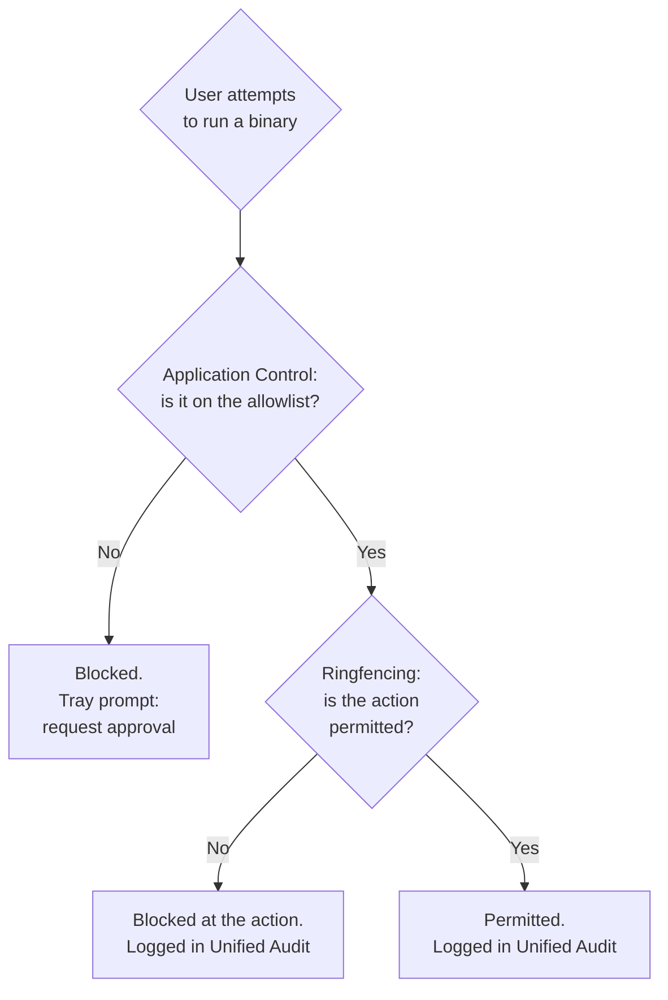

ThreatLocker is a zero-trust endpoint agent built around two ideas: **block anything that isn't explicitly allowed**, and **constrain what the allowed things can do**. It runs alongside whatever EDR or antivirus the customer has, and pulls a different lever from both.

## The problem this product solves

Most endpoint security products work *backwards*. Antivirus matches files against signatures of known-bad. EDR watches for behaviour patterns that look bad. Both depend on recognising the bad thing in time. A genuinely new ransomware payload, a fresh dropper, a tool nobody's seen before; these win the race against detection often enough that ransomware operators keep getting paid.

Application allowlisting flips the question. Instead of asking "is this binary recognised as malicious?" the agent asks "is this binary on the customer's allowlist?" and denies execution if the answer is no. The novel ransomware never gets to run because nobody put it on the allowlist. Word still runs because Word is on the allowlist. The user trying to install a music streamer? Blocked, with a tray prompt to request approval.

Where ThreatLocker sits in a stack:

- **MFA + DNS filtering** keep credentials and domain lookups honest.
- **EDR / AV** watches behaviour on the box, fileless and lateral movement included.
- **ThreatLocker** prevents *execution* in the first place, and constrains the apps that are allowed to run.
- **Backups + an incident-response retainer** clean up if everything else fails.

EDR and ThreatLocker are not competitors. EDR catches the things ThreatLocker permitted (an allowed Office app that got a malicious macro). ThreatLocker catches the things EDR would have to chase down (the unsigned binary that just landed in `%TEMP%`). The MSPs that get the most out of either run both.

## The two halves of ThreatLocker, one diagram

**Application Control** is the allowlist. **Ringfencing** is what the allowed app is allowed to do once it's running. Word is permitted, but Word ringfenced won't spawn `powershell.exe`, won't write to `system32`, and won't open a connection to a foreign IP. The macro payload that depended on those things stops at the ringfence even though Word itself is allowed.

The agent runs as a system-level driver on Windows, with equivalent low-level integration on Mac and Linux. Decisions are made locally, so disconnected machines still enforce. Approval requests funnel back to the ThreatLocker Portal when the box reconnects.

## The six modules at a glance

ThreatLocker is several products in one agent. The portal exposes them as modules:

| Module | What it controls | Most-asked beginner ticket |
|---|---|---|
| **Application Control** | Which binaries can execute. The default-deny core. | "I tried to install X and got blocked." |
| **Ringfencing** | What allowed apps can spawn, read, write, talk to. | "Excel can't open my CSV from the network share." |
| **Storage Control** | USB / DVD / file-share read & write access. | "I plugged in a USB and it won't open." |
| **Elevation Control** | Per-application local-admin rights for standard users. | "My QuickBooks update is asking for admin." |
| **Network Control** | Host-firewall-as-policy for inbound and outbound traffic. | "I can't RDP to my server from this device." |
| **ThreatLocker Detect** | Telemetry-driven detection rules over the agent's own data. | (Mostly invisible to the helpdesk; alerts go to senior tiers.) |

The exact module mix depends on the customer's ThreatLocker plan. **ThreatLocker Protect** bundles Allowlisting, Ringfencing, Configuration Manager, and Network Control. **ThreatLocker Unified Endpoint** adds Elevation, Storage, Detect, Patch Management, Web Control, and Cyber Hero Approvals. **ThreatLocker Unified Security + Cloud** adds Cloud Control / Cloud Detect on top.

<Callout type="info" title="Cyber Hero is the other half of operating ThreatLocker">
ThreatLocker's <Term slug="cyber-hero">Cyber Hero</Term> service is a 24/7 managed-approval team. When a customer subscribes, end-user approval requests get triaged by ThreatLocker's own engineers within an SLA. The MSP still owns policy design and the genuinely-judgement-call decisions; Cyber Hero clears the routine ones so allowlisting doesn't drown the helpdesk during onboarding or after every quarterly software refresh.
</Callout>

<Callout type="warn" title="ThreatLocker is not antivirus, and doesn't replace it">
No signatures, no file scanning, no behavioural analysis on running processes. It's a policy engine. The customer still needs AV/EDR for the things that *are* allowed; the macro inside an approved Office app is exactly the kind of thing EDR catches and ThreatLocker doesn't.
</Callout>

<Callout type="info" title="Sources">
[ThreatLocker Detect overview](https://threatlocker.kb.help/the-threatlocker-detect-page/), [Module options on the Organizations page](https://threatlocker.kb.help/understanding-and-changing-the-module-options-on-the-organizations-page/), [Elevation quick-start guide](https://threatlocker.kb.help/threatlocker-elevation-quick-start-guide/), [Notifications for requests](https://threatlocker.kb.help/notifications-for-requests/).
</Callout>
