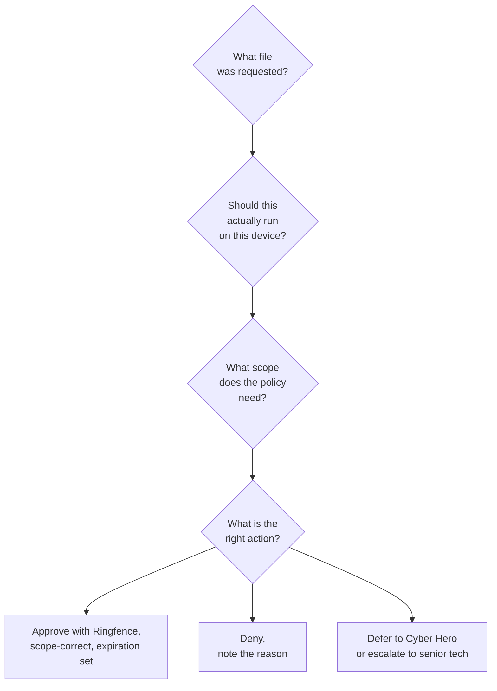

Most ThreatLocker tickets are the same shape: a user tried to run something, got blocked, clicked the tray prompt, typed a reason, and now there's a pending request in the Response Center. The goal of triage is to answer four questions in order, then pick the right action.

The user side of the conversation is a tray dialog they see the moment something is blocked:

<AnnotatedScreenshot
  src="/img/threatlocker/tray-prompt.png"
  alt="ThreatLocker tray dialog: a cybersecurity threats banner naming teamviewer_setup_x64.exe, a Request Access button, and a Don't Show Again button"
  caption="What the user sees the moment a binary is blocked. Request Access creates the Response Center entry the helpdesk picks up."
  aspect="1102/240"
>
  <Hotspot client:load x={85} y={10} label="1" title="Blocked binary in the message" purpose="The exact filename the user attempted.">
    The tray names the binary. That string is the first thing the helpdesk looks at when the request lands; it travels into the Response Center entry as the path.
  </Hotspot>
  <Hotspot client:load x={68} y={70} label="2" title="Request Access" purpose="Creates the Response Center entry.">
    Clicking this opens a small comment box, sends the request to the portal, and the user waits. The status integer 1 (Pending) is what the helpdesk filters on.
  </Hotspot>
  <Hotspot client:load x={87} y={70} label="3" title="Don't Show Again" purpose="Suppresses the prompt for that binary." tone="warning">
    The block stays in place; the user just doesn't see the prompt again on this machine for that binary. If a user clicks this and then complains to the helpdesk that "nothing happens when I try to install it", check the Unified Audit rather than the Response Center.
  </Hotspot>
</AnnotatedScreenshot>

<Callout type="info" title="Self-approval is a tray-settings concept covered later">
Some customers configure their tray to allow users to self-approve their own requests under specific rules. That's an Intermediate-course topic. For now, treat every approval as something a tech does in the portal.
</Callout>

## The four-question triage

Walk these in order. Each question gates the next.

### 1. What file was requested?

Open the request. The detail panel shows the **full path**, **hash**, **certificate** (if signed), **originating process** (what spawned it), and **organisation / hostname / requestor email**. ThreatLocker also runs a matching-applications search and shows you any built-in or existing custom application definitions that fit the file.

The matching-applications panel is what makes the call tractable. The Application Control list it draws from looks like this:

<AnnotatedScreenshot
  src="/img/threatlocker/matching-applications.png"
  alt="Application Control list view: rows for Adobe Acrobat, bcdedit.exe, Blue Jeans, CERTUTIL.EXE with OS, application name, type (Built-In), category tags, risk and business ratings, computer counts, policy counts, access icons, and country flags"
  aspect="1992/471"
>
  <Hotspot client:load x={12} y={32} label="1" title="Application Name + (Built-In)" purpose="Tells you the source of the definition.">
    Built-In definitions are vendor-curated and update automatically. They cannot be edited via the API; custom application definitions can. Approving a built-in via a request effectively permits the whole built-in (every file rule it ships with), not just the requested file.
  </Hotspot>
  <Hotspot client:load x={36} y={28} label="2" title="Risk / Business / Combined rating" purpose="Vendor's read on each application.">
    Risk rates the security exposure (a low-trust utility scores higher), Business rates how commonly it's needed in a business setting, Combined averages the two. Useful as a quick sanity check; the rating doesn't replace looking at the path, signature, and originating process.
  </Hotspot>
  <Hotspot client:load x={50} y={28} label="3" title="Computers count" purpose="How widely it's already deployed at this customer.">
    A "Computers: 2" cell tells you the application is already permitted somewhere in the org. New approvals at the same scope often mean reusing the existing definition rather than creating a parallel custom one.
  </Hotspot>
  <Hotspot client:load x={59} y={28} label="4" title="Policies count" purpose="How many policies reference the app.">
    Multiple policies on one application means multiple scopes already exist (org-wide, per group, per machine). Read those before adding a new one; you may already have the permit you need a click away.
  </Hotspot>
</AnnotatedScreenshot>

If the request matches a built-in like "Microsoft Edge (Built-In)" with a valid signature, you have more to go on than a hash-only match from `c:\users\*\downloads\setup.exe`.

<Callout type="warn" title="Built-in matches aren't a free pass">
A common DLL or system file might match into multiple unrelated built-in applications. Approving a built-in via a request effectively permits the entire built-in. Before approving from a built-in match, confirm the file the request originated from is actually part of that application, not a coincidental DLL collision.
</Callout>

### 2. Should this actually run on this device?

The judgement call. Cues:

- **Known business app, signed by a vendor the customer uses, requestor email matches a real user, comment makes sense.** Probably approve.
- **Path is `c:\users\*\downloads\` and the file name is "setup.exe" with no certificate.** Treat as suspicious. Verify with the user out-of-band before approving. Their comment alone isn't enough; if the box is compromised, an attacker can also type into the tray prompt.
- **Hash already on the customer's deny list, or matches a known-bad ThreatLocker built-in.** Deny, escalate, raise a security incident with the customer.
- **Cyber Hero would have known this one.** If the customer subscribes to Cyber Hero, look at why this one landed in your queue rather than theirs; it usually means the request needs a person with policy authority (something genuinely new for that customer, not just routine).

### 3. What scope does the policy need?

ThreatLocker lets you scope a permit policy to:

- **Single computer.** This one machine only.
- **Single computer, application only.** This machine, this app, no future requests.
- **Computer group.** Everyone in the customer's "Finance" or "Hybrid Workers" group.
- **Entire organisation.** Everyone at this customer.

The default is the *narrowest* scope that solves the customer's problem. A finance app should be scoped to the Finance group, not the whole org. A one-off engineering tool that one developer needs for a project should be scoped to that machine.

Going broader means more endpoints get the permit. Going broader also means a future compromise on any of those endpoints can use the permit. Tighten unless the customer has explicitly asked for fleet-wide.

### 4. What's the right action?

| Action | When to pick it |
|---|---|
| **Approve** | Known good app, scope is right, you've confirmed identity. |
| **Approve with Ringfence** | Same, but the app shouldn't spawn interpreters / talk to foreign IPs / write everywhere. Default for browsers, Office, anything internet-facing. |
| **Approve with Elevation** | The app legitimately needs admin (driver installer, an updater that writes to `Program Files`). Combine with Ringfencing. Set an Elevation expiration, not "never." |
| **Deny** | Game / streamer / unsanctioned tool. Note the reason in the request comment so future-you knows why. |
| **Escalate** | Anything that smells off, or where the policy decision needs an MSP / customer joint call. |

## A worked ticket: Able Moose Accounting

Sarah at Able Moose Accounting opens a tray prompt: she's trying to install **QuickBooks Tool Hub** so the bookkeeper can fix a corrupt company file. The request lands in the Response Center.

<StepThrough client:load>
  <Step title="Open the request">
    Path is `c:\users\sarah\downloads\quickbookstoolhub_setup.exe`. File is signed by "Intuit Inc.", certificate is valid. Originating process is `chrome.exe`. The matching-applications panel lights up "QuickBooks Tool Hub (Built-In)".
  </Step>
  <Step title="Decide if it should run">
    Sarah's role at the customer is "Office Manager", and Able Moose is an accounting firm. QuickBooks tooling is plausible. The file's signature plus the matching built-in is solid corroboration.
  </Step>
  <Step title="Pick the scope">
    Only Sarah needs this right now. Scope: **Single computer**. Future-Sarah won't need to re-request because the policy will exist for her machine.
  </Step>
  <Step title="Pick the action">
    **Approve with Ringfence**, using the QuickBooks built-in's default ringfence which restricts the app from spawning shells. **Elevation expiration** of 4 hours so she can finish the install without leaving permanent admin on the policy. Comment: "Ticket #12345; QuickBooks Tool Hub; bookkeeper file repair; Sarah confirmed via Slack." That comment is the single most-read field by the next technician who looks at this policy; ticket number, requestor, reason, every time.
  </Step>
</StepThrough>

<Checkpoint slug="threatlocker-helpdesk-fundamentals-checkpoint-approvals" client:load />

<Callout type="info" title="Sources">
[Processing Application Control Approval Requests through API](https://threatlocker.kb.help/processing-application-control-approval-requests-through-api/), [Approval Request endpoints](https://threatlocker.kb.help/portalapiapprovalrequest/), [Application matching](https://threatlocker.kb.help/portalapiapplication/), [Elevation quick-start](https://threatlocker.kb.help/threatlocker-elevation-quick-start-guide/).
</Callout>
