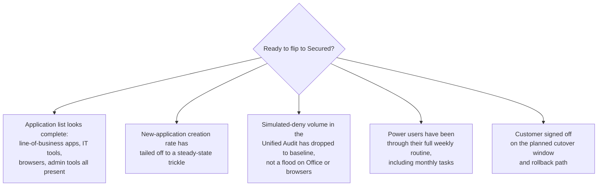

Learning Mode is how a freshly-deployed ThreatLocker agent figures out what software the customer actually runs. Until that's mapped, switching the endpoint to Secured Mode would deny the line-of-business apps along with the malware, and the customer would lynch you.

## What Learning Mode does

The agent runs in a Maintenance state where execution is **permitted but logged**. As applications launch, the agent observes them and, with Automatic Learning enabled, creates new application definitions and policies for what it sees.

<Callout type="warn" title="Learning Mode only writes when the Default Deny policy is named correctly">
The agent only writes new application definitions when the customer's catch-all Default Deny policy follows the `Default - (Group Name)` naming pattern. Vendor docs flag this as the most common Learning-Mode failure: techs enable Learning Mode, expect data, get nothing, because the Default policy was renamed at some point and the automatic-creation logic stopped recognising it. Check the Default policy's name before scheduling Learning Mode.
</Callout>

The mode comes in three flavours:

| Mode | Where new policies land | Use when |
|---|---|---|
| **Automatic Computer** | Per-machine policies. | The customer's fleet is heterogeneous; what one user runs isn't what others run. |
| **Automatic Group** | Per computer-group policies. | The customer has clean role-based groups (Finance, Sales, Engineering), and people in a group share most software. |
| **Automatic System** | Per-machine, drivers and Windows files only. | Already in production, only filling in OS-level gaps; not a primary onboarding mode. |

The integer values are 1 (Computer), 2 (Group), 3 (System), with 0 meaning no automatic application creation. Pick the right one *before* you start; switching mid-Learning makes the artifact harder to clean up.

## The Maintenance Mode neighbours

Learning sits on a spectrum of Maintenance states the portal exposes per-endpoint:

- **Application Control Monitor Only**: policies log but don't enforce. Useful for safely tuning a new ringfence on a live box.
- **Application Control Installation Mode**: a short window for known software installs, like a major application update.
- **Learning**: what we've been describing.
- **Elevation**: temporary self-elevation window for the user.
- **Tamper Protection Disabled**: lets you make agent-level changes during major work.
- **Isolation / Lockdown**: incident-response states.

Don't conflate them. "Monitor Only" doesn't write new application definitions; "Learning" does. If you put a customer in Monitor Only thinking it'd build their allowlist, you'll come back to nothing.

## How long Learning lasts

Long enough to capture a *normal* business cycle for the customer. This is MSP cadence, not a vendor-specified duration. At least one full week, and ideally one full month, so the quarterly accounting tools, the once-a-month payroll run, the monthly board-pack export, and the partner-uploaded CSV all execute under Learning before cutover. Adjust to the customer's actual change-freeze and busy-period windows.

## Signs you're ready to enforce

If any of those is "no", stay in Learning a bit longer or extend to the affected machines only.

The **deny count** is the load-bearing signal. The Unified Audit, filtered to the customer's machines and the Learning window, tells you how loud Secured Mode will be on day one. A high count of Simulated denies (the green ones, where Secured *would* have blocked) is the future post-cutover noise; if you flip Secured with that count high, the Response Center floods. Tune the ringfences first, or add the missing permits, then re-check the count before you cut over.

## Signs you're not ready

- **New applications still appearing daily.** The customer's normal pattern hasn't been observed yet.
- **The customer mentions "we use this once a quarter"** and you don't see it in the application list. That app will be the first thing denied at cutover.
- **A subset of users haven't logged in during Learning** (out on leave, contractors, seasonal staff). They're dark spots in the allowlist.
- **The Unified Audit shows a high deny count** (true denies or Simulated). Each one is a workflow that will break at cutover unless the policy or ringfence is adjusted first.

## Before you flip the switch: justify or remove

Learning collects everything that ran. Some of it is line-of-business software the customer needs. Some of it is `setup.exe` for a tool somebody installed once and never used, an outdated remote-access utility a previous tech left behind, or a personal application that drifted onto a work machine. Cutting over with the raw learned list permits all of it.

The discipline before cutover, line by line through the application list:

- **Business case present?** The customer's office manager (or whoever knows what staff actually use) confirms the app belongs. **Keep the permit.**
- **No business case, software still installed?** **Uninstall the software**, *then* remove the permit. The app default-denies the next time anyone tries to launch it.
- **Genuinely unsure?** Defer to a senior on shift before deciding. The cost of a wrongly-removed permit is one ticket; the cost of a wrongly-kept permit is a permanent allowlist entry that might host an attacker years later.

The phased cutover itself (which subset of machines to flip first, what the rollback path looks like) is covered in the Intermediate course's rollout-and-cutover lesson. The pre-cutover application audit is the helpdesk's prep work that makes the rollout safe.

## A worked example: Able Moose Accounting

Able Moose just signed for ThreatLocker. The MSP has installed agents on the 15 staff laptops. The plan: 4 weeks of Learning Mode (Automatic Group), then a phased cutover to Secured.

<StepThrough client:load>
  <Step title="Set the mode" image="/img/threatlocker/schedule-maintenance-dialog.png" imageAlt="Schedule Maintenance dialog with Maintenance Type set to Application Control Learning Mode, Start and End Date pickers, Application set to Existing Automatic, Permit learned Applications for: Computer dropdown, Allow Schedule End By User toggle, and Applies To: All Users selected">
    On each new endpoint, open the Computer Details, Maintenance tab, then Schedule Maintenance. Maintenance Type: Application Control Learning Mode. Start and end dates that span the customer's normal business cycle. Permit learned Applications for: Computer (or Group, per the matrix above). Applies To: All Users when you want every user's activity captured.
  </Step>
  <Step title="Watch week 1">
    Daily check: how many new applications appeared? Heavy creation rate is normal; the agent is meeting the customer's software for the first time.
  </Step>
  <Step title="Watch week 3">
    The creation rate should be tailing off. The Office, browser, accounting-software, and IT-tools categories should be full. New applications now are mostly marketing add-ins or one-off downloads.
  </Step>
  <Step title="Pre-cutover review">
    Two passes with the customer's office manager. First pass, *missing apps*: anything obvious that wasn't observed (the auditor's quarterly tool, a seasonal staff member's specialty software). Add another week of Learning if needed. Second pass, *justify or remove*: walk the learned-application list, confirm a business case for each entry, uninstall anything stale and remove its permit so it default-denies after cutover.
  </Step>
  <Step title="Cutover">
    Phased: enforce on 2 pilot machines first, watch the Response Center for two days, then roll the rest. The phased cutover is covered in detail in the Intermediate course's deployment lesson.
  </Step>
</StepThrough>

<Callout type="warn" title="Learning is not 'set and forget'">
Without someone reviewing the new application list, Learning still produces an allowlist; it's just the *machine's* allowlist, every random installer that hit it during the period included. Review what's been learned before you trust it.
</Callout>

<Callout type="info" title="Sources">
[Maintenance Mode API](https://threatlocker.kb.help/portalapimaintenancemode/), [Automatic Learning - Policy Creation](https://threatlocker.kb.help/agent-settings/), [Module options on the Organizations page](https://threatlocker.kb.help/understanding-and-changing-the-module-options-on-the-organizations-page/).
</Callout>
