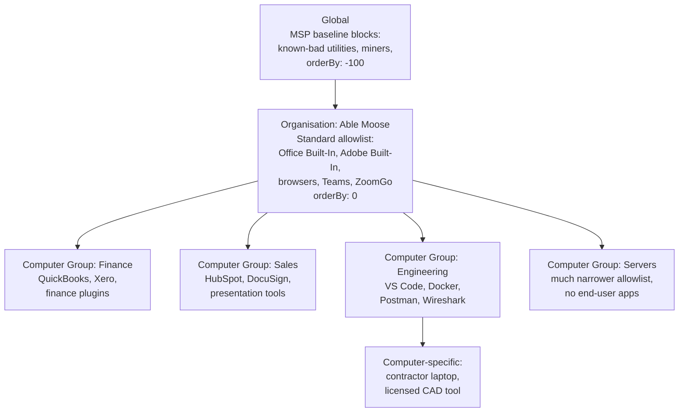

The Beginner course covered approving an individual request. This lesson is the design question behind it: how do you build a policy set that doesn't drown the helpdesk three months in?

## How policies stack

ThreatLocker evaluates policies in an ordered list. Every policy has an `orderBy` integer; the policy with the lower number wins where they overlap. Policies live at four scopes:

| Scope | Where it applies | Typical use |
|---|---|---|
| **Global** | The MSP-wide level. Affects every customer beneath. | Vendor-supplied built-ins, MSP baseline blocks. |
| **Organisation** | One customer. | Per-customer baseline plus customer-specific allows. |
| **Computer Group** | A subset of one customer's fleet (Finance, Servers, Hybrid Workers). | Role-specific software. |
| **Computer** | One machine. | Single-user exceptions, contractor laptops. |

### The flat numbering scheme

ThreatLocker's policy list is a flat structure. Vendor docs are explicit: **policies cannot be reordered to a negative number.** There is no negative-orderBy escape hatch. Instead, the numbering is laid out with deliberate gaps:

| Range | What lives here | Why the range matters |
|---|---|---|
| **101 onwards** | Built-in policies. Vendor-managed, update automatically as ThreatLocker ships new application definitions. | Don't reorder built-ins below custom policies; the built-in list is curated and renumbering breaks the curation. Use the Prioritize Built-In Applications agent setting instead. |
| **100,001 onwards** (in steps of 100) | Custom policies. The MSP's work lives here. | The 100-step gap exists so you can slot a tighter rule in without renumbering everything around it. |
| **1,000,000** | Default Deny. The catch-all. | This is the floor. Everything below it gets denied because nothing matches. The Default Deny policy must be named `Default - (Group Name)` for Learning Mode's automatic-creation logic to work. |

The "Add to Top" and "Add to Bottom" buttons in the policy editor are how you place a new custom policy into this scheme: top gives you a numerically lower (higher priority) number; bottom gives you a numerically higher (lower priority) one. Default to bottom; reach for top only when you have a specific reason to elevate above existing custom rules.

### Built-ins vs custom: who wins on conflict

When a built-in and a custom policy both match, the **Prioritize Built-In Applications** agent setting decides. This is a per-customer toggle in the agent-settings panel:

<AnnotatedScreenshot
  src="/img/threatlocker/policy-order-changes.png"
  alt="Create Settings dialog with Setting Type: Prioritize Built-In Applications, Applies To: Entire Organization, Order By with Add Settings to Top and Add Settings to Bottom buttons, agent version 10.5.3, and a tooltip explaining that without the setting built-in applications are processed before custom applications"
  caption="The setting that decides whether built-ins or custom policies win on conflict. Tooltip is the bit that often surprises techs: without this setting, built-ins are processed first by default."
  aspect="676/532"
>
  <Hotspot client:load x={50} y={28} label="1" title="Setting Type: Prioritize Built-In Applications" purpose="The agent-setting that controls evaluation order.">
    On = built-ins evaluated first; ThreatLocker's curated allowlists win on overlap. Off = custom evaluated first; your customer-specific rules win. Without the setting at all, built-ins are processed first by default (per the tooltip).
  </Hotspot>
  <Hotspot client:load x={50} y={42} label="2" title="Applies To: Entire Organization" purpose="The scope the setting applies to.">
    The agent setting is per-organisation. If you've inherited a customer with the setting at Org level and another at Computer Group level, the lowest-orderBy setting wins, same as policies.
  </Hotspot>
  <Hotspot client:load x={20} y={56} label="3" title="Add Settings to Top" purpose="Numerically lower (higher priority).">
    For a new agent setting that should override existing ones at the same scope. Use sparingly; you're declaring this setting more important than what's there.
  </Hotspot>
  <Hotspot client:load x={50} y={56} label="4" title="Add Settings to Bottom" purpose="Numerically higher (lower priority).">
    Default placement; respects the existing structure. The same Top/Bottom convention applies to policies in the policy editor.
  </Hotspot>
</AnnotatedScreenshot>

The pattern most MSPs land on:

- **High-priority denies** at low custom orderBy values (early in the 100,001+ range). Known-bad applications, blocked regardless of any permit further down. Use Add to Top in the policy editor when adding new ones.
- **Built-in permit policies** sit in the 101+ range; the Prioritize Built-In Applications setting controls whether they win or lose against custom on conflict.
- **Targeted custom permits** at the computer-group or computer level, in the higher 100,001+ range, for things specific to that subset.
- **Default Deny** at orderBy 1,000,000. The agent default-denies anything no policy matched.

## Built-in vs custom applications

Every permit policy ties to an *application definition*. ThreatLocker maintains a library of **Built-In** applications (Microsoft Office, Adobe Creative Cloud, common dev tooling, common AV products). Built-ins update automatically as vendor signing certificates rotate or new file paths appear, so a policy attached to "Microsoft Edge (Built-In)" keeps working through Edge updates without you touching it.

Custom applications are definitions you build for things ThreatLocker doesn't ship. A line-of-business app from a small vendor; an in-house PowerShell module; a niche industry tool. You're responsible for keeping the file rules current.

The decision rubric:

| Use a built-in when | Use a custom application when |
|---|---|
| ThreatLocker ships one for the product | The product isn't in the catalogue |
| The customer's install is the standard signed distribution | The customer has a heavily customised internal build |
| You want updates to the application's footprint to be tracked for you | The product has unusual deployment paths or none of the standard rules fit |

<Callout type="warn" title="Approving a built-in approves the whole built-in">
A request that matches a built-in via a single common DLL effectively permits the entire built-in if you approve it. Confirm the requested file is genuinely part of the built-in's intended footprint before approving from the request panel. The matching list isn't a guarantee.
</Callout>

## File-rule design for custom applications

A custom application is a collection of file rules. The available rule types:

- **Hash** (ThreatLocker hash or SHA256). Most precise. Brittle: any binary update changes the hash and the rule stops matching.
- **Full Path**. Wildcardable. Useful for "anything under `c:\program files\acme\*`".
- **Process Path**. The path of the parent process that launched the file.
- **Installed By (Created By Process)**. The path of the process that wrote the file. Catches an app's own updater dropping new binaries.
- **Certificate**. Match by signing certificate. Stable across updates as long as the vendor signs consistently.

The pattern that ages well: certificate plus full-path with a directory wildcard. Hash-only rules look airtight but become a maintenance load you don't want.

## The Able Moose Accounting policy structure (mid-market)

Able Moose has grown to 120 staff across three offices. Computer groups are organised by role: Finance, Sales, Engineering, Servers. ThreatLocker policy structure:

Naming convention: `<scope>-<application>-<purpose>`. Examples:

- `org-office-permit-baseline`
- `grp-finance-quickbooks-permit-ringfenced`
- `grp-engineering-docker-permit-elevated`
- `cmp-able-cad-01-acme-cad-permit`

The convention gives the next technician (or future-you) immediate context: which scope the policy lives at, which application, what kind of permit. The scope prefix is what tells you whether removing the policy affects one machine or 120.

The MSP baseline (global blocks, a standard org-level allowlist) is the layer that makes per-customer work tractable. Skip it and you're rebuilding the same allowlist for every new tenant; baseline design at scale is the next course's first lesson.

<Checkpoint slug="threatlocker-l2-checkpoint-policydesign" client:load />

<Callout type="info" title="Sources">
[Policy API endpoints](https://threatlocker.kb.help/portalapipolicy/), [Application API endpoints](https://threatlocker.kb.help/portalapiapplication/), [Application File rule fields](https://threatlocker.kb.help/portalapiapplicationfile/), [Copy Existing Policies](https://threatlocker.kb.help/portalapipolicy/).
</Callout>
