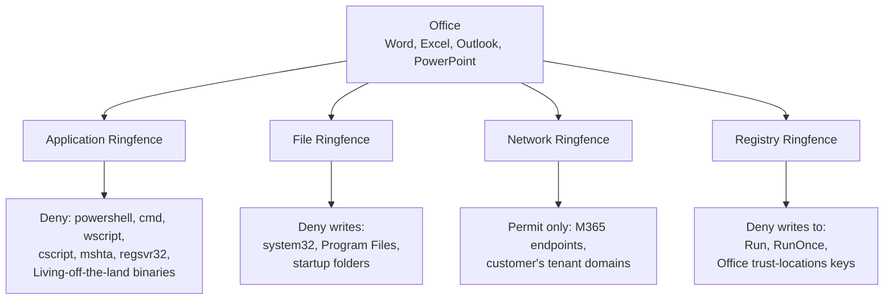

Application Control decides whether Office runs. Ringfencing decides what Office can do once it's running. The Beginner course mentioned the four levers; this lesson is how to actually design them.

## The four levers

| Lever | What it controls | Example |
|---|---|---|
| **Application Ringfencing** | Which other applications this app can launch (or *be launched by*) | Word can't spawn `powershell.exe` |
| **File Ringfencing** | Which file paths this app can read or write | A browser can't write to `c:\windows\system32` |
| **Network Ringfencing** | Which destination IPs / domains / ports this app can reach | Excel can only reach the customer's known partner domains |
| **Registry Ringfencing** | Which registry paths this app can read / modify | A line-of-business app can't write to the Run key |

Each lever has two modes:

- **Restrict by exclusion** (the default, `restrictApplicationSpawning: false` in the API). Block all interactions *except* the listed exclusions.
- **Restrict by inclusion** (`restrictApplicationSpawning: true`). Permit interactions *only with* the listed exclusions.

You'll mostly use restrict-by-exclusion: deny everything, allow the specific things that are needed.

## Designing a ringfence for Office

Each lever earns its place by stopping a specific abuse pattern:

- **Application Ringfence** stops the macro-and-script payload chain. Most ransomware loaders need a shell; deny it and the chain breaks.
- **File Ringfence** stops a malicious add-in writing a persistence binary into a startup folder.
- **Network Ringfence** stops a compromised Office app from reaching out to a C2 server.
- **Registry Ringfence** stops persistence via Run keys and stops the macro from changing Office's trust-locations.

## How to roll a new ringfence safely

The key safety mechanism: **Monitor Only on the policy itself**, independent of the endpoint's maintenance mode. A policy can be set to Monitor Only even on a computer that's otherwise enforcing; the rest of the endpoint's policies still enforce, and only this one logs without blocking.

Three behaviours to know:

- **Inherit from the computer.** The default. The policy enforces if the endpoint is in Secured Mode; logs without blocking if the endpoint is in Maintenance.
- **Secured (regardless of computer).** The policy enforces even if the endpoint is in a Maintenance state.
- **Monitor Only (regardless of computer).** The policy logs without blocking, even if the endpoint is in Secured Mode.

Setting a freshly-designed Ringfence to Monitor Only for a week is the safe rollout pattern. The Unified Audit shows you the green Simulated denies the ringfence *would* have blocked, you tune the exclusions list against real-world activity, and only then flip the policy to enforce.

Skipping monitor mode is how teams accidentally block someone's quarterly board-pack export macro and then have to apologise.

## Common mistakes in initial Ringfence rollouts

| Mistake | What happens | Fix |
|---|---|---|
| Ringfencing applied straight to Secured mode without a monitor pass | Real users get blocked on day one; ringfence gets disabled in panic | Always 7-14 days in Monitor Only first, review Simulated denies, tune, then Secured |
| Network ringfence with a too-narrow exclusion list | Apps lose access to legitimate endpoints (CDNs, telemetry, update servers) | Build the exclusion list from observed traffic in Monitor Only, not from guesses |
| Application ringfence that denies *all* spawn | Legitimate add-in installers and helper utilities break | Default-deny shells specifically; allow the specific helper apps the customer's add-ins need |
| Same ringfence template applied to every app | Office's needs are not Excel's needs are not Adobe's needs | One ringfence template per high-risk application, tuned per app |
| File ringfence with permit-write everywhere | Defeats the lever | File writes default-deny; permit specific paths the app legitimately writes to |

## A worked example: Able Moose's Office ringfence

The MSP designs a Microsoft Office ringfence as a single policy applied at the Able Moose organisation level. It targets the Office (Built-In) application:

- **Application Ringfence**: deny spawn of the industry-standard LOLBIN list, `powershell.exe`, `cmd.exe`, `wscript.exe`, `cscript.exe`, `mshta.exe`, `regsvr32.exe`. Permit only `splwow64.exe` (legitimate Office helper) as the exception. (The LOLBIN list is the broader security industry's, not a ThreatLocker-specific recommendation; the abuse pattern it covers is what ringfencing addresses.)
- **File Ringfence**: deny writes to `c:\windows\system32\*`, `c:\program files\*`, `c:\users\*\appdata\roaming\microsoft\windows\start menu\programs\startup\*`. Permit reads everywhere; permit writes to the user profile directory and explicitly to the customer's `\\\\fileserver\\shared\\` partner shares.
- **Network Ringfence**: permit `*.office.com`, `*.office365.com`, `*.microsoft.com`, plus the customer's M365 tenant URL. Deny everything else. Excel and Outlook should not be calling random IPs.
- **Registry Ringfence**: deny writes to `\\registry\\user\\software\\microsoft\\windows\\currentversion\\run\\*` and the Office trust-locations keys.

The policy goes to Monitor Only for 14 days, the team reviews Simulated denies, adds two exclusions for legitimate Office add-ins the customer uses, then flips to Secured.

<Checkpoint slug="threatlocker-l2-checkpoint-ringfencing" client:load />

## What this is NOT

- **Not "set the ringfence and forget it."** Quarterly review is part of the operational cost. Customers add software, add-ins update, network endpoints rotate; a stale ringfence either denies legitimate work or has accumulated permits that no longer earn their place.
- **Not the right answer for every app.** A line-of-business product that genuinely needs to spawn arbitrary processes (a developer IDE, a deployment tool) should be permitted without a ringfence rather than fighting one. Reach for ringfences where the abuse risk is real.

<Callout type="info" title="Sources">
[Policy API: Ringfence fields](https://threatlocker.kb.help/portalapipolicy/), [Approval Request Ringfence options](https://threatlocker.kb.help/portalapiapprovalrequest/), [monitorMode field](https://threatlocker.kb.help/portalapipolicy/).
</Callout>
