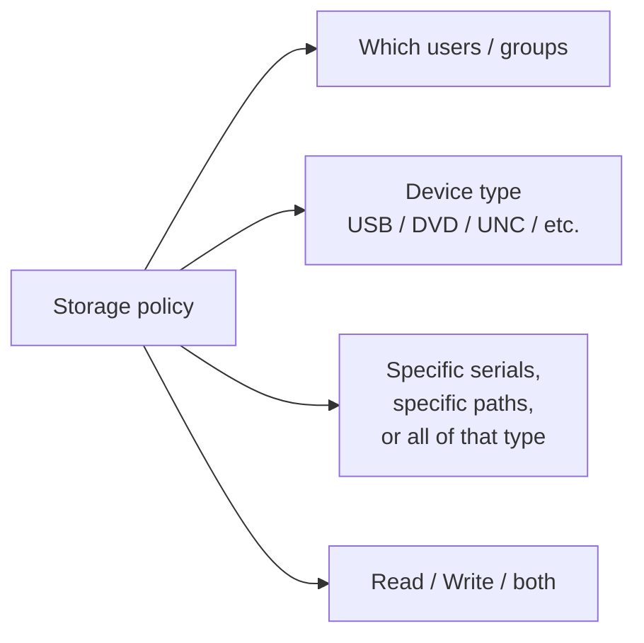

Two modules sit alongside Application Control in most ThreatLocker deployments: Storage Control (what the user can read or write to) and Elevation Control (when a standard user can run something as admin). They earn their place when the customer has either compliance requirements around removable media or the "everyone is local admin" anti-pattern they want to clean up.

## Storage Control: the device types

Storage Control policies target specific device types. The Policy API exposes:

- **USB** removable storage
- **DVD** optical media
- **UNC** network file shares
- **SCSI / SATA / IDE** internal volumes

Each policy permits or denies for one device type. The decision dimensions:

A coherent USB pattern for an accounting firm:

| Policy | Scope | Action | Why |
|---|---|---|---|
| `org-storage-usb-deny-default` | Whole organisation, all users | Deny USB read+write | The baseline. Plugging an unknown USB does nothing. |
| `org-storage-dvd-deny-default` | Whole organisation, all users | Deny DVD | Same reasoning. |
| `grp-finance-storage-auditor-usb` | Finance computer group, named auditor user | Permit USB read for serials matching the auditor's encrypted USB | The audit team's known device. |
| `cmp-it-tech-storage-usb-permit` | One IT tech's laptop, IT tech user | Permit USB read+write | The technician needs working USB for legitimate ops. |

The `grp-finance-storage-auditor-usb` row is the pattern that pays off. Most products give you "USB on" or "USB off"; ThreatLocker lets you say "this USB serial, for this user, on this group of machines, read-only" and reject the rest. That's the lever that earns the module its slot in a stack.

## Storage Control gotchas

- **UNC denials look like a network problem, not a storage problem.** A user reports "I can't open the file share." Rule out network first (can they ping it, can they `\\\\server\\` from File Explorer at all). Then check Storage Control's UNC policy. The Unified Audit's `read` and `write` action types tell you which it actually is.
- **Read-as-execute matters.** ThreatLocker has an Override Read as Execute setting that controls whether reading a file from removable media counts as executing it. If you're tightening a USB policy, check the customer's setting; the read-as-execute behaviour can change which policy lever is the right place to fix.

## Elevation Control: the per-app elevation pattern

The traditional answer to "this user occasionally needs admin" is local-admin permanently, with someone half-promising to remove it. The ThreatLocker pattern: the user stays a standard user, you create an Elevation policy for the specific application, and the tray app handles the request flow.

Elevation has four states (per the Policy API's `elevationStatus` field):

- `0` Do not elevate
- `1` Elevate (notify user)
- `2` Elevate (do not notify user, "silent elevation")
- `3` Force the program to run as a standard user (does not apply for administrators)

The `policyElevation` workflow:

<StepThrough client:load>
  <Step title="User clicks the app's installer or a feature that triggers UAC">
    The tray app surfaces the elevation prompt, captures a comment, and sends a request to the Response Center.
  </Step>
  <Step title="Tech approves the Elevation request">
    Pick the scope (single computer, computer-app, computer group, organisation), elevation status (notify or silent), and the elevation expiration. The expiration is independent of the policy's overall expiration.
  </Step>
  <Step title="Policy is created and deployed">
    The user can now elevate the specific app. The policy can be combined with a Ringfence: even when elevated, the app can't reach into PowerShell or write outside its install directory.
  </Step>
</StepThrough>

## Elevation expiration is your friend

The `elevationExpiration` field can be set in hours from the API call. The pattern:

- **Routine app updates** (QuickBooks, Sage, finance plugins): elevation expires in 4-24 hours. Long enough for the install, short enough that idle days don't accumulate elevated permission.
- **Driver / hardware install** (printer, scanner): expiration matches the install window, then back to standard.
- **A power-user developer or sysadmin** with ongoing elevation needs: longer expiration, tighter ringfence, periodic re-evaluation. Don't make this the default.

When elevation expires before the underlying permit policy does, ThreatLocker creates two policies: one with elevation enabled until the expiration, one without elevation that continues to permit the app. The user keeps using the app; they just don't have admin rights with it any more. That's the design intent: elevation should always be the time-bounded layer.

<Callout type="warn" title="Silent elevation hides the indicator from the user">
'Silent Elevation' (`elevationStatus: 2`) elevates the application without showing a tray notification to the user. Useful for unattended update flows that don't need user awareness, dangerous for any app the user wouldn't expect to run as admin. Default to "notify"; reach for silent only when the use case is clear and documented.
</Callout>

## A worked example: Able Moose Accounting

The customer's bookkeeper Sarah needs to install QuickBooks updates on her laptop without being a permanent local admin.

| Element | Value | Why |
|---|---|---|
| Application | QuickBooks (Built-In) | Existing built-in covers the update pathway |
| Scope | Single computer (Sarah's laptop) | Only she needs this |
| Elevation status | `1` (notify user) | Sarah should know when something elevated |
| Elevation expiration | 4 hours | Enough for the update, then re-prompt next time |
| Ringfence | Deny PowerShell / cmd spawn, deny writes outside `c:\program files\intuit\*` | Even elevated, the app can't be repurposed |

The policy lives at the computer level, named `cmp-able-lt-sarah-quickbooks-elevate-update`. Future-tech reading the policy list sees "Sarah's QuickBooks update elevation" without opening it.

<Checkpoint slug="threatlocker-policy-rollout-checkpoint-elevation" client:load />

## What this is NOT

- **Not a replacement for proper RBAC in the customer's IdP.** Elevation Control handles the local-admin question on individual endpoints. Tenant-level admin rights, M365 role assignments, SharePoint permissions; the IdP's job, ThreatLocker doesn't see them.
- **Not the only USB lever in the stack.** Storage Control is the *access* decision. BitLocker To Go (encryption) and DLP products (content inspection) are different layers with different jobs; designing one without the others leaves data-leak gaps that Storage Control was never meant to close.

<Callout type="info" title="Sources">
[Policy device types](https://threatlocker.kb.help/portalapipolicy/), [Elevation Control quick-start guide](https://threatlocker.kb.help/threatlocker-elevation-quick-start-guide/), [Elevation API fields](https://threatlocker.kb.help/portalapipolicy/), [Override Read as Execute setting](https://threatlocker.kb.help/agent-settings/).
</Callout>
